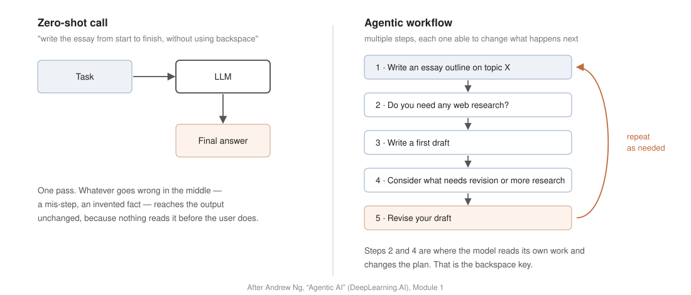
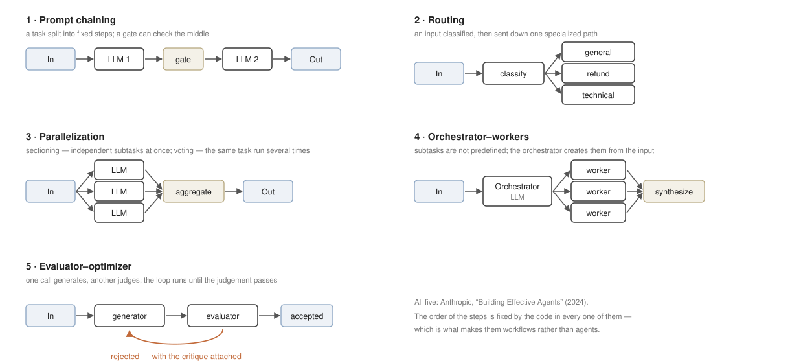
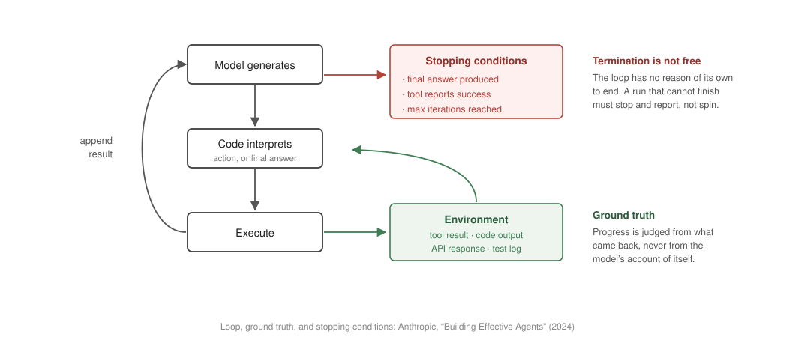

# Chapter 1. What is an Agent?

## 1.1 The Agentic Paradigm

Chatbots of around 2022 received a user's question, generated a single answer, and ended the interaction. Systems that appeared afterward behave differently. Deep Research, given a topic, searches and reads dozens of web pages on its own and returns a synthesized report with citations. Claude Code, given a bug report, moves through a local codebase, runs the test suite in a terminal, reads the failures, and edits again.

Neither capability came from changing the weights. The same class of model serves on one side as a chatbot and on the other as a component of Deep Research or Claude Code. What separates them is the tools each was given and the loop each was placed in — that is, the program surrounding the model. Specialized value is created outside the model, and the subject of this chapter is that outside.

A **zero-shot call** is one prompt, one response, and the end of the session. The answer arrives immediately, and so does any error made along the way: nothing read the output before the user did. Andrew Ng's *Agentic AI* course states the demand this places on the model in a form worth holding onto — it is the demand to "type out an essay on topic X from start to finish in one go, without using backspace."

*Figure 1.1 — The same task under the two regimes. Steps 2 and 4 on the right are where the model reads its own work and changes what happens next. After Andrew Ng, "Agentic AI" (DeepLearning.AI), Module 1.*

The alternative is a process: write an outline, decide whether web research is needed, write a first draft, consider what needs revision, revise. An **agentic AI workflow**, in Ng's definition, is a process in which an LLM-based application executes multiple steps to complete a task. No competent writer works without a backspace key, and the right reading of the figure is not that the right-hand column is exotic but that it is ordinary — it is simply what producing good work looks like. What the architecture owes the model is not a sharper instruction to get the answer right the first time, but a system in which it can delete and rewrite.

Quality, on this view, is not extracted from a better single guess. It is accumulated across passes.

## 1.2 Control Flow and Degrees of Agency

An **LLM (large language model)** is an autoregressive generative model trained on large text corpora with the objective of next-token prediction. Autoregressive means that the model computes a probability distribution over the next token conditioned on the tokens generated so far, samples one token from it, and repeats this process to produce text. An LLM call therefore takes text in and returns text out, and has no other input or output channel. The model cannot open a file, cannot execute a search, and cannot verify whether its own output is factual. What it produces is a chain of tokens with high conditional probability, not an action on the external world.

*Figure 1.2 — Autoregressive generation: each sampled token is appended to the input and fed back, one token per pass, until a stop token. Source: P.-M. Dartus, "How LLMs Generate Text for the Rest of Us" (2025), pm.dartus.fr.*

Consequently, everything the model cannot do by itself is handled by code outside it, and that code must decide which action to execute next, when to repeat, and when to stop. **Control flow** is the name for the totality of those decisions. In conventional software every path is fixed by the developer's conditionals before the program runs, so the set of reachable states is known at write time. In an agentic system the path is decided at run time by reading the model's output: which function fires, which tool is loaded, and when the loop ends are determined by tokens that did not exist when the code was written.

### The definition dispute

The word *agent* has no single accepted definition, and the disagreement is worth stating before one is chosen. Anthropic's *Building Effective Agents* (2024) records it: some practitioners use the term for fully autonomous systems that operate independently over extended periods, others for prescriptive implementations that follow predefined workflows. That article groups all such variations under **agentic systems** and draws one architectural distinction inside the group.

- **Workflows** are systems where LLMs and tools are orchestrated through predefined code paths.
- **Agents** are systems where LLMs dynamically direct their own processes and tool usage, maintaining control over how they accomplish tasks.

OpenAI's *A Practical Guide to Building Agents* (2025) draws the same line from the other side: agents are systems which independently accomplish tasks on the user's behalf, and applications that integrate an LLM without using it to control workflow execution are not agents.

The Hugging Face position contradicts both in form. The smolagents documentation defines AI agents as programs where LLM outputs control the workflow, and then refuses the binary in as many words: with that definition, "'agent' is not a discrete, 0 or 1 definition: instead, 'agency' evolves on a continuous spectrum, as you give more or less power to the LLM on your workflow." The disagreement is not academic. Anthropic files **routing** under workflows; smolagents places a router on the agency scale, because the model's output already chooses the branch.

Ng ends the argument by declining it: "Rather than arguing over which work to include or exclude as being a true agent, we can acknowledge that there are different degrees to which systems can be agentic." This course takes that position. The workflow/agent distinction is retained because it names the axis — where control flow resides — and systems are graded along that axis rather than sorted into two boxes. The design question stops being whether a system is an agent and becomes how much of the control flow has been handed over, and whether that is the amount the task and its risk tolerance warrant.

### Levels of agency

The smolagents documentation grades the axis and names each level together with the code that implements it.

| Agency | What the LLM output does | Name | Example code |
|---|---|---|---|
| ☆☆☆ | has no impact on program flow | Simple processor | `process_llm_output(llm_response)` |
| ★☆☆ | controls an if/else switch | Router | `if llm_decision(): path_a() else: path_b()` |
| ★★☆ | controls function execution | Tool call | `run_function(llm_chosen_tool, llm_chosen_args)` |
| ★★☆ | controls iteration and program continuation | Multi-step agent | `while llm_should_continue(): execute_next_step()` |
| ★★★ | starts another agentic workflow | Multi-agent | `if llm_trigger(): execute_agent()` |
| ★★★ | acts in code, defining its own tools | Code agent | `def custom_tool(args): ...` |

*Table 1.1 — Levels of agency. Source: Hugging Face, smolagents conceptual guide.*

*Figure 1.3 — The same levels on one axis. Rightward, the model holds more of the program's flow; predictability and per-run cost control shrink.*

The code column carries the substance. A router is one `if` statement whose branch is chosen by the model; a multi-step agent is one `while` loop whose continuation is chosen by the model. The distance between two levels is a difference of one line, and everything this course builds from Chapter 4 onward lives inside that `while`.

Six levels are the instrument for design. For deciding, and for explaining a decision to people who will not read the code, Ng's three bands are enough.

| Band | What holds |
|---|---|
| Less autonomous | All steps predetermined, all tool use hard-coded; the autonomy is in text generation alone |
| Semi-autonomous | The agent makes some decisions and chooses tools, but every tool was predefined by the developer |
| Highly autonomous | The agent makes many decisions on its own and can create new tools on the fly |

*Table 1.2 — Source: Andrew Ng, "Agentic AI" (DeepLearning.AI), Module 1.*

The two tables nest. Ng's less-autonomous band is the simple processor, where the model writes text that the program then uses on a path it did not choose. His semi-autonomous band covers the router, the tool call, and the multi-step agent: the model decides, but only among tools the developer defined. His highly-autonomous band is where a system creates new tools on the fly, which is the code agent, and where one agentic workflow starts another, which is the multi-agent row.

### What is not an agent

Not every system containing an LLM is an agent. OpenAI's guide excludes three categories by name. A simple chatbot is a conversational surface that renders history, with no execution plan behind the reply. A single-turn LLM call answers once and the session is gone. A sentiment classifier takes text in and returns a static label from a fixed vocabulary. The defect is the same in all three: no feedback loop. Nothing in them changes its own execution in response to a result, and nothing acts on the world such that a result could come back. On Table 1.1 they occupy the first row, where the output has no impact on program flow.

### Reading autonomy off the task

The level is not chosen by preference; it is read off the task. Ng grades the task itself on three dimensions. **Structure** asks whether the process is clear and step-by-step with procedures already standard, or whether the steps are not known ahead of time. **Ambiguity** asks whether inputs arrive in a fixed machine-readable shape, or whether unstructured context and open natural language must be interpreted. **Step depth** asks whether one call or a short fixed chain suffices, or whether many reasoning steps and tool calls stand between the request and an answer. A task on the easier side of all three gains nothing from an agent; the further it sits toward the harder side, the more a semi- or highly-autonomous design earns its cost.

## 1.3 The Four Components

OpenAI's guide states that in its most fundamental form an agent consists of three core components.

| Component | Definition |
|---|---|
| Model | The LLM powering the agent's reasoning and decision-making |
| Tools | External functions or APIs the agent can use to take action |
| Instructions | Explicit guidelines and guardrails defining how the agent behaves |

*Table 1.3 — Source: OpenAI, "A Practical Guide to Building Agents" (2025).*

Anthropic describes the same building block as the **augmented LLM** — a model enhanced with retrieval, tools, and memory, able to generate its own search queries, select appropriate tools, and determine what information to retain. The difference between the two lists is memory, and the loop requires it, so this course carries memory as a fourth component. The four are treated in turn.

**The model** is the autoregressive engine of 1.2, doing something else inside an agent than it does in a chat product: it reads the accumulated record — the task, the actions already taken, the results that came back — and emits the next action. Because control flow is parsed out of that text, the practical requirement on the model is not eloquence but reliable encoding and decoding of a strict schema: structured JSON, a function-calling format, a parseable action directive. A model that writes fluent prose and malformed JSON cannot drive a loop.

**Tools** are external functions or APIs, described to the model by a schema, through which it reads from and writes to the world outside its context window. OpenAI's guide sorts them by purpose. *Data* tools retrieve the context needed to execute the workflow: querying a transaction database or a CRM, reading a PDF, searching the web. *Action* tools change something outside the model: sending mail, updating a record, handing a support ticket to a human. *Orchestration* tools are other agents, used as tools by an agent — a refund agent, a research agent, a writing agent. The third category is the one to hold, because Chapter 6 is built on it.

**Instructions** are the explicit guidelines and guardrails defining how the agent behaves, and they are an operating procedure written down rather than encouragement. OpenAI's guide is specific about how to produce them. Routines should be built from the operating procedures, support scripts, and policy documents an organization already has, rather than invented at the prompt. Edge cases need stated fallbacks — a tool call fails, a service is down, the user refuses to supply what is needed — because an agent without a stated fallback invents one. And instructions should be modular: not one monolithic prompt covering every state, but the sub-instruction the current state requires. Ambiguity here surfaces as erratic decisions, since the instructions are what the decisions are made against.

**Memory** is the record of what has happened so far in the run, together with what should persist beyond it. The failure it prevents is specific. The model sees only its input; drop the record of the last attempt and the agent cannot know that a tool has already failed, so it selects the same action again, receives the same error, and repeats — a loop that runs until a cap stops it, having made no progress. Short-term context holds the current run: the task, the actions taken, the results returned, the working state. A long-term store holds what must survive it: durable facts, user preferences, retrieved documents (→ Ch. 9–10). Memory is what makes iteration iteration rather than repetition.

## 1.4 Workflow Patterns

Before any pattern, Anthropic states a governing rule: when building applications with LLMs, find the simplest solution possible and increase complexity only when needed, which may mean not building an agentic system at all. Agentic systems trade latency and cost for task performance, and the trade has to be worth making. Workflows offer predictability and consistency for well-defined tasks; agents are the better option where flexibility and model-driven decision-making are needed at scale; and for many applications, optimizing a single call with retrieval and in-context examples is enough.

That advice is unusable while the only workflow in view is a straight line of calls. A **workflow pattern** is a named arrangement of LLM calls whose order is decided by the code rather than by the model, and Anthropic reports five it has seen in production.

*Figure 1.4 — The five patterns. In every one of them the order of the steps is fixed by the code, which is what makes them workflows. Structures from Anthropic, "Building Effective Agents" (2024).*

**Prompt chaining** decomposes a task into a fixed sequence of steps, each call processing the output of the previous one, with optional programmatic checks — a gate — between steps to verify the process is still on track. It fits when the task decomposes cleanly into fixed subtasks and the goal is to trade latency for accuracy by making each individual call easier. Anthropic's examples are generating marketing copy and then translating it, and writing a document outline, checking it against criteria, then writing the document from it.

**Routing** classifies an input and directs it to a specialized followup task, which separates concerns and lets each path carry a prompt specialized for its own kind of input; without it, optimizing for one input type degrades the others. It fits where distinct categories are better handled separately and classification can be done accurately, by an LLM or by a conventional classifier. Anthropic's examples are directing general questions, refund requests, and technical support into different downstream processes, and routing easy questions to a small cost-efficient model while hard ones go to a more capable one. This is the pattern the sources disagree about, as 1.2 recorded.

**Parallelization** runs several calls simultaneously and aggregates their outputs programmatically, in two variations. *Sectioning* breaks a task into independent subtasks run in parallel: one model instance handles the user query while another screens it for inappropriate content, or each call in an automated eval scores a different aspect. *Voting* runs the same task several times for diverse outputs: several prompts review the same code for vulnerabilities, or several judge content with different vote thresholds to balance false positives against false negatives. It fits when subtasks are genuinely independent and speed matters, or when multiple attempts raise confidence — models generally do better when each consideration gets its own call.

**Orchestrator–workers** places a central LLM that dynamically breaks a task down, delegates the pieces to worker LLMs, and synthesizes their results. Topologically it resembles parallelization, and the difference is flexibility: here the subtasks are not predefined but determined by the orchestrator from the specific input. It fits where the subtasks cannot be predicted in advance — in coding, the number of files to change and the nature of each change depend on the task. Anthropic's examples are coding products that make complex changes across multiple files, and search that gathers and analyzes across many sources.

**Evaluator–optimizer** has one call generate a response while another evaluates it and returns feedback, in a loop, with the critique attached to the next attempt. Anthropic names two signs of good fit, both required: an articulated human critique would demonstrably improve the response, and the model is capable of producing that critique. Clear evaluation criteria must exist. Its examples are literary translation, where an evaluator can name nuances the translator missed, and complex multi-round search, where the evaluator decides whether another round is warranted.

## 1.5 Agentic Design Patterns

The five patterns of 1.4 describe how calls are composed. Ng's four design patterns describe what a system is made to do — capabilities engineered on top of a model rather than waited for from the next one. They are reflection, tool use, planning, and multi-agent collaboration, and they compose: production systems run several at once.

**Reflection** feeds the output back as input with an instruction to criticize it, and lets the criticism drive a revision. Ng's coding illustration runs: the request "please write code for {task}" produces a first version; the follow-up "here's code intended for {task}; check it carefully for correctness, style and efficiency, and give constructive criticism" produces "there's a bug on line 5, fix it by …"; the revision produces a second version, which fails unit test 3, which produces a third. Two arrangements are possible — a single model criticizing itself inside one context, or a Coder agent and a separate Critic agent with the critic holding the checklist. Termination comes when the critic passes the work or an attempt cap is reached. Chapter 5 builds this.

**Tool use** repairs three deficits at once: the model cannot compute reliably, cannot see data created after training, and cannot read anything held inside an organization. The routine, in ReAct form, is a cycle of Thought, Action, and Observation. A Thought states that the user's address is needed and the internal database must be queried; an Action emits `get_user_db(address)` in the specified schema; the Observation appends the returned value to the context, and the next Thought reads it. Ng's tool categories span analysis (code execution, Wolfram Alpha), information gathering (web search, Wikipedia, database access), productivity (email, calendar, messaging), and images (generation, captioning, OCR). The specification is where the work is: ambiguous names and untyped parameters produce tool-selection failures. Chapter 3 builds this.

**Planning** applies where the route to a goal cannot be hard-coded, so the agent produces the route itself and adapts it when reality interferes. Decomposition turns "write a trend report on company B" into searching related companies' social accounts, crawling, cleaning the text, and mapping the indicators. Dynamic replanning is what happens when step two's tool returns HTTP 403 and the source is unreachable: the loop does not halt, the plan is rewritten to reach the same goal through another tool. Ng's worked example is HuggingGPT (Shen et al., 2023), where a request combining an image and a spoken description is planned as pose determination, then pose-to-image, then image-to-text, then text-to-speech, each step handled by a different specialized model. Chapter 7 builds this.

**Multi-agent collaboration** solves the degradation that follows when one agent holds every instruction and every tool. OpenAI's guide is precise about the cause: "the issue isn't solely the number of tools, but their similarity or overlap. Some implementations successfully manage more than 15 well-defined, distinct tools while others struggle with fewer than 10 overlapping tools." Its second trigger is complex logic — when a prompt accumulates so many conditional branches that the template stops scaling, each logical segment is better divided into its own agent. The design separates agents by role, each holding a small and distinct tool set and communicating with the others. Ng cites Multiagent Debate (Du et al., 2023) as evidence: biographies improve from 66.0 to 73.8, MMLU from 63.9 to 71.1, and chess move selection from 29.3 to 45.2. Chapter 6 builds this.

## 1.6 Domain Evidence and the Safe Loop

Anthropic reports two domains in which agents have demonstrated value with its customers.

In **customer support**, tools pull customer data, order history, and knowledge-base articles, while actions such as issuing a refund or updating a ticket are handled programmatically. A resolution is defined by the user, which makes success measurable, and the article notes that several companies price the product per successful resolution — a commercial statement of confidence in the loop. Safety here lives in code rather than in instruction: escalation to a human is a function call, triggered on repeated failure.

In **coding**, tools search the codebase, edit source, and run the test suite, and the loop is write, run the tests, read the failure log, correct, with the log returned to memory on each pass. Anthropic reports its own implementation resolving real GitHub issues in SWE-bench Verified from the pull-request description alone. The article states the limit in the same breath: human review remains necessary, because automated tests verify function but not alignment with broader system requirements.

What the two domains share is the more useful lesson, and it is not their position on the agency scale. Both require conversation and action together, have clear success criteria, admit feedback loops, and integrate meaningful human oversight. Neither was chosen for its autonomy; both were chosen because their outputs can be checked, which is the condition that makes iteration worth anything.

*Figure 1.5 — What keeps an autonomous loop honest and what makes it stop. Both from Anthropic, "Building Effective Agents" (2024).*

Two properties complete the loop. The first is **environmental ground truth**. Anthropic insists that the agent take its bearings at every step from what actually came back — the tool result, the code execution, the API response — rather than from its own account of its progress. An agent that judges itself by its own text is an agent that reports success it has not achieved. The second is **stopping conditions**, which must be written in code and layered: the task completes or a tool reports success, and failing that, a maximum iteration count is reached at which the run halts and reports rather than continuing. Termination is not a property the loop has on its own.

The closing rule follows from the whole chapter. A system should not be made agentic by preference. The lightest workflow chain that could work is the place to start; autonomy is added where the evidence demands it, one level at a time.

## 1.7 Organization of the Course

As established in 1.2, an LLM call takes text in and returns text out, and nothing more. From this follow the deficits that must be filled to build an agent, and those deficits form the organization of this course.

- The model cannot act → tools (Ch. 3), the agent loop (Ch. 4)
- The model does not know when it is wrong → reflection and evaluation (Ch. 5), planning and search (Ch. 7)
- Tasks too large for a single agent are divided among several → multi-agent systems (Ch. 6)
- The model knows nothing after its training cutoff and nothing inside an organization → retrieval augmentation (Ch. 8), memory (Ch. 10)
- Iteration accumulates input without bound → context management (Ch. 9)
- The caller's procedures migrate into the model's weights → reasoning models (Ch. 11)
- Accumulated capability multiplies inference cost → inference economics (Ch. 12); capability must be measured against that cost → benchmarks (Ch. 13)
- A system that acts becomes an attack surface → security (Ch. 14)

The order of the chapters is the arc of the course. The first half builds one complete agent and disciplines it: reasoning as the raw material (Ch. 2), tools as its hands (Ch. 3), the loop that assembles the first agent (Ch. 4), then the feedback and measurement that make its improvement claimable (Ch. 5), and finally scale — several agents (Ch. 6) and paths planned rather than stumbled into (Ch. 7) — before the midterm. The second half grounds the agent in knowledge it does not have (Ch. 8–10) and turns it into an operated system (Ch. 11–14).

The four design patterns of 1.5 are the same arc read from the other side, and this is not a coincidence: from week 3 the labs adapt Ng's modules. Labs run as one self-contained Colab notebook per week, with one course-built lab (week 4, the loop built by hand); weeks 1–2 cover prompting practice. This chapter's lab is the first API call and prompting fundamentals.

## 1.8 Discussion

Each question is answerable with this chapter's definitions; several return as design decisions in later chapters.

1. A nightly job sends every new arXiv abstract in your field to an LLM, stores the summaries, and mails a digest. A support bot reads each incoming ticket and decides whether to answer, refund, or escalate to a human. Place each on Table 1.1 and name the single decision that settles the placement.
2. A RAG chatbot always retrieves the top five passages for the user's question and answers from them, in a fixed sequence. Which row of Table 1.1 does it occupy? State the smallest change that would move it up one row.
3. OpenAI's guide excludes sentiment classifiers from the category of agents, while Anthropic's routing workflow classifies a support ticket and dispatches it. Both classify. Explain the difference using the criterion of 1.2, and say what each system's program would contain from the table's last column.
4. Take a task from your own research. Grade it on Ng's three dimensions — structure, ambiguity, step depth — and argue for the lowest level of Table 1.1 that would serve it. Name one observed failure that would justify moving up exactly one level.
5. Choose one of Anthropic's five workflow patterns and one of Ng's four design patterns that could be combined to solve that task, and state what each contributes that the other does not.

**Presentation.** There is no paper presentation this week. Presentations begin in week 2; presenter assignment and format guidance take place during orientation.

**Lab.** `W1_lab_setup.ipynb` — a Colab notebook: paste an API key into the setup cell and make first model calls through aisuite; examine message roles, statelessness, and temperature; then write a system prompt that forces every answer into clean JSON (checked PASS/FAIL by the notebook). Reference answers: `labs/checkpoints/week01/solution.py`.
