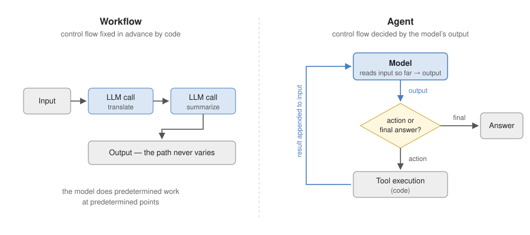
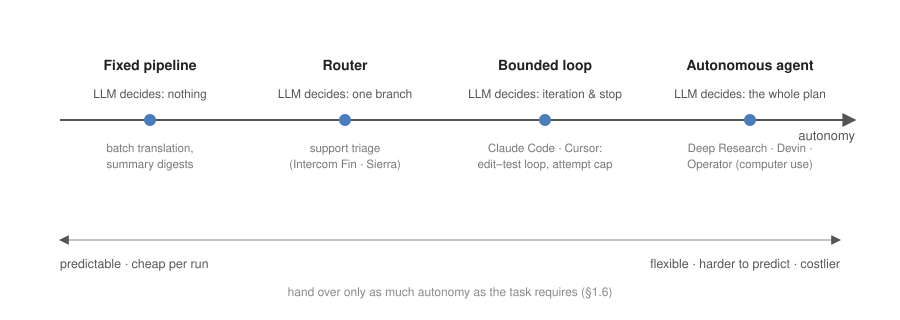

# Chapter 1. What is an Agent?

## 1.1 An Observation — Same Model, Different Work

Chatbots of around 2022 received a user's question, generated a single answer, and ended the interaction. Systems that appeared afterward behave differently. Deep Research, given a topic, searches and reads dozens of web pages on its own and produces a synthesized report. Claude Code, given a bug report, reads the code, edits it, runs the tests, and when they fail, analyzes the cause and edits again.

This difference did not come from changing the model. The same model serves on one side as a chatbot and on the other as a component of Deep Research or Claude Code. What separates the two is not the model but the program surrounding the model. To determine what in that program separates a chatbot from an agent, the first step is to establish what an LLM call itself can and cannot do.

## 1.2 Definition — Where Control Flow Resides

An **LLM (large language model)** is an autoregressive generative model trained on large text corpora with the objective of next-token prediction. Autoregressive means that the model computes a probability distribution over the next token conditioned on the tokens generated so far, samples one token from it, and repeats this process to produce text. An LLM call therefore takes text in and returns text out, and has no other input or output channel. The model cannot open a file, cannot execute a search, and cannot verify whether its own output is factual. What it produces is a chain of tokens with high conditional probability, not an action on the external world.

Consequently, everything the model cannot do by itself — opening files, executing searches, validating output — is handled by code outside the model. That code decides which action to execute next, when to repeat, and when to stop. The totality of these decisions is called **control flow**.

The difference that separated the chatbot from Deep Research lies precisely in who holds the authority over this control flow.

- **Workflow** = a system whose control flow is fixed in advance by the developer's code. The LLM does predetermined work at predetermined points.
- **Agent** = a system whose control flow is determined by the LLM's output. The model chooses the next action.

This distinction was introduced by Anthropic's *Building Effective Agents* (2024) and is now standard usage. The criterion is not the system's capability but the location of decision authority. Having a search feature does not by itself make a system an agent. A pipeline that performs translation → summarization → storage in a fixed order remains a workflow even if it contains search. Conversely, the same search makes the system an agent when the model's output decides whether to search and with what query.

Translating the definition of an agent into an execution form yields the following iterative structure.

1. The model reads the input accumulated so far and generates an output.
2. Code interprets that output. If the output is an action directive, the code executes the action; if it is a final answer, the iteration terminates.
3. The execution result is appended to the model's input.
4. The model reads the updated input and generates the next output (return to step 1).

This iterative structure is called the **agent loop**, and it is implemented directly in Chapter 4. Deep Research and Claude Code differ in the form visible to the user, but the internal execution structure of both is this loop. The two systems differ only in which tools the loop holds and which instructions it follows; the skeleton of control is identical.

*Figure 1.1 — A workflow executes a path fixed in code; an agent's every next step is a branch taken by reading the model's output.*

## 1.3 Components

One iteration of the loop in 1.2 passes through the following steps. The model decides the next action; that decision refers to the given goal and constraints; code executes the decision; and the execution result remains as input for the next iteration. The parts responsible for each of these steps are the components of an agent, and in standard vocabulary they are as follows.

| Component | Why it is needed | Standard name |
|---|---|---|
| A model that makes decisions | Control flow must be decided by output | Model |
| Instructions that ground the decisions | Without what the goal is and what is permitted, decisions are meaningless | Instructions (system prompt) |
| Means to execute decisions | Text output alone cannot change the external world | Tools (→ Ch. 3) |
| A record of progress so far | Each iteration must decide on top of the previous iteration's result | Memory / Context (→ Ch. 9–10) |

These four elements appear under varying names across frameworks, and they are also what the labs of this course build week by week.

## 1.4 Autonomy — A Matter of Degree

The distinction in 1.2 placed decision authority on one side, code or model, but in real systems decision authority is not all-or-nothing. How many decisions are handed to the model is a matter of degree. **Autonomy** is the degree to which control-flow decisions are entrusted to the LLM's output rather than to the developer's code.

| Autonomy | Example | What the LLM decides |
|---|---|---|
| Fixed pipeline | Translate → summarize → store | Nothing |
| Router | Classify inquiries by type and dispatch to different handlers | One branch |
| Bounded loop | Edit code until tests pass (cap of 5 attempts) | Iteration and termination |
| Autonomous agent | "Research this topic and produce a report" | The entire plan |

Moving down the table, the system can handle problems that cannot be fixed in advance, but its behavior becomes harder to predict and the number of calls and the cost grow. Autonomy is a trade: flexibility is gained at the price of predictability and cost.

Real systems occupy every band of this spectrum. Batch translation and summary-digest pipelines leave the model no control-flow decision. Commercial support agents (Intercom Fin, Sierra) run between router and bounded loop: the model classifies the ticket, drafts the reply, and decides escalation, inside guardrails fixed by code. Coding agents (Claude Code, Cursor's agent mode) are the third row's bounded loop in production form — edit, run the tests, read the failure, edit again, under an attempt cap. At the far end, Deep Research (OpenAI, Google) and the software-engineering agent Devin are handed a whole task and produce the plan themselves, and computer-use agents (OpenAI's Operator, Anthropic's computer use) do the same with the screen and mouse as their action surface.

*Figure 1.2 — The autonomy spectrum with deployed systems placed on it; rightward, flexibility grows while predictability and per-run cost control shrink.*

The side that does not hand over decision authority — the workflow — also has an established design vocabulary. The following patterns for composing LLM calls are standard terms in framework documentation and papers, and later chapters of this course implement each of them.

| Pattern | Structure | Appears in |
|---|---|---|
| Prompt chaining | One call's output connected serially as the next call's input | Ch. 7 planning |
| Routing | Classify input and dispatch to different paths | Ch. 8 adaptive retrieval |
| Parallelization | Call in parallel on the same input, then aggregate | Ch. 2 self-consistency |
| Orchestrator–workers | A central call divides subtasks among subordinate calls | Ch. 6 multi-agent |
| Evaluator–optimizer | Alternate generation and evaluation | Ch. 5 reflection |

## 1.5 Form Factor — Independence from the Interface

The definition so far specifies only where control flow resides; it does not specify how the system meets people. The interface is independent of the internal structure, so the same agent can be deployed in different **form factors**.

| Form factor | Example | Unit of interaction |
|---|---|---|
| Conversational | ChatGPT, Claude — the chat products themselves | Exchange of messages |
| Delegated | Deep Research, Devin, cloud coding agents | Assign a task, review the deliverable |
| Embedded | GitHub Copilot, Cursor — inside the IDE | Assistance inside the workplace |
| Headless | an extraction step inside a data pipeline; a sub-agent inside another agent | API call (no human) |

The chatbot is not the definition of an agent but one of its form factors, and historically the first to appear. What this course covers is the internal structure common to all four forms.

## 1.6 Adoption Criteria

Since autonomy is a trade, choosing between an agent and a workflow becomes the problem of identifying the conditions under which the trade pays off. An agent is advantageous when flexibility is genuinely required: open problems whose solution path cannot be fixed in code beforehand, multi-step tasks that pass through several tools, and work that can improve from feedback on intermediate results. Conversely, when the procedure is fixed, a workflow is cheaper and more stable. When error tolerance is low and there is no means to verify results, handing over decision authority is itself a risk, and a single-turn question-answer task needs no iterative structure.

For the same problem, therefore, no single level of autonomy is uniquely correct. The governing principle is to hand over only as much autonomy as the task requires, and this principle is reexamined from the cost perspective in inference economics (→ Ch. 12) — for well-structured tasks, a fixed workflow can be cheaper than a complex agent and still sufficient.

## 1.7 Organization of the Course

As established in 1.2, an LLM call takes text in and returns text out, and nothing more. From this follow the deficits that must be filled to build an agent, and those deficits form the organization of this course.

- The model cannot act → tools (Ch. 3), the agent loop (Ch. 4)
- The model does not know when it is wrong → reflection and evaluation (Ch. 5), planning and search (Ch. 7)
- Tasks too large for a single agent are divided among several → multi-agent systems (Ch. 6)
- The model knows nothing after its training cutoff and nothing inside an organization → retrieval augmentation (Ch. 8), memory (Ch. 10)
- Iteration accumulates input without bound → context management (Ch. 9)
- The caller's procedures migrate into the model's weights → reasoning models (Ch. 11)
- Accumulated capability multiplies inference cost → inference economics (Ch. 12); capability must be measured against that cost → benchmarks (Ch. 13)
- A system that acts becomes an attack surface → security (Ch. 14)

The order of the chapters is the arc of the course. The first half builds one complete agent and disciplines it: reasoning as the raw material (Ch. 2), tools as its hands (Ch. 3), the loop that assembles the first agent (Ch. 4), then the feedback and measurement that make its improvement claimable (Ch. 5), and finally scale — several agents (Ch. 6) and paths planned rather than stumbled into (Ch. 7) — before the midterm. The second half grounds the agent in knowledge it does not have (Ch. 8–10) and turns it into an operated system (Ch. 11–14).

Labs run as one self-contained Colab notebook per week. From week 3 onward the labs adapt Andrew Ng's *Agentic AI* modules, with one course-built lab (week 4, the loop built by hand); weeks 1–2 cover prompting practice. This chapter's lab is the first API call and prompting fundamentals.

## 1.8 Discussion

Each question is answerable with this chapter's definitions; several return as design decisions in later chapters.

1. A nightly job sends every new arXiv abstract in your field to an LLM, stores the summaries, and mails a digest. A support bot reads each incoming ticket and decides whether to answer, refund, or escalate to a human. Classify each as workflow or agent by the criterion of 1.2, and name the single decision that settles the classification.
2. A RAG chatbot always retrieves the top five passages for the user's question and answers from them, in a fixed sequence. Is it an agent under 1.2? State the smallest change that would flip your answer.
3. A team proposes "a fully autonomous agent that answers all customer email." Using 1.4 and 1.6, argue for the lowest autonomy level that serves the goal, and name one observed failure that would justify moving up exactly one level.
4. Pick one agentic product you have used (1.4–1.5 name several). Identify its form factor, fill in its four components from the table in 1.3, and give one control-flow decision its model makes and one that its code fixes.
5. The same model serves as a chatbot and as a component of Deep Research (1.1). If the weights are identical, where does the added capability come from — and which components of 1.3 supply it?

**Presentation.** There is no paper presentation this week. Presentations begin in week 2; presenter assignment and format guidance take place during orientation.

**Lab.** `W1_lab_setup.ipynb` — a Colab notebook: paste an API key into the setup cell and make first model calls through aisuite; examine message roles, statelessness, and temperature; then write a system prompt that forces every answer into clean JSON (checked PASS/FAIL by the notebook). Reference answers: `labs/checkpoints/week01/solution.py`.
