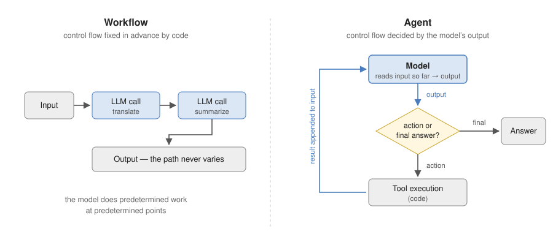

<!-- course-navigation:start -->
<nav class="chapter-nav" aria-label="Course navigation">
<a href="../../index.html">Home</a>
<a href="../reading.html">All chapters</a>
<a href="../../week01.html">Week 1 materials</a>
</nav>
<!-- course-navigation:end -->

<button id="classroom-toggle" type="button" aria-pressed="false">Larger text</button>
<button id="answers-toggle" type="button" aria-pressed="false">Show all answers</button>

::: {.callout-note appearance="minimal"}
## Learning objectives

- Define a token and a large language model (LLM), and explain how an LLM generates text.
- Explain what one model call receives and returns.
- Define an agent, and explain the roles of the model and the program.
- Name the four components of an agent.
- Explain the difference between a workflow and an agent.
- Select an amount of autonomy for a task.
:::

A language model receives text and returns text. Many tasks need more than text. For example, "Reserve a study room" needs a change in a reservation system, and a written reply cannot make that change. This chapter explains how a system around the model can act and use the results.

## 1.1 Language models and model calls {#model-call}

An agent uses a language model to read a task and to write its next step. This section defines the model and the unit of text that it uses.

::: {.callout-tip icon=false}
## Token

The unit of text that a language model reads and writes. A **tokenizer** divides text into tokens. A token can be a word, a part of a word, a number, or a punctuation mark.
:::

A frequent word is usually one token. A long or rare word can become several tokens. In English text, 100 tokens are about 75 words.

::: {.callout-tip icon=false}
## Large language model (LLM)

A neural network that predicts the next token of a text. It learns this prediction from a very large amount of text.
:::

An LLM generates text one token at a time:

1. The tokenizer divides the input text into tokens.
2. The model calculates a probability for each possible next token.
3. The model selects one token and adds it to the input.
4. Steps 2 and 3 repeat until the model writes an end token or the output gets to a length limit.

A **chat model** is an LLM with more training to follow instructions and to reply in a conversation. The models in this course are chat models.

The input to one call is the **prompt**. It can contain instructions, the request of the user, documents, and earlier messages. The information that one call receives is its **context**.

A chat model receives the prompt as a list of **messages**. Each message has a **role** that shows who wrote it:

- A **system** message gives the instructions for the whole conversation.
- A **user** message gives a request.
- An **assistant** message is an earlier reply of the model.

Chapter 3 adds a fourth role, **tool**, for the result of a tool.

The program sends the messages to the model provider through an **API**: a service that other programs call over the network. The provider counts the tokens of the input and of the output. The cost and the time of a call grow with these numbers. The **context window** is the maximum number of tokens that one call can process (Chapter 9).

A model call has four properties:

1. **It writes text only.** The model can write an explanation, a plan, or a request for an operation. It cannot do the operation.
2. **It keeps no memory between calls.** A second call does not know the first call. To continue a conversation, the program sends the earlier messages again.
3. **Its output can vary.** In step 3, the model can select a token that is not the most probable one. An option called **temperature** controls this variation.
4. **It can be wrong with confidence.** The model can write a fluent statement that is false. This is a **hallucination**. For this reason, an agent checks important facts with tools, with documents, and with evaluation (Chapters 3, 5, and 8).

For this reason, a model call alone cannot complete a task that needs actions. The next section adds the parts that do the actions.

## 1.2 Agent {#agent}

::: {.callout-tip icon=false}
## Agent

A system that uses the available information to select actions toward a goal. In an **LLM-based agent**, the model selects the actions, and the program runs them and returns the results.
:::

An agent works in four steps:

1. The program gives the task and the latest results to the model.
2. The model selects the next action, or it writes the final answer.
3. The program runs the selected action.
4. The result becomes part of the input for the next call.

These steps repeat. This repetition is the **agent loop**. The loop stops when the model writes the final answer, or when the number of steps gets to a limit.

The agent is the whole system. The model is one part of it. The model decides what to do. The program does the actions and keeps the results.

## 1.3 Components {#components}

To build an agent, you must know its parts. An agent has four components:

| Component | Role |
|--|------|
| Model | Reads the context, and writes a reply or a request for an action |
| Instructions | Tell the model how to do the task, for example "Report a reservation only after the service confirms it" |
| Tools | Functions or services that the program runs for the model, for example a room search or a reservation |
| Memory | Information that the program keeps between steps, for example the request and the results so far |

A tool is code that the program runs. An instruction cannot replace a tool. Memory helps a call only when the program puts it into the context of that call.

::: {.checkpoint}
### Check 1 · Instruction or tool?

A program has a room search tool but no reservation tool. Can the instruction "You can make reservations" make the agent book a room?

Read the answer

No. The program needs a reservation tool. An instruction changes what the model reads. It does not add an operation.

:::

## 1.4 Workflows and agents {#control-flow}

Many systems make several model calls. Not all of them are agents. The difference is the part that selects the next step.

**Control flow** is the order of the operations in a program, with its branches, repetitions, and stop conditions.

- In a **workflow**, code sets the control flow before the run. The model does fixed work at fixed points.
- In an **agent**, the output of the model selects the next step. The result of each step goes back into the input.

{#fig-workflow-agent width="100%" fig-alt="Workflow: Input, LLM call, LLM call, Output, with a fixed path. Agent: the model reads the input, then selects an action or a final answer; tool execution appends the result to the input."}

**Autonomy** is the set of decisions that a system makes without a new instruction from a person. A workflow gives the model few decisions. An agent gives the model more decisions.

Five workflow patterns are common:

| Pattern | Organization |
|--|------|
| Prompt chaining | Each step uses the output of the step before it. |
| Routing | A first step classifies the input and selects a path. |
| Parallelization | Independent calls run at the same time, and a last step combines the results. |
| Orchestrator–workers | One model divides the task and gives the parts to other calls. |
| Evaluator–optimizer | One call examines a result, and another call revises it. |

Andrew Ng names four design patterns of agentic systems: tool use, reflection, planning, and multi-agent collaboration. Chapters 3 to 7 study these patterns. Chapters 8 and 9 add retrieval from documents and the management of the context.

## 1.5 How much autonomy {#autonomy-and-completion}

More autonomy gives more flexibility, and it also gives more points where the model can make a wrong decision. Select the autonomy that the task needs:

- If you know the steps before the run, use a workflow.
- If the results of a step change what to do next, give that decision to the model.

In both cases, the program sets the limits. It sets the tools that the model can use, and it sets a **stop condition**: a rule that ends the run. A task is complete only when a result from a tool shows it, for example a reservation confirmation.

::: {.checkpoint}
### Check 2 · Workflow or agent?

Code tries room R12. If the reservation fails, code tries room R18. Then a model writes the confirmation message. Is this a workflow or an agent?

Read the answer

A workflow. Code selects each step. The model only writes the message at a fixed point.

:::

## Summary {#recap}

- A token is a unit of text. An LLM generates text one token at a time: it predicts the next token from the tokens before it.
- One model call receives a list of messages with roles and returns text. It keeps no memory between calls, and its output can be wrong.
- An agent is a system in which the model selects actions and the program runs them and returns the results.
- An agent has four components: a model, instructions, tools, and memory.
- In a workflow, code selects the next step. In an agent, the model selects it.
- Give the model only the decisions that the task needs, and let a tool result show completion.

## Lab preparation: from concept to code {#implementation}

The lab uses the `aisuite` client. One call sends a list of messages and returns a reply.

| Concept | Lab code (short form) |
|--|-------|
| One model call | `client.chat.completions.create(model=MODEL, messages=messages)` |
| Reply text | `response.choices[0].message.content` |
| Instructions | `{"role": "system", "content": "Answer in one sentence, for a graduate ML audience."}` |
| Request of the user | `{"role": "user", "content": QUESTION}` |
| Memory of a conversation | `conversation.append({"role": "assistant", "content": reply})`, then send the whole list again |
| Temperature | `temperature=0.0` and `temperature=1`: the same prompt five times |
| Output format | `response_format={"type": "json_object"}`, then `json.loads` |
| Tokens and cost | `response.usage.prompt_tokens`, `response.usage.completion_tokens` |

## Lab {#lab-guide}

1. Make one model call, and read the reply.
2. Add a system message, and compare the two replies.
3. Send a second call without the history, and then with the history.
4. Send the same prompt five times at two temperatures.
5. Ask for JSON, and parse the reply with code.

[Lab notebook in Colab](https://colab.research.google.com/github/ralbu85/stml_2026/blob/main/lectures/week01/W1_lab_setup.ipynb)

## Materials and sources {#readings}

- [Anthropic — Building effective agents](https://www.anthropic.com/engineering/building-effective-agents): workflows, agents, and the five workflow patterns.
- [Hugging Face — What are agents?](https://huggingface.co/docs/smolagents/conceptual_guides/intro_agents): degrees of model control over the program flow.
- [Andrew Ng — Agentic AI](https://www.deeplearning.ai/courses/agentic-ai): tool use, reflection, planning, and multi-agent collaboration.

<!-- course-pagination:start -->
<nav class="chapter-pagination" aria-label="Previous and next chapters">
<a href="../week02/notes.html" rel="next">Next →: 2 · Prompting &amp; Reasoning</a>
</nav>
<!-- course-pagination:end -->
