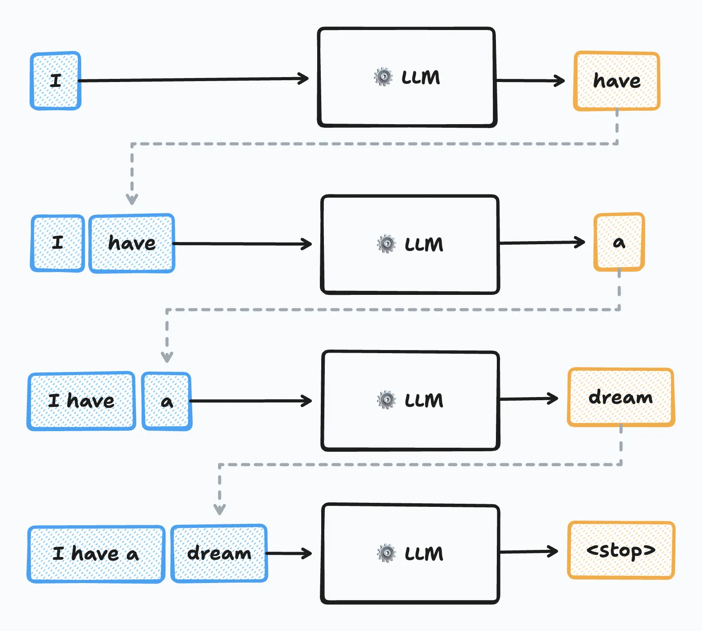

## Same Model, Different Work

Chatbots of around 2022 received a question, generated one answer, and ended the interaction. Systems that appeared afterward behave differently:

- **Deep Research** — given a topic, searches and reads dozens of web pages on its own and produces a synthesized, cited report.
- **Claude Code** — given a bug report, reads the code, edits it, runs the tests; when they fail, analyzes the cause and edits again.

This difference did not come from changing the model — **the same model serves on every side**. What separates them is the *program surrounding the model*.

To find what in that program separates a chatbot from an agent, we first need to establish what an LLM call itself can and cannot do.

<!-- 훅: 셋 다 같은 모델. 차이는 모델 밖 프로그램 — 여기서 1장 전체가 출발 -->

## The LLM, Defined

**LLM (large language model)** = an autoregressive generative model trained on large text corpora with the objective of next-token prediction.

*Autoregressive* means the model:

1. computes a probability distribution over the **next token**, conditioned on the tokens so far;
2. samples one token from that distribution;
3. appends it and repeats — until the text is complete.

That is the entire mechanism. Everything a chat product appears to do — answering, summarizing, "reasoning" — is this loop of predict → sample → append.

## One Call, as a Machine

{height=72%}

[Each output token is appended to the input and fed back, until a stop token. Source: P.-M. Dartus, *How LLMs Generate Text for the Rest of Us* (2025), pm.dartus.fr.]{style="font-size:0.55em"}

## What One Call Cannot Do

An LLM call takes **text in and returns text out — and has no other input or output channel.** By itself it cannot:

- open a file,
- execute a search,
- verify whether its own output is factual.

What it produces is a chain of tokens with *high conditional probability* — not an action on the external world.

Consequently, everything the model cannot do — opening files, executing searches, validating output — is handled by **code outside the model**. That code decides which action to execute next, when to repeat, and when to stop.

**Control flow** = the totality of these decisions.

## Workflow and Agent, Defined

The difference between the chatbot and Deep Research lies in *who holds authority over control flow*:

- **Workflow** = a system whose control flow is fixed in advance by the developer's code. The LLM does predetermined work at predetermined points.
- **Agent** = a system whose control flow is determined by the LLM's output. The model chooses the next action.

Introduced by Anthropic's *Building Effective Agents* (2024); now standard usage.

The criterion is **not capability but the location of decision authority.** Having a search feature does not make a system an agent.

## The Criterion, Applied

The same search feature, in two systems:

- A pipeline that performs *translate → summarize → store* in a fixed order remains a **workflow**, even if it contains search — the model decides nothing about the path.
- The same search makes the system an **agent** when the model's output decides *whether* to search and *with what query* — the branch is taken by reading the model's output.

Having a capability is not the test. **Deciding is.**

## Workflow versus Agent

{width=88%}

## The Agent Loop

Translating the agent definition into an execution form gives an iterative structure:

1. The model reads the input accumulated so far and **generates an output**.
2. Code **interprets** that output — an action directive is executed; a final answer ends the iteration.
3. The execution result is **appended** to the model's input.
4. The model reads the updated input and generates the next output (back to 1).

Which iteration the loop ends on is determined by the results — it is written nowhere in the code.

Deep Research and Claude Code differ in tools and instructions, but the internal execution structure of both is this loop — **the skeleton of control is identical.** (We build it by hand in Chapter 4.)

## The Loop, Watched Live

What a Claude Code session prints, turn by turn:

- a line of judgment — *"tests fail in `parse_date`; the regex misses two-digit years"*
- a tool call — edit the file, run the test suite
- the result — a failing or passing log, appended to the record
- repeat — until the tests pass, or the attempt cap is reached

That visible transcript **is** the agent loop of the previous slide, running in a shipped product. When we debug agents in Week 4, this record — the *trace* — is what we read.

<!-- 시연: 실제 Claude Code/Cursor 화면을 여기서 잠깐 보여주면 효과적 -->

## Components

One iteration of the loop needs four things: a decision, grounds for the decision, a way to execute it, and a record of progress. The parts responsible are the components of an agent:

| Component | Why it is needed |
|:--|:--|
| **Model** | control flow must be decided by its output |
| **Instructions** (system prompt) | without the goal and what is permitted, decisions are meaningless |
| **Tools** | text output alone cannot change the external world |
| **Memory / Context** | each iteration must decide on top of the previous result |

The names vary across frameworks; the four parts do not. The labs build them week by week (Ch. 2 · 3 · 9–10).

## Autonomy — a Matter of Degree

In real systems, decision authority is not all-or-nothing.

**Autonomy** = the degree to which control-flow decisions are entrusted to the LLM's output rather than to the developer's code.

Moving toward higher autonomy, the system can handle problems that cannot be fixed in advance — but its behavior becomes harder to predict, and the number of calls and the cost grow.

**Autonomy is a trade: flexibility, bought with predictability and cost.**

## The Four Bands

| Autonomy | Example | What the LLM decides |
|:--|:--|:--|
| Fixed pipeline | translate → summarize → store | nothing |
| Router | classify inquiries, dispatch to handlers | one branch |
| Bounded loop | edit code until tests pass (cap of 5) | iteration and termination |
| Autonomous agent | "research this topic, produce a report" | the entire plan |

Every band is occupied by shipping products. The next four slides take the bands in this order — one band each: what the service does, and which decisions it holds — and a fifth looks past the far end.

## Real Systems on the Spectrum

{width=96%}

## Band 1 — Fixed Pipeline

**Document pipeline** = a feature that runs every input through the same fixed sequence of LLM calls. A meeting recording becomes a transcript, then a summary, then a list of action items — that order, every time.

Shipped as meeting-notes and summarization features: Otter.ai, Granola, Zoom AI Companion, Notion AI, and the "summarize this thread" button in most productivity software.

- The LLM writes the summary; it does not decide that a summary is what comes next. Predetermined work at predetermined points.
- No branch exists to take: the same recording always visits the same steps in the same order.
- Under today's definition this is a **workflow** — control flow fixed in advance by code, however good the writing is.

Worth stating plainly: most shipping "AI features" are this band, not the ones that follow.

## Band 2 — Router

**Triage** = a system that reads an incoming request, assigns it to one of a fixed set of categories, and dispatches it to that category's handler — a template reply, a specialist queue, or a human.

Shipped in customer service (Intercom Fin, Sierra, Zendesk intelligent triage), and inside LLM products themselves, where a request is routed to a cheap or an expensive model by difficulty.

- The model makes exactly **one** control-flow decision: which branch. Everything after the branch is ordinary code.
- The branch set is fixed by the developer. The model chooses among the categories; it cannot invent a new one.
- One decision is enough to cross the line — the path is taken by reading the model's output, so this is already an agent, the smallest one.

Where a router grows into the next band: when the chosen handler itself loops — draft the reply, check it against refund limits, escalate if the check fails.

## Band 3 — Bounded Loop

**Coding agent** = a development tool that receives a bug report or feature request in ordinary language, then reads the repository, edits files, and runs the test suite on its own until the work is done or the attempt cap stops it.

Sold in four packagings: Claude Code (a terminal program), Cursor agent mode (inside the IDE), Devin (a hosted service that opens pull requests), GitHub Copilot (inside the editor).

- The band's loop, productized: **edit → run tests → read the failure → edit again**. The model decides how many iterations to spend and when the work is finished.
- The cap is the one number code fixes, because the loop cannot be trusted to always terminate — a run that cannot fix the bug must stop and report, not spin forever.
- Guardrails live in code, not in the model: permission prompts before running commands, caps on attempts, restricted directories.

Same model as the chat products. The loop, the tools, and the guardrails are the whole difference.

## Band 4 — Autonomous Agent

**Deep Research** = a mode of a commercial chat product in which the user submits one research question and receives, minutes later, a written report with source citations — the web browsing in between running unattended.

Shipped by OpenAI (2025) and Google Gemini (2024); Perplexity runs a lighter variant. Devin's ticket-to-pull-request run belongs to this band as well.

- Across those minutes the model decides the entire plan: *which searches to run, which pages to open, which to trust, when the evidence suffices.*
- The user cannot steer during the run — this is autonomy **inside a delegated task**, not an unbounded system.

One detail to hold for Chapter 7: these products draw up a research plan first, and some let the user edit it before execution — a control surface exactly where planning theory says it belongs.

## Computer Use — the Autonomous Band's Far Edge

**Computer use** = a system handed a browser or a virtual desktop and a goal stated in words, which then operates that machine as a person would — reading the screen, moving the cursor, clicking, typing — to carry out the task in ordinary web applications.

OpenAI Operator (2025), Anthropic computer use (2024). A booking or a form submission is a representative errand.

- Band 4 decides the plan within a fixed set of tools. Here the tool surface is the **screen itself**, so the set is no longer enumerated: whatever a browser can do is in scope.
- The price is the autonomy trade at full strength: slow, expensive, hardest to predict — which is why these ship with confirmation prompts for consequential actions.

A reading habit for any agent product: ask *which decisions belong to the model, and which are fixed by code around it.* That question is the whole of this chapter.

## Workflow Patterns

The side that does **not** hand over decision authority also has an established design vocabulary. Five patterns cover most LLM-call compositions — and this course implements each one:

| Pattern | Structure | Appears in |
|:--|:--|:--|
| Prompt chaining | one call's output → next call's input | Ch. 7 planning |
| Routing | classify input, dispatch to paths | Ch. 8 retrieval |
| Parallelization | parallel calls on one input, aggregate | Ch. 2 self-consistency |
| Orchestrator–workers | a central call divides subtasks | Ch. 6 multi-agent |
| Evaluator–optimizer | alternate generation and evaluation | Ch. 5 reflection |

## Patterns in Production

The same five patterns, spotted in shipped systems:

- **Orchestrator–workers** — Anthropic's research feature: a lead agent decomposes the question and spawns parallel searchers.
- **Evaluator–optimizer** — every coding agent's edit ↔ test cycle: generate a fix, let the tests evaluate it.
- **Routing** — support triage: which tickets the bot resolves, which reach a human.
- **Parallelization** — premium "parallel thinking" tiers: several candidate solutions, then selection.
- **Prompt chaining** — fixed document pipelines: translate, then summarize, then store.

## Form Factor, Defined

The definition of an agent specifies where control flow resides — it says nothing about how the system meets people. The interface is independent of the internal structure.

**Form factor** = the deployment shape of an agent: how it is packaged for interaction.

| Form factor | Example | Unit of interaction |
|:--|:--|:--|
| Conversational | ChatGPT, Claude | exchange of messages |
| Delegated | Deep Research, Devin | task in, deliverable out |
| Embedded | GitHub Copilot, Cursor | assistance inside the workplace |
| Headless | a sub-agent inside another agent | API call, no human |

## The Four Forms, Explained

- **Conversational** — turn-by-turn; a human steers at every step. The oldest form, and the one autonomy suits least: the human is already in the loop.
- **Delegated** — assign a task, review the deliverable. Where the highest autonomy lives: Deep Research's run, Devin's ticket, a cloud coding agent's PR.
- **Embedded** — the agent lives inside the workplace (IDE, document editor) and acts in place: Copilot's suggestions, Cursor's in-editor edits.
- **Headless** — no human interface at all: a pipeline step, or one agent serving as another agent's tool (→ Ch. 6).

**The chatbot is not the definition of an agent — it is one form factor, historically the first.** This course covers the internal structure common to all four.

## Adoption Criteria

An agent is advantageous when **flexibility is genuinely required**:

- open problems whose solution path cannot be fixed in code beforehand;
- multi-step tasks that pass through several tools, order unknown upfront;
- work that improves from feedback on intermediate results.

Conversely, a **workflow** is cheaper and more stable when the procedure is fixed; when error tolerance is low and there is no means of verification, handing over decision authority is itself a risk; a single-turn question–answer task needs no iteration at all.

**The governing principle: hand over only as much autonomy as the task requires.** (Reexamined as a cost question in Ch. 12.)

## When Not to Build an Agent

Three requests that deserve a workflow:

- *"Summarize every incoming report in this fixed format."* — The procedure never varies; an agent adds cost and variance, nothing else.
- *"Answer FAQ questions from this list."* — Single turn; there is nothing for a loop to decide.
- *"Transfer money when a customer asks."* — Errors are costly and there is no verification step; decision authority itself is the risk.

A practical checklist before splitting:

1. Can the procedure be written down in advance? → workflow.
2. Is there a way to verify results? If not → lower the autonomy.
3. Several tools, order unknown upfront? → agent territory.
4. What does one failure cost? → that sets the bound and the guardrails, in code.

## The Course, From the Deficit List

An LLM call is text in, text out — and each deficit of that bare call is repaired by one part of this course:

- the model cannot **act** → tools (Ch. 3) · the agent loop (Ch. 4)
- it does not know when it is **wrong** → reflection & evaluation (Ch. 5) · planning & search (Ch. 7)
- tasks outgrow **one agent** → multi-agent systems (Ch. 6)
- it knows nothing past its **training cutoff** → RAG (Ch. 8) · memory (Ch. 10)
- iteration accumulates input **without bound** → context engineering (Ch. 9)
- the caller's procedures **migrate into the weights** → reasoning models (Ch. 11)
- capability **multiplies cost** → inference economics (Ch. 12) · benchmarks (Ch. 13)
- a system that acts is an **attack surface** → security (Ch. 14)

## The Arc

- **First half (W2–W7)** — build one complete agent and discipline it: reasoning as raw material → tools → the loop → feedback and measurement → several agents → planned paths.
- **Midterm (W8)** — written exam over weeks 1–7.
- **Second half (W9–W13)** — ground the agent in knowledge it does not have, and turn it into an operated system.
- **Final (W14–15)** — a research-assistant agent over this course's own paper corpus, demonstrated and defended with its evaluation scorecard.

## Chapter 1 in Seven Terms

- **LLM** — autoregressive next-token generator; text in, text out, nothing else.
- **Control flow** — the decisions: next action, repetition, termination.
- **Workflow** — control flow fixed in advance by code.
- **Agent** — control flow decided by the model's output.
- **Agent loop** — generate → interpret → execute → append → repeat.
- **Autonomy** — how many control-flow decisions the model holds; a flexibility ↔ predictability/cost trade.
- **Form factor** — how the system meets people; independent of the internals.

## Discussion — Classify Two Systems

- A nightly job sends every new arXiv abstract in your field to an LLM, stores the summaries, and mails a digest.
- A support bot reads each incoming ticket and decides: **answer it, refund the customer, or escalate to a human.**

Which is the agent — and what single decision settles the classification?

<!-- 정답 축: 결정권의 위치. 다이제스트 잡 = 모델이 아무 분기도 결정하지 않음(고정 절차 안의 LLM 호출). 티켓 봇 = 분기(응답/환불/이관)가 모델 출력으로 결정 -->

## Discussion — Two Boundary Cases

**The RAG chatbot.** It always retrieves the top five passages for the question, then answers from them, in a fixed sequence.

- Agent or workflow, under today's definition?
- What is the *smallest* change that would flip your answer?

**The lowest sufficient autonomy.** A team proposes "a fully autonomous agent that answers *all* customer email."

- Argue for the lowest autonomy level that serves the goal.
- Name one observed failure that would justify moving up exactly one level.

<!-- RAG: 고정 시퀀스 = 워크플로. 최소 변화 = 검색 여부·질의를 모델이 결정 (Ch. 8 adaptive retrieval 예고). 이메일: 라우터(분류→템플릿/이관)부터 시작, 실패 관찰 후 한 단계씩 -->

## Discussion — Products, Dissected

- Pick one agentic product you have used. Identify its **form factor**, fill in its **four components**, and give one control-flow decision its **model** makes — and one its **code** fixes.
- The same model serves as a chatbot and as a component of Deep Research. If the weights are identical, **where does the added capability come from** — and which of the components supply it?

(These five questions are notes §1.8 — they return as exam material.)

## This Week's Lab · Next Week

`W1_lab_setup.ipynb` — Google Colab, about 80 minutes:

- paste your API key into the setup cell (**API Setup guide first**);
- first calls through `aisuite`; message roles, statelessness, temperature;
- final task: a system prompt that forces clean JSON — checked PASS/FAIL.

Download it from the Week 1 page of the course site, then upload it to Colab (**File → Upload notebook**).

**Next week — where Chapter 2 starts:** the same model, the same question, different accuracy:

- *"23 apples, 20 used, 6 bought — answer only"* → **27** (wrong)
- the same question, worked solution demanded → 23−20=3, 3+6=9 → **9** (correct)

Why *writing* changes correctness — the model's only workspace is the text itself.
