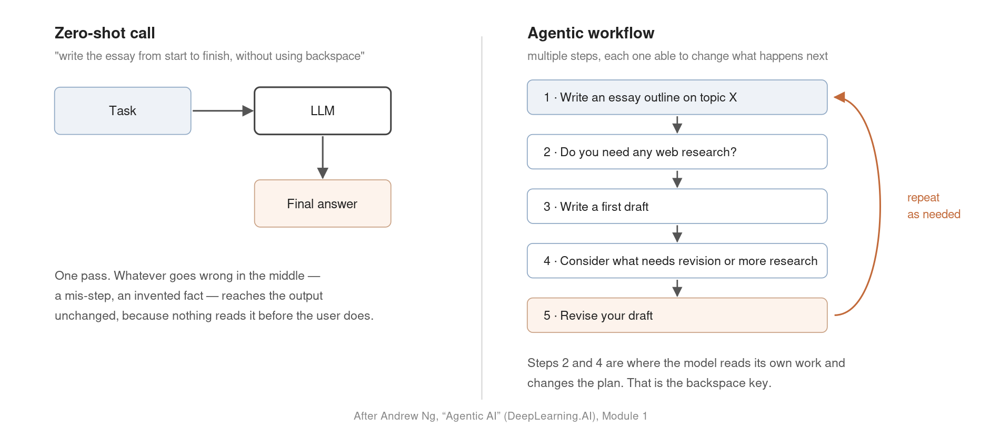
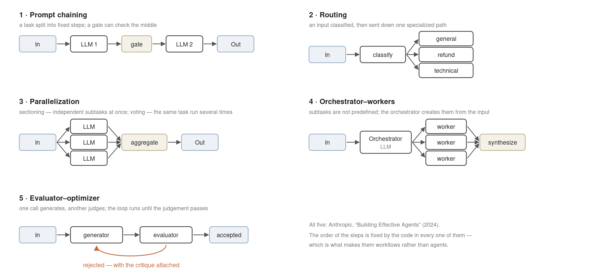
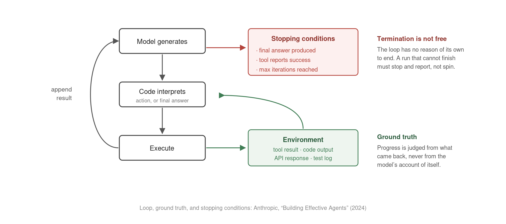

## Session Overview

This session assembles one design guide out of four sources that have converged on the same architecture: **Andrew Ng** (DeepLearning.AI), **Anthropic**, **OpenAI**, and **Hugging Face**.

The subject is not a new model. It is the program built around an existing one:

- what a single call cannot do, and what the surrounding code must therefore decide;
- how much of that decision to hand over, and by what measure;
- the components, the workflow patterns, and the design patterns that make the handover work.

Where the sources disagree — and they do, on the definition itself — this deck says so and states which position the course takes.

<!-- 도입: 새 모델이 아니라 모델을 감싸는 프로그램이 주제라는 것을 먼저 못박기 -->

## Agenda

| Part | Subject | Slides |
|:--|:--|:--|
| **1** | Understanding the agentic paradigm — zero-shot to agentic workflow | 1–7 |
| **2** | The definition of an agent and the autonomy spectrum | 8–12 |
| **3** | The four core components of an agentic system | 13–17 |
| **4** | Anthropic's five workflow patterns | 18–23 |
| **5** | Ng's four agentic design patterns | 24–28 |
| **6** | Domain evidence and the conditions for success | 29–30 |

Parts 1 and 2 settle what an agent is. Parts 3 to 5 are the construction vocabulary. Part 6 is the evidence and the safety boundary.

## The Agentic Paradigm {.divider}

[Part 1 · Slides 1–7]{.eyebrow}

## Deep Research versus Claude Code

Two products, the same class of underlying model, entirely different work:

- **Deep Research** (OpenAI, Google) — given a topic, searches and reads dozens of web pages on its own and returns an analyst-grade report with citations.
- **Claude Code** — given a bug report, moves through a local codebase, runs the test suite in a terminal, reads the failures, and edits again.

Neither capability came from changing the weights. It came from the **tools** each one was given and the **loop** each one was placed in.

This is the chapter's premise: specialized value is created outside the model.

<!-- 훅: 같은 모델. 차이는 도구와 루프 — 여기서 1장 전체가 출발 -->

## The Limit of Asking for a Finished Answer

**Zero-shot call** = one prompt, one response, session over. The answer arrives immediately, and an error made anywhere in the middle arrives with it, uncorrected — nothing read the output before the user did.

**Agentic AI workflow** = a process in which an LLM-based application executes multiple steps to complete a task. [(Ng, DeepLearning.AI)]{style="font-size:0.7em"}

The steps are the point: plan → research → draft → revise, each one able to change what happens next.

Quality is not extracted from a better single guess. It is accumulated across passes.

## Writing Without a Backspace Key

{width=92%}

## The Backspace Argument

Ng's image for the zero-shot demand: *"type out an essay on topic X from start to finish in one go, **without using backspace**."*

- **How people actually work.** A rough draft goes down first. Sources are checked against it. Sentences are cut, moved, and rewritten many times before anything is finished.
- **What the architecture owes the model.** Not a sharper instruction to get it right the first time, but a system in which it can delete and rewrite — a revision loop.

No competent human writer works under the constraint we routinely impose on the model.

## The Definition Dispute

The industry does not agree on what counts as an agent, and the disagreement is load-bearing.

- **Anthropic — a binary.** *Workflows* are systems where LLMs and tools are orchestrated through predefined code paths. *Agents* are systems where LLMs dynamically direct their own processes and tool usage.
- **Hugging Face — a continuum.** smolagents rejects the binary in as many words: *"'agent' is not a discrete, 0 or 1 definition: instead, 'agency' evolves on a continuous spectrum, as you give more or less power to the LLM on your workflow."*

The unresolved case: **routing**. Anthropic files it under workflows. smolagents places a router on the agency scale, because the model's output already chooses the branch.

## Degrees of Agenticness

Ng ends the argument by declining it:

> *"Rather than arguing over which work to include or exclude as being a true agent, we can acknowledge that there are different degrees to which systems can be agentic."*

**This course takes that position.** Agenticness is a continuous property, not a badge a system either holds or does not.

What it buys in design terms: the question stops being *"is this an agent?"* and becomes *"how much of the control flow have I handed over, and is that the amount this task and this risk tolerance warrant?"* — a dial tuned per system, rather than a label argued over.

## The Definition and the Autonomy Spectrum {.divider}

[Part 2 · Slides 8–12]{.eyebrow}

## Control Flow

**Control flow** = the decisions that determine what a program does next: which function to execute, which tool to load, whether to repeat, when to stop.

- **Conventional control.** Every path is fixed by the developer's `if`/`else` before the program runs. The set of reachable states is known at write time.
- **Agentic control.** The path is decided at run time by reading the model's output. Which function fires, which tool is loaded, and when the loop ends are determined by tokens that did not exist when the code was written.

Agency is measured by how far the model's output reaches into that flow. That is the axis for the rest of Part 2.

## Levels of Agency

smolagents grades the axis and names each level with the code that implements it.

| Agency | What the LLM output does | Name | Example code |
|:--|:--|:--|:--|
| ☆☆☆ | has no impact on program flow | Simple processor | `process_llm_output(llm_response)` |
| ★☆☆ | controls an if/else switch | Router | `if llm_decision(): path_a() else: path_b()` |
| ★★☆ | controls function execution | Tool call | `run_function(llm_chosen_tool, llm_chosen_args)` |
| ★★☆ | controls iteration and continuation | Multi-step agent | `while llm_should_continue(): execute_next_step()` |
| ★★★ | starts another agentic workflow | Multi-agent | `if llm_trigger(): execute_agent()` |
| ★★★ | acts in code, defining its own tools | Code agent | `def custom_tool(args): ...` |

The **code column** is the instrument: the distance between two levels is one line. A router is an `if`; a multi-step agent is a `while`. [Source: Hugging Face, smolagents conceptual guide.]{style="font-size:0.6em"}

## Levels of Agency, on One Axis

{width=96%}

Everything this course builds from Chapter 4 onward lives inside that `while`.

## Ng's Three Autonomy Bands

Six levels are for design. Three bands are for deciding, and for talking to people who will not read the code.

| Band | What holds |
|:--|:--|
| **Less autonomous** | All steps predetermined, all tool use hard-coded. The autonomy is in text generation alone. |
| **Semi-autonomous** | The agent makes some decisions and chooses tools — but every tool was predefined by the developer. |
| **Highly autonomous** | The agent makes many decisions on its own, and can create new tools on the fly. |

[Source: Andrew Ng, *Agentic AI* (DeepLearning.AI), Module 1.]{style="font-size:0.6em"}

**How the two nest.** Less autonomous = simple processor. Semi-autonomous = router, tool call, multi-step agent. Highly autonomous = multi-agent and code agent, where the system starts other workflows or writes its own tools.

## What Is Not an Agent

Not every system with an LLM in it is an agent. OpenAI's guide excludes three categories by name:

- **Simple chatbots** — a conversational surface that renders history, with no execution plan behind the reply.
- **Single-turn LLM calls** — one question, one text response, and the session is gone.
- **Sentiment classifiers** — text in, a static label from a fixed vocabulary out.

The defect is the same in all three: **no feedback loop**. Nothing changes its own execution in response to a result, and nothing acts on the world such that a result could come back.

They sit at the ☆☆☆ level — the output has no impact on program flow.

## Task Fit — Easier versus Harder

Autonomy is not chosen by preference. It is read off the task. Ng grades the task on three dimensions:

| Dimension | Easier | Harder |
|:--|:--|:--|
| **Structure** | a clear, step-by-step process; procedures already standard | steps not known ahead of time |
| **Ambiguity** | inputs arrive in a fixed, machine-readable shape | unstructured context and open natural language must be interpreted |
| **Step depth** | one call, or a short fixed chain | many reasoning steps and tool calls before an answer exists |

A task on the left of all three gains nothing from an agent. The further right it sits, the more a semi- or highly-autonomous design earns its cost.

## The Four Core Components {.divider}

[Part 3 · Slides 13–17]{.eyebrow}

## The Four Pillars

OpenAI's guide: in its most fundamental form an agent consists of **three** core components.

| Component | Definition |
|:--|:--|
| **Model** | the LLM powering the agent's reasoning and decision-making |
| **Tools** | external functions or APIs the agent can use to take action |
| **Instructions** | explicit guidelines and guardrails defining how the agent behaves |

Anthropic's **augmented LLM** describes the same block with one addition: retrieval, tools, and **memory**.

This course carries memory as a fourth pillar, because the loop cannot close without it — each iteration must decide on top of the previous iteration's result.

## Component 1 — Model

**The autoregressive engine.** The model computes a distribution over the next token conditioned on everything so far, samples one, appends it, and repeats. Every apparent act of reasoning is that loop of predict → sample → append.

Inside an agent the same mechanism does something else: it reads the accumulated record — the task, the prior actions, the results that came back — and emits the next action.

**What this demands in practice.** Control flow is parsed out of text, so the model must encode and decode a strict schema reliably: structured JSON, a function-calling format, a parseable action directive. A model that writes fluent prose and malformed JSON cannot drive a loop.

[Mechanism shown in Figure 1.1 of the notes; source P.-M. Dartus (2025).]{style="font-size:0.7em"}

## Component 2 — Tools

**Tools** = external functions or APIs, described to the model by a schema, through which it reads from and writes to the world outside its context window.

OpenAI's guide sorts them by purpose:

| Type | What it does | Examples |
|:--|:--|:--|
| **Data** | retrieve the context needed to execute the workflow | query a transaction database or CRM, read a PDF, search the web |
| **Action** | interact with systems to change something | send mail, update a record, hand a ticket to a human |
| **Orchestration** | other agents, used as tools by an agent | refund agent, research agent, writing agent |

The third row is the one to hold: an agent can be another agent's tool. Chapter 6 is built on it.

## Component 3 — Instructions

**Instructions** = explicit guidelines and guardrails defining how the agent behaves. Not encouragement — the operating procedure, written down.

OpenAI's guide is specific about how to produce them:

- **Use existing documents.** Build routines from the operating procedures, support scripts, and policy documents the organization already has, rather than inventing behaviour at the prompt.
- **Specify the edge cases.** A tool call fails, a service is down, the user refuses to supply what is needed. Each needs a stated fallback, or the agent invents one.
- **Keep them modular.** Not one monolithic prompt covering every state, but the sub-instruction the current state requires.

Ambiguity here surfaces as erratic decisions, because the instructions are what the decisions are made against.

## Component 4 — Memory

**Memory** = the record of what has happened so far in the run, and what should persist beyond it. Anthropic's augmented LLM names it alongside retrieval and tools.

**The failure without it.** The model sees only its input. Drop the record of the last attempt and the agent cannot know a tool already failed, so it selects the same action, receives the same error, and repeats — a loop that runs until a cap stops it, having made no progress.

- **Short-term context** — the current run: the task, actions taken, results returned, working state.
- **Long-term store** — across runs: durable facts, user preferences, retrieved documents (→ Ch. 9–10).

Memory is what makes iteration *iteration* rather than repetition.

## Workflow Patterns {.divider}

[Part 4 · Slides 18–23]{.eyebrow}

## The Simplest Solution Possible

Anthropic's governing rule, stated before any pattern:

> *"When building applications with LLMs, we recommend finding the simplest solution possible, and only increasing complexity when needed. This might mean not building agentic systems at all."*

- Agentic systems trade **latency and cost** for task performance, and that trade has to be worth making.
- Workflows give predictability and consistency for well-defined tasks; agents are better where flexibility and model-driven decisions are needed at scale.
- For many applications, optimizing a single call with retrieval and in-context examples is enough.

**Workflow pattern** = a named arrangement of LLM calls whose order is decided by the code, not the model.

## The Five Patterns

{width=90%}

## Pattern 1 — Prompt Chaining

**Structure.** A task is decomposed into a fixed sequence of steps, each call processing the output of the previous one. Programmatic checks — a *gate* — can sit between steps to verify the process is still on track.

`[input] → [LLM: summarize] → [gate] → [LLM: translate and adjust tone] → [output]`

**When it fits.** The task decomposes cleanly into fixed subtasks, and the goal is to trade latency for accuracy by making each individual call an easier one.

**Anthropic's examples.** Generate marketing copy, then translate it. Write a document outline, check that it meets criteria, then write the document from it.

## Pattern 2 — Routing

**Structure.** An input is classified and directed to a specialized followup task. This separates concerns and lets each path carry a prompt specialized for its own kind of input — without it, optimizing for one input type degrades the others.

**When it fits.** Distinct categories are better handled separately, and classification can be done accurately, by an LLM or by a conventional classifier.

**Anthropic's examples.** Route general questions, refund requests, and technical support into different downstream processes, prompts, and tools. Route easy questions to a small, cost-efficient model and hard ones to a more capable one.

**The contested pattern.** This is the one Anthropic files under *workflows* and smolagents counts as agency, because the branch is chosen by the model's output.

## Pattern 3 — Parallelization

**Structure.** Several calls run simultaneously and their outputs are aggregated programmatically. Two variations:

- **Sectioning** — a task broken into independent subtasks run in parallel. *Anthropic's example:* one model instance handles the user query while another screens it for inappropriate content; automated evals where each call scores a different aspect.
- **Voting** — the same task run several times for diverse outputs. *Anthropic's example:* several prompts review the same code for vulnerabilities; several judge content with different vote thresholds, balancing false positives against false negatives.

**When it fits.** Subtasks are genuinely independent and speed matters, or multiple attempts raise confidence. Models generally do better when each consideration gets its own call.

## Pattern 4 — Orchestrator–Workers

**Structure.** A central LLM dynamically breaks a task down, delegates the pieces to worker LLMs, and synthesizes their results.

`[goal] → [orchestrator: divide] → [worker | worker | worker] → [orchestrator: synthesize]`

**The distinction from parallelization.** Topologically the two look alike. The difference is flexibility: here the subtasks are **not predefined**, but determined by the orchestrator from the specific input.

**When it fits.** The subtasks cannot be predicted in advance — in coding, the number of files to change and the nature of each change depend on the task.

**Anthropic's examples.** Coding products that make complex changes across multiple files; search that gathers and analyzes across many sources.

## Pattern 5 — Evaluator–Optimizer

**Structure.** One call generates a response while another evaluates it and returns feedback, in a loop. The critique is attached to the next attempt.

`[generator: draft] → [evaluator: judge] → rejected, with critique → [generator] → … → accepted`

**When it fits.** Two signs of good fit, both required: an articulated human critique would demonstrably improve the response, and the model is capable of producing that critique. Clear evaluation criteria must exist.

**Anthropic's examples.** Literary translation, where nuances the translator missed can be named by an evaluator. Complex multi-round search, where the evaluator decides whether another round is warranted.

## Agentic Design Patterns {.divider}

[Part 5 · Slides 24–28]{.eyebrow}

## Agentic Design Patterns

Anthropic's five patterns describe how calls are *composed*. Ng's four describe what a system is made to *do* — capabilities engineered on top of a model rather than waited for from the next one.

1. **Reflection** — judge and revise its own output
2. **Tool use** — reach outside the weights
3. **Planning** — decompose and adapt a route to a distant goal
4. **Multi-agent collaboration** — divide the work across specialists

These four are this course, chapter by chapter: tool use (Ch. 3), reflection (Ch. 5), multi-agent (Ch. 6), planning (Ch. 7). They compose — production systems run several at once.

## Design Pattern 1 — Reflection

**The mechanism.** The output is fed back as input with an instruction to criticize it, and the criticism drives a revision.

Ng's coding illustration, turn by turn:

- *"Please write code for {task}"* → `def do_task(x): ...`
- *"Here's code intended for {task}. Check it carefully for correctness, style and efficiency, and give constructive criticism."* → *"There's a bug on line 5. Fix it by …"*
- → `def do_task_v2(x)` → *"It failed Unit Test 3. Try changing …"* → `def do_task_v3(x)`

**Two arrangements.** A single model criticizing itself inside one context; or a **Coder agent** and a separate **Critic agent**, the critic holding the checklist.

**Termination.** The critic passes the work, or an attempt cap is reached.

## Design Pattern 2 — Tool Use

**The deficit.** The model cannot compute reliably, cannot see data created after training, and cannot read anything inside an organization. Tool use repairs all three.

**The ReAct routine** — Thought, Action, Observation:

- **Thought** — *"the user's address is needed; the internal ERP database must be queried"*
- **Action** — `get_user_db(address)`, emitted in the specified schema
- **Observation** — the returned value is appended to the context, and the next Thought reads it

Ng's tool categories: analysis (code execution, Wolfram Alpha), information gathering (web search, Wikipedia, database access), productivity (email, calendar, messaging), images (generation, captioning, OCR).

**Tool specification is the work.** Ambiguous names and untyped parameters produce tool-selection failures. Chapter 3 builds this.

## Design Pattern 3 — Planning

**The mechanism.** When the route to a goal cannot be hard-coded, the agent produces the route itself, then adapts it when reality interferes.

- **Decomposition.** *"Write a trend report on company B"* → search related companies' social accounts → crawl → clean the text → map the indicators.
- **Dynamic replanning.** Step 2's tool returns HTTP 403 and the source is unreachable. The loop does not halt; the plan is rewritten to reach the same goal by another tool.

Ng's worked example is HuggingGPT (Shen et al., 2023): a request combining an image and a spoken description is planned as pose determination → pose-to-image → image-to-text → text-to-speech, each step a different specialized model.

Chapter 7 builds this, and returns to the control surface: some products let the user edit the plan before execution.

## Design Pattern 4 — Multi-Agent Collaboration

**The problem it solves.** One agent holding every instruction and every tool degrades. OpenAI's guide is precise about why:

> *"The issue isn't solely the number of tools, but their similarity or overlap. Some implementations successfully manage more than 15 well-defined, distinct tools while others struggle with fewer than 10 overlapping tools."*

Its second trigger is **complex logic** — when a prompt accumulates so many if-then-else branches that the template stops scaling, divide each logical segment into its own agent.

**The design.** Separate agents by role — PM, QA, engineer — each holding a small, distinct tool set, communicating with the others.

**The evidence.** Ng cites Multiagent Debate (Du et al., 2023): biographies 66.0 → 73.8, MMLU 63.9 → 71.1, chess move 29.3 → 45.2.

## Evidence and the Conditions for Success {.divider}

[Part 6 · Slides 29–30]{.eyebrow}

## Domain Evidence

Anthropic reports two domains where agents have demonstrated value with customers.

**Customer support.** Tools pull customer data, order history, and knowledge-base articles; actions issue refunds and update tickets. A resolution is defined by the user, so success is measurable — and several companies price the product *per successful resolution*. Safety sits in code, not in instruction: escalate to a human on repeated failure.

**Coding.** Tools search the codebase, edit source, and run the test suite. The loop is write → run tests → read the failure log → correct, the log returned to memory each pass. Anthropic reports resolving real GitHub issues in SWE-bench Verified from the pull-request description alone. Human review remains necessary: tests verify function, not fit.

**What the two share** — and it is not their autonomy level: conversation and action together, clear success criteria, a feedback loop, and meaningful human oversight.

## The Boundary of a Safe Loop

{width=86%}

## Ground Truth and Stopping Conditions

**Environmental ground truth.** Anthropic insists the agent take its bearings at every step from what actually came back — the tool result, the code execution, the API response — and never from its own account of its progress. An agent that judges itself by its own text is an agent that reports success it has not achieved.

**Stopping conditions**, written in code and layered:

- the task completes, or a tool reports success;
- a maximum iteration count is reached, at which the run halts and reports rather than continuing.

**The closing rule.** Do not force a system to be agentic. Start from the lightest workflow chain that could work, verify it, and add autonomy only where the evidence demands it.

## This Week's Lab · Next Week

`W1_lab_setup.ipynb` — Google Colab, about 80 minutes:

- paste your API key into the setup cell (**API Setup guide first**);
- first calls through `aisuite`; message roles, statelessness, temperature;
- final task: a system prompt that forces clean JSON — checked PASS/FAIL.

Download it from the Week 1 page of the course site, then upload it to Colab (**File → Upload notebook**).

**Next week — where Chapter 2 starts:** the same model, the same question, different accuracy:

- *"23 apples, 20 used, 6 bought — answer only"* → **27** (wrong)
- the same question, worked solution demanded → 23−20=3, 3+6=9 → **9** (correct)

Why *writing* changes correctness — the model's only workspace is the text itself.
