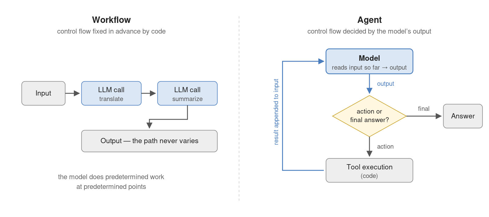
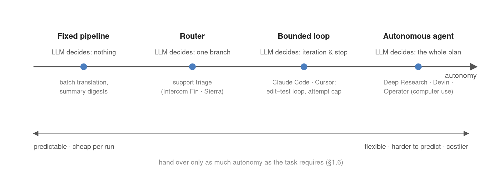

## Same Model, Different Work

- Chatbots of ~2022: one question in, one answer out, interaction ends.
- Deep Research: given a topic, searches and reads dozens of pages on its own, returns a synthesized report.
- Claude Code: given a bug report, reads the code, edits, runs the tests — on failure, analyzes and edits again.

The model did not change. What separates them is the **program surrounding the model**.

::: notes
훅: 셋 다 같은 모델을 쓴다. 차이는 모델 밖 프로그램 — 이 사실에서 수업 전체가 출발.
:::

## The LLM Call — Text In, Text Out

An **LLM** generates text one token at a time, each conditioned on the text so far.

One call:

- takes text in, returns text out — no other channel;
- cannot open a file, execute a search, or verify its own output;
- produces a chain of plausible tokens — not an action on the world.

Everything the model cannot do is handled by **code outside the model**.

## Control Flow

**Control flow** = the decisions about which action runs next, when to repeat, when to stop.

The criterion is the **location of decision authority** — not capability (*Building Effective Agents*, Anthropic 2024):

|  | control flow is decided by |
|---|---|
| **Workflow** | the developer's code, fixed in advance |
| **Agent** | the model's output |

::: notes
판별 기준 한 문장: 결정권의 위치. 다음 슬라이드에서 같은 검색 기능으로 구별 연습.
:::

## The Criterion, Applied

The same search feature, two different systems:

- Pipeline: every document is translated, summarized, stored — search included, order fixed. **Workflow.** The model decides nothing.
- Assistant: the model reads the question and decides *whether* to search and *with what query*. **Agent.** The output took the branch.

Having a capability does not make a system an agent; deciding does.

## Workflow versus Agent

## The Agent Loop

1. The model reads the input accumulated so far and generates an output.
2. Code interprets it: action directive → execute; final answer → terminate.
3. The execution result is appended to the model's input.
4. The model reads the updated input and generates the next output (→ 1).

Deep Research and Claude Code differ only in tools and instructions — the skeleton of control is identical. (Built by hand in Chapter 4.)

## The Loop, Watched Live

What a Claude Code session shows on screen, turn by turn:

- a line of judgment — *"tests fail in parse_date; the regex misses two-digit years"*;
- a tool call — edit the file, run the test suite;
- the result — a failing or passing log, appended to the record;
- repeat, until the tests pass or the attempt cap is reached.

That visible transcript is the agent loop of the previous slide, running in a shipped product.

::: notes
수업 시연 포인트: 실제 Claude Code/Cursor 화면 캡처를 여기서 보여주면 좋다.
:::

## Components

Four parts appear in every agent, under varying names:

| Component | Why it is needed | Where |
|---|---|---|
| Model | control flow is decided by its output | every chapter |
| Instructions (system prompt) | the goal and what is permitted | Ch. 2 |
| Tools | text alone cannot change the world | Ch. 3 |
| Memory / Context | each iteration builds on the last | Ch. 9–10 |

::: notes
프레임워크마다 이름이 다를 뿐 네 부품은 동일. 랩이 매주 이 부품들을 만든다.
:::

## Autonomy — a Matter of Degree

**Autonomy** = how many control-flow decisions are entrusted to the model rather than to code. It is a trade: flexibility, at the price of predictability and cost.

| Autonomy | Example | The LLM decides |
|---|---|---|
| Fixed pipeline | translate → summarize → store | nothing |
| Router | classify inquiries, dispatch | one branch |
| Bounded loop | edit code until tests pass (cap 5) | iteration and stop |
| Autonomous agent | "research this, produce a report" | the entire plan |

## Real Systems on the Spectrum

## Case — Deep Research

OpenAI (2025), Google Gemini (2024); Perplexity runs a lighter variant.

- Input: one research topic. Output, minutes later: a cited, synthesized report.
- In between, the model decides: which searches to run, which pages to open, when the evidence suffices.
- The delegated form factor: assign a task, review a deliverable — no conversation during the run.

One detail to remember for Ch. 7: these products draw up a research plan first, and some let the user edit it before execution.

## Case — Coding Agents

Claude Code (terminal), Cursor agent mode (IDE), Devin (delegated SWE agent), GitHub Copilot (embedded).

- The bounded loop of the autonomy table, productized: edit → run tests → read failure → edit again, under an attempt cap.
- Guardrails live in code, not in the model: permission prompts before running commands, caps on attempts.
- Same model as the chat products — the loop and the tools are the difference.

## Case — Support Agents and Computer Use

Customer support — Intercom Fin, Sierra (2024–):

- the model classifies the ticket, drafts the reply, decides escalation;
- refund limits and forbidden actions are fixed by code — router to bounded loop on the spectrum.

Computer use — OpenAI Operator (2025), Anthropic computer use (2024):

- the tool surface is the screen itself: look at pixels, click, type;
- an autonomous agent whose "toolbox" is a GUI made for humans.

## Workflow Patterns

The non-agent side has standard vocabulary too — each pattern returns later in the course:

| Pattern | Structure | Appears in |
|---|---|---|
| Prompt chaining | outputs connected serially | Ch. 7 planning |
| Routing | classify, dispatch to paths | Ch. 8 retrieval |
| Parallelization | parallel calls, aggregate | Ch. 2 self-consistency |
| Orchestrator–workers | one call divides subtasks | Ch. 6 multi-agent |
| Evaluator–optimizer | generation ↔ evaluation | Ch. 5 reflection |

## Patterns in Production

The same five patterns, spotted in shipped systems:

- Orchestrator–workers — Anthropic's research feature: a lead agent decomposes the question, spawns parallel searchers.
- Evaluator–optimizer — every coding agent's edit ↔ test cycle.
- Router — support triage deciding bot answer vs. human handoff.
- Parallelization — premium "parallel thinking" tiers sampling several solutions and selecting.
- Prompt chaining — fixed document pipelines (translate → summarize → store).

## Form Factors

The interface is independent of the internal structure — the same agent ships four ways. The chatbot is one form factor, not the definition, only historically the first:

| Form factor | Example | Interaction unit |
|---|---|---|
| Conversational | ChatGPT, Claude | messages |
| Delegated | Deep Research, Devin | task in, deliverable out |
| Embedded | GitHub Copilot, Cursor | help inside the workplace |
| Headless | a sub-agent inside another agent | API call, no human |

## Adoption Criteria

An agent pays when flexibility is genuinely required:

- open problems whose path cannot be fixed in code;
- multi-step work through several tools;
- work that improves from feedback on intermediate results.

A workflow wins when the procedure is fixed, when errors are costly and unverifiable, and for single-turn question answering.

**Hand over only as much autonomy as the task requires** (→ Ch. 12, the cost view).

## When Not to Build an Agent

Three requests that deserve a workflow, not an agent:

- "Summarize every incoming report in this fixed format" — the procedure never varies; an agent adds cost and variance.
- "Answer FAQ questions from this list" — single-turn, no iteration to decide.
- "Transfer money when a customer asks" — low error tolerance, no verification step; handing over decision authority is itself the risk.

The default answer is the workflow; the agent must earn its place.

## The Course, From the Deficit List

- cannot act → tools (3), the agent loop (4)
- does not know when it is wrong → reflection & evaluation (5), planning & search (7)
- tasks outgrow one agent → multi-agent systems (6)
- knows nothing past its training cutoff → RAG (8), memory (10)
- iteration accumulates input without bound → context (9)
- the caller's procedures migrate into the weights → reasoning models (11)
- capability multiplies cost → economics (12), benchmarks (13)
- a system that acts is an attack surface → security (14)

::: notes
암기 대상 아님 — "결핍 → 장" 구조만. 각 장 도입부가 이 목록의 한 줄에서 다시 시작한다.
:::

## The Arc

- First half (W2–W7): build one complete agent and discipline it — reasoning → tools → loop → feedback & measurement → several agents → planned paths.
- Midterm (W8): written, weeks 1–7.
- Second half (W9–W13): ground it in knowledge it does not have; operate it as a system.
- Final deliverable: a research-assistant agent over this course's own paper corpus.

## Discussion — Classify the Two Systems

A nightly job summarizes every new arXiv abstract in your field and mails a digest.

A support bot reads each ticket and decides: answer it, refund the customer, or escalate to a human.

Which is the agent — and what single decision settles the classification?

::: notes
정답 축: 결정권 위치. 다이제스트 잡 = 모델이 아무 분기도 결정하지 않음. 티켓 봇 = 분기가 모델 출력.
:::

## Discussion — the RAG Chatbot

A RAG chatbot always retrieves the top five passages for the question, then answers from them, in a fixed sequence.

- Agent or workflow, under today's definition?
- What is the smallest change that would flip your answer?

::: notes
고정 시퀀스 = 워크플로. 뒤집는 최소 변화: 검색 여부/질의를 모델이 결정하게 (Ch. 8 adaptive retrieval 예고).
:::

## Discussion — the Lowest Sufficient Autonomy

A team proposes "a fully autonomous agent that answers all customer email."

- Argue for the lowest autonomy level that serves the goal.
- Name one observed failure that would justify moving up exactly one level.

(Questions 4–5: notes §1.8.)

## This Week's Lab

`W1_lab_setup.ipynb` — Google Colab, about 80 minutes:

- paste your API key into the setup cell (API Setup guide first);
- first calls through `aisuite`; message roles, statelessness, temperature;
- final task: a system prompt that forces clean JSON, checked PASS/FAIL.

Open it from the Week 1 page of the course site (Open in Colab).

Next week: prompting and reasoning — chain-of-thought, worked examples, self-consistency.

# Backup

## Backup — Term Sheet

- **LLM** — autoregressive next-token generator; text in, text out, nothing else.
- **Control flow** — the decisions about next action, repetition, termination.
- **Workflow** — control flow fixed in advance by code.
- **Agent** — control flow decided by the model's output.
- **Agent loop** — generate → interpret → execute → append → repeat.
- **Autonomy** — how many control-flow decisions the model holds; a flexibility ↔ predictability/cost trade.
- **Form factor** — how the system meets people; independent of the internals.

## Backup — Products by Autonomy Band

- Fixed pipeline: batch translation, summary digests — the model decides nothing.
- Router: support triage (Intercom Fin, Sierra) — classify, dispatch, escalate.
- Bounded loop: Claude Code, Cursor agent mode — edit–test loop under an attempt cap.
- Autonomous: Deep Research (OpenAI, Google), Devin — handed the whole plan.
- Computer use: Operator, Anthropic computer use — autonomy with the GUI as the toolbox.

## Backup — Deciding the Split (a checklist)

Before building an agent, answer four questions:

1. Can the procedure be written down in advance? If yes — workflow.
2. Is there a way to verify results (tests, checks, review)? If no — lower the autonomy.
3. Does the task pass through several tools with order unknown upfront? If yes — agent territory.
4. What does one failure cost? The answer sets the bound and the guardrails, in code.

## Backup — Discussion Questions 4–5

4. Pick one agentic product you have used. Identify its form factor, fill in its four components, and give one control-flow decision its model makes — and one its code fixes.

5. The same model serves as a chatbot and as a component of Deep Research. If the weights are identical, where does the added capability come from — and which components supply it?

## Backup — a Preview of Chapter 2

Same model, same question, different accuracy:

- "23 apples, 20 used, 6 bought — answer only": **27** (wrong)
- the same question, worked solution demanded: **23 − 20 = 3, 3 + 6 = 9** (correct)

Why writing changes correctness — the model's only workspace is the text itself — is where Week 2 begins.
