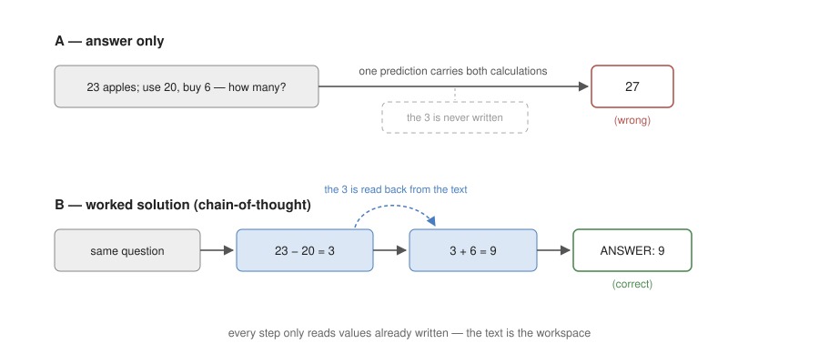
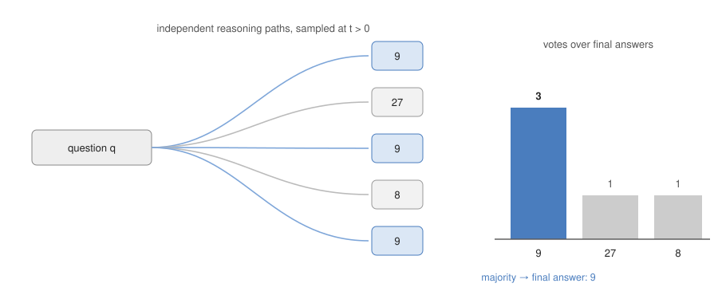

# Chapter 2. Prompting & Reasoning

Chapter 1 defined the agent by where control flow resides: a system whose next action is decided by the model's output. Every deficit on Chapter 1's list is repaired in a later chapter by adding something around the model — tools, a loop, feedback, retrieval. This chapter repairs the one deficit that cannot be delegated outward: the quality of the decisions themselves. Before anything is built around the model, what can be gotten out of a bare call must be settled.

## 2.1 The Problem — Same Model, Different Accuracy

**Reasoning** is the process of deriving a conclusion from given premises through intermediate steps. Solving an arithmetic word problem, combining several facts to narrow down an answer, and ordering the steps of a plan are all reasoning. What distinguishes it from single-fact recall ("What is the capital of Korea?") is the existence of intermediate steps: there are steps that must be passed through on the way to the conclusion, and if any one step is wrong, the conclusion is wrong.

An agent decides "what to do next" at every step through the model's output (→ Ch. 1), and that decision is itself reasoning. The accuracy of an agent is therefore bounded by the accuracy of the model's reasoning at each step. No agent architecture can be accurate on top of a model that reasons inaccurately.

The quality of reasoning, however, is not determined by the model alone. On the same model and the same problem, correctness splits according to how the question is asked.

> **Q.** A cafeteria has 23 apples. They use 20 for lunch and buy 6 more. How many apples do they have?
>
> Method A — demand only the answer: "Answer: 27" (wrong)
> Method B — elicit the worked solution: "23 − 20 = 3, 3 + 6 = 9. Answer: 9" (correct)

This is a measured case from Figure 1 of the original CoT paper (Wei et al., 2022 — on the large models of that time). Today's large models solve a problem of this size even by direct answering, but the same failure reappears on any model once the number of steps and the number of digits grow (the lab reproduces it on harder multi-step problems). The weights are identical, yet correctness splits; the cause therefore lies not in the weights but in the computational process by which the model produces the answer.

## 2.2 The Cause — A Workspace Made Only of Text

An LLM has no workspace outside the text. When the model produces the next token it only reads the text so far; between one token and the next there is no separate train of thought continuing outside the text. A person can pause mid-sentence and carry a calculation forward in their head, but the only place a model can hold an intermediate result is the text it is writing.

Placing this fact against the apple problem exposes the difference between the two methods. Reaching the answer requires computing 23 − 20 = 3 and then adding 6 to that 3. The intermediate value 3 must be kept somewhere. Method B writes it into the text: the moment "23 − 20 = 3" is written, the 3 is preserved in the text, and from then on the model only has to read the written value and use it. Method A demanded only the answer, so there is nowhere to write. Then the single prediction that emits the answer digit must handle both calculations in succession. The difference between A and B is therefore not a few tokens. B's additional tokens are not decoration but the storage site of intermediate values, and A is the condition that forbids that storage.



*Figure 2.1 — In A, nothing stores the intermediate value, so one prediction must carry both calculations; in B, the written "3" is read back from the text and each step advances alone.*

There is a limit on how many steps a single prediction can handle, and the existence of that limit is an established empirical fact. The wrong answer 27 in §2.1 is the evidence, and failure becomes more frequent as steps and digits grow. The shape of the wrong answers agrees with this account: prediction emits the most plausible token regardless of whether the computation finished, so where processing could not complete, an answer-shaped value assembled from the numbers in the problem (23, 6) appears. Why the limit exists, however, is an open question. One analysis holds that the internal computation of a single prediction is bounded by the model's layer count, imposing a ceiling on chaining ordered steps (Feng et al., 2023; Merrill & Sabharwal, 2023); another explanation is that answer-only solution text is rare in the training data; the two are not mutually exclusive. Settling the cause is not needed for what follows. What is needed is the fact that the limit is measured, and the fact that having a place to write intermediate values circumvents it.

**Hallucination** is the phenomenon of generating content that is not factual but plausible. The cause is the same as above: even when processing has not finished, even when no relevant fact is known, prediction does not stop — it emits the most plausible token.

## 2.3 The Remedy — Using Chain-of-Thought

The remedy is to give the model a place to write intermediate values. If the model is made to write out the solution instead of going straight to the answer, each token only needs to read the previously written values and advance one step. The structure is the same as a person solving a hard calculation on paper instead of in their head. The only means of making the model write a solution is text placed in the prompt, and that text takes one of two forms: an instruction or examples.

Method 1 — instruction. Append one line after the question demanding a worked solution (zero-shot CoT, Kojima et al., 2022). The lab's zero-shot section uses this form.

```
There are 23 apples. 20 are used and 6 more are bought. How many are there?
Write the solution step by step, then give the answer on the last line as "ANSWER: <number>".
```

Method 2 — examples. Prepend worked question–answer examples before the question. An LLM generates by following the format and procedure of the examples inside the prompt (**in-context learning, few-shot** = the property that examples in the prompt specify the output without any weight update), and when the examples contain worked solutions, the model generates a solution first.

```
Q: Roger has 5 tennis balls. He buys 2 more cans of 3 balls each. How many balls does he have?
A: He starts with 5 balls. 2 cans of 3 balls is 3 × 2 = 6 balls. 5 + 6 = 11. ANSWER: 11

Q: There are 23 apples. 20 are used and 6 more are bought. How many are there?
A:
```

With either prompt, the model's output comes out like Method B ("23 − 20 = 3. 3 + 6 = 9. ANSWER: 9"). The instruction is convenient; the examples additionally control the procedure and format of the solution. An instruction alone underspecifies both — "solve step by step" fixes neither how fine the steps should be nor how the final answer is written — and a worked example pins down exactly what the instruction leaves open. This specifying role of examples is why the lab's measured task is exemplar writing.

**Chain-of-Thought (CoT)** designates this family of prompting techniques that induce the model to generate its solution process, and the original paper uses the example form (Wei et al., 2022). The reason both forms work is the same: at the moment the final "9" is produced, the text already contains "23 − 20 = 3" and "3 + 6 =", so the model finishes by reading the written values instead of performing both calculations from scratch.

The effect of CoT is conditional. **Emergence** designates the phenomenon in which a capability absent at small scale appears above a certain scale, and the effect of CoT is emergent: only in sufficiently large models does solution generation translate into accuracy, while in small models it is ineffective or even harmful. The concrete improvement magnitudes (GSM8K and others) and the scale curves are examined in this week's presented paper.

## 2.4 The Limit of CoT — Dependence on Internal Knowledge

What CoT repairs is the computation limit of §2.2 — one of the two defects. Hallucination remains. The following is a measured case from Figure 1 of the ReAct paper (Yao et al., 2022 — the question is from HotpotQA; the correct answer is "keyboard function keys").

> Q: Aside from the Apple Remote, what other device can control the program the Apple Remote was originally designed to interact with?
>
> Solution (CoT): Let's think step by step. The Apple Remote was originally designed to interact with Apple TV. Apple TV can be controlled by iPhone, iPad, and iPod Touch. So the answer is iPhone, iPad, and iPod Touch. (wrong)

The form of the solution is impeccable: steps connect from premise to conclusion. But the first premise is false. What the Apple Remote was designed to control is not Apple TV but a piece of software called Front Row, and the model — with no path to verify that fact — generated a plausible premise and then reasoned coherently on top of it. The same paper identifies this as a structural problem of CoT: the reasoning is not grounded in the external world, so fact hallucination and error propagation occur (Figure 1 (1b)).

CoT's reasoning depends only on the internal knowledge stored in the parameters and has no path for checking external facts. When a premise is a hallucination, coherent reasoning ends in a wrong conclusion. Coherence of the reasoning structure does not guarantee factuality. Repairing hallucination requires a step that checks external facts, and that requires tools (→ Ch. 3) and the agent loop (→ Ch. 4). How the question above is solved by a loop holding a search tool is examined in Ch. 4 through the same paper's trace.

On the computation side there is still room left. CoT made the model predict more within one response — every token of the solution is one prediction. The other direction for adding predictions is to produce the response itself multiple times.

## 2.5 Repetition and Majority Voting — Self-Consistency

CoT writes the solution down a single path. If any step on that path is wrong the conclusion is wrong, but the model, unaware of this, commits to that one answer. The difficulty is that the robustness of that answer cannot be judged from the answer alone.

Robustness shows itself when the same question is asked several times. An LLM **samples** tokens from a probability distribution, so raising the temperature (the generation parameter controlling sampling randomness) and asking again makes each run follow a different solution path and produce a different answer. A single response is thus one sample drawn from the set of possible paths, and the fact that this sample is wrong means another draw might be right.

There is then no reason to stake everything on one sample. Sample several times and take the majority vote of the final answers. This is **Self-Consistency** (Wang et al., 2022). Why majority voting works is explained in probability. What we want is the probability of answer $a$ given question $q$; since the answer arrives through an intermediate reasoning path $r$, the true probability of the answer is obtained by summing over all possible paths rather than any single one:

$$P(a \mid q) = \sum_{r} P(a \mid r, q)\, P(r \mid q)$$

Asking once shows only the answer of the single most plausible path — one term of this sum — and if that path is wrong, the result is simply wrong. Majority voting over multiple samples approximates this whole sum with a sample estimate. Correct answers are reached by different paths converging on the same conclusion, while wrong answers scatter across paths, each wrong in its own way; counting votes therefore brings the correct answer to the front.



*Figure 2.2 — Sampled paths from the same question: correct paths converge on one value, wrong paths scatter, and the vote surfaces the convergent answer.*

Majority voting presupposes that answers can be compared and counted — a discrete final answer (a number, a choice, a short string) that can be extracted from each sample. On open-ended outputs such as free-form prose, where no two samples are literally equal, the vote cannot be tallied as is; selecting among such outputs requires a separate scoring device, which the next section names.

## 2.6 Generalization — Test-Time Compute

What self-consistency increased is the number of predictions. Where CoT lengthened one response (adding as many predictions as solution tokens), self-consistency produces N responses (N times the predictions). The cost of one prediction is roughly constant, so the number of predictions is the bill. The family of approaches that leaves training (the weights) untouched and buys accuracy by increasing the number of predictions at answer time is collectively called **test-time compute**, and its methods are as follows.

| Method | How predictions are increased |
|---|---|
| CoT | one response made longer — predictions added per solution token |
| Self-consistency | N responses — N× predictions → majority vote |
| Best-of-N | N responses → a verifier selects the best |
| Tree search | branch, evaluate, backtrack (→ Ch. 7 planning & search) |

The common principle is the exchange of inference computation for accuracy, called **inference-time scaling**. Unlike majority voting, Best-of-N and tree search additionally require a **verifier** — a device that scores answers against each other — which is also what replaces voting when answers are not discrete (→ §2.5).

The exchange is now visible on product price lists, not only in papers. The "thinking" modes of current chat products (OpenAI's o-series, Claude's extended thinking, Gemini's thinking models) are the written solution of 2.2 moved into the model and billed by the token (→ Ch. 11). The tiers above them — o1 pro mode, Gemini Deep Think, Grok's Heavy tier — are documented by their vendors as exploring several lines of reasoning in parallel on each question: the sampling and selection of 2.5–2.6, sold as a subscription level.

The exchange is not free. Repeating N times multiplies cost and latency by N as well. In practice the decision variable is not the size of N but the selection of which questions deserve N > 1 (→ Ch. 12, routing in inference economics).

## 2.7 Summary

The chapter departed from the measured fact that the same model gives different answers depending on how it is asked. A model has no workspace outside the text, so demanding only the answer forces every intermediate calculation into a single prediction, while eliciting a written solution preserves intermediate values in the text and lets the model advance one step at a time. The limit on steps per prediction is an established measurement; its cause remains open (→ 2.2). The means of inducing the writing are an instruction (zero-shot) and worked examples (few-shot), the latter being the original form of CoT; examples additionally specify the procedure and format that instructions leave open. The defect CoT leaves — dependence on internal knowledge — calls for an external checking step, that is, tools (→ Ch. 3) and the loop (→ Ch. 4). On the computation side, the stochastic nature of sampling makes repetition and majority voting (self-consistency) valid, and the general form of buying accuracy with prediction count is test-time compute. None of these procedures reads the answer after it is written; adding that reading step — critique and revision — is the subject of Ch. 5, reflection. Moving the whole exchange from the caller's procedure into the model's own weights returns in Ch. 11, reasoning models.

## 2.8 Discussion

Each question is answerable with this chapter's concepts; section numbers point at the relevant part.

1. A teammate concludes "our model cannot do arithmetic" after it answers 27 in the cafeteria problem. State what that run actually measured, and design the smallest two-prompt experiment that separates a limitation of the weights from a limitation of the prompt condition (2.1–2.2).
2. An output must always end with a date line formatted "2026-03-02 (Mon)". Name two properties of that requirement a "think step by step" instruction leaves unspecified but three worked exemplars would pin down (2.3).
3. Self-consistency lifts accuracy on this week's math evalset but fails outright on "write a 200-word abstract of this paper." Say exactly where the procedure breaks (2.5), and name the device that replaces the vote (2.6).
4. The Apple Remote failure of 2.4 keeps its flawless step structure even when the prompt adds "verify each step before continuing." Why can no added instruction fix this failure class, and what is the smallest addition to the system — not to the prompt — that can (→ Ch. 3)?
5. Your chat product's thinking toggle makes answers slower and costlier, and a product manager asks whether it should be on by default. Using 2.2 and 2.6, state what the toggle buys, for which question types it buys nothing, and what measurement would settle the default (→ 5.8).

**Presentation.** CoT (Wei et al., 2022) — the improvement obtainable by prompting alone, and the emergence curve across model scales. First student presentation week; one paper this week.

**Lab.** `W2_lab_prompting.ipynb` — adapted nearly as given from Anthropic's *Prompt Engineering Interactive Tutorial* (ch. 6–7) and *Prompt Evaluations* course (lesson 3): observe thinking-step-by-step flips on the source's own examples, then improve a code-graded eval from baseline through a format fix to your own chain-of-thought prompt (target ≥ 11/12), solve the few-shot email-classification exercise (4/4), and close with self-consistency (Wang et al., 2022) on the hardest eval item. Reference answers: `labs/checkpoints/week02/solution.py`.

**Homework.** `W2_hw_build_evalset.ipynb` — design an eight-item code-graded evalset in a domain of your own, then show your chain-of-thought template beating answer-only prompting on it (target ≥ 7/8). Due before W3.
