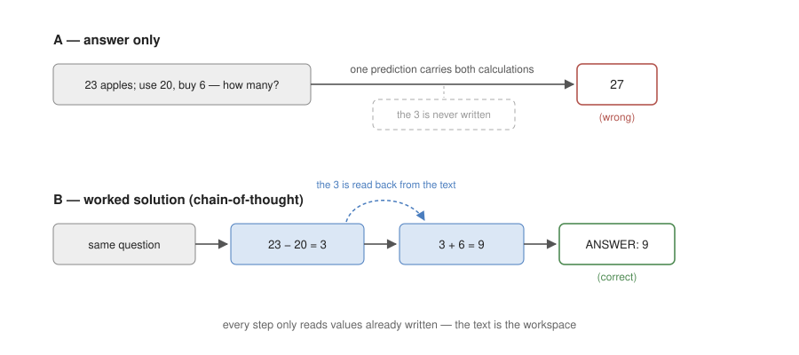
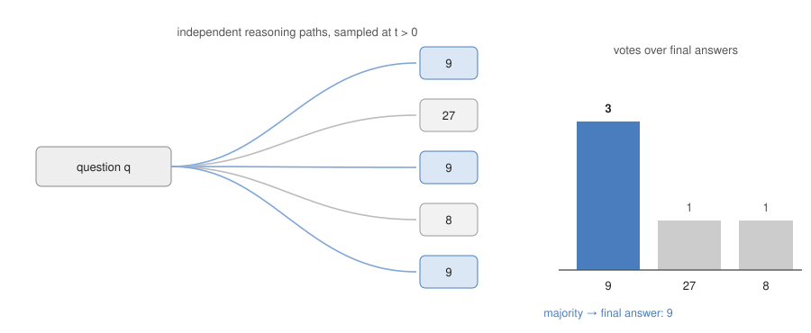

<!-- course-navigation:start -->
<nav class="chapter-nav" aria-label="Course navigation">
<a href="../../index.html">Home</a>
<a href="../reading.html">All chapters</a>
<a href="../../week02.html">Week 2 materials</a>
</nav>
<!-- course-navigation:end -->

<button id="classroom-toggle" type="button" aria-pressed="false">Larger text</button>
<button id="answers-toggle" type="button" aria-pressed="false">Show all answers</button>

::: {.callout-note appearance="minimal"}
## Learning objectives

- Explain what a prompt changes, and what it does not change.
- Explain why written intermediate steps can help a model.
- Write a chain-of-thought prompt with an instruction and with worked examples.
- Explain the steps of self-consistency.
- Compare two prompts on an evaluation set.
:::

In Chapter 1, the model selected actions toward a goal. The quality of each selection depends on the input to the model. This chapter shows how the prompt changes the reply. It also shows how more computation at answer time can give better answers.

## 2.1 Prompt {#task-and-prompt}

The same model can give different replies to the same question when the input changes.

::: {.callout-tip icon=false}
## Prompting

The design of the model input to guide the reply. A prompt changes the input of one call. It does not change the **parameters** of the model, the numbers that training sets.
:::

A prompt can contain four parts:

1. **An instruction:** what to do, for example "Reply with only the number."
2. **Information:** the facts that the task needs.
3. **Examples:** questions with their answers.
4. **An output format:** the form of the reply, for example a last line `ANSWER: <number>`. When code must read several fields, ask for **JSON**. Some APIs have a JSON mode that guarantees a valid JSON reply.

The number of examples gives a name to the prompt. A **zero-shot** prompt has no examples. A **few-shot** prompt has a small number of examples. The model adapts its reply to the examples in the prompt. This is **in-context learning**. It differs from **fine-tuning**, which changes the parameters with training data.

## 2.2 Intermediate steps {#intermediate-steps}

Some questions need several calculations, and each calculation uses the result of the one before it. For example: a cafeteria has 23 apples, uses 20, and buys 6. The first step gives 3, and the second step gives 9.

A model generates text one token at a time. Each new token depends on all tokens before it. This is **autoregressive generation**. For this reason, a value that the model writes becomes part of the input for the next step.

{#fig-cot-workspace width="100%" fig-alt="A, answer only: the question goes directly to one answer. B, worked solution: 23 minus 20 equals 3, then 3 plus 6 equals 9, then ANSWER: 9. The value 3 is read back from the text."}

The steps must come before the answer. If the model writes the answer first, the answer cannot use the steps.

## 2.3 Chain-of-thought prompting {#cot}

::: {.callout-tip icon=false}
## Chain-of-thought (CoT) prompting

A prompt that makes the model write intermediate reasoning steps before the final answer.
:::

There are two methods to get these steps:

1. **An instruction (zero-shot CoT).** Add one sentence to the question (Kojima et al., 2022). For example: `Write the solution step by step, then give the answer on the last line as ANSWER: <number>.`
2. **Worked examples (few-shot CoT).** Put two or three solved questions into the prompt. Each example shows the steps and the answer line. (Wei et al., 2022)

The number of examples and the steps are two different properties. A prompt with labeled examples and no steps is few-shot, but it is not CoT.

A fixed answer line or answer tags, such as `<answer>…</answer>`, let code find the final answer in the reply.

CoT organizes calculations on the information in the prompt. It does not add a fact that the prompt does not contain.

::: {.checkpoint}
### Check 1 · Classify two prompts

Prompt A gives three emails with the labels "urgent" or "routine", and then a new email. Prompt B gives no examples and asks for a short calculation before the number. Which prompt is few-shot? Which prompt is CoT?

Read the answer

Prompt A is few-shot, because it has examples. It is not CoT, because the examples show no steps. Prompt B is zero-shot CoT.

:::

## 2.4 Self-consistency {#self-consistency}

One generated solution can contain an error. Another generation of the same question can take a different path. **Sampling** selects each token from the probabilities of the model. The **temperature** controls the variation: at temperature 0, the replies are almost the same, and at a higher temperature, they vary more.

::: {.callout-tip icon=false}
## Self-consistency

A method that generates several reasoning paths for the same question and selects the final answer that most paths give (Wang et al., 2022).
:::

Self-consistency has four steps:

1. Generate N solutions at a temperature above 0.
2. Extract the final answer from each solution.
3. Count the solutions for each answer.
4. Select the answer with the most votes.

{#fig-self-consistency width="100%" fig-alt="A question q leads to five sampled paths with final answers 9, 27, 9, 8, 9. A bar chart shows 3 votes for 9, 1 for 27, and 1 for 8. The majority answer is 9."}

The vote counts final answers, not the words of the solutions. The selected answer is the answer with the most agreement.

## 2.5 Test-time compute {#test-time-compute}

CoT and self-consistency both spend more computation when the model answers. They do not change the model.

::: {.callout-tip icon=false}
## Test-time compute

The computation that a model uses to make a reply after training. It is also called **inference-time compute**.
:::

| Method | Extra work | How it gets the answer |
|--|----|-----|
| CoT prompting | Generate intermediate steps | Continue from the steps to the final answer |
| Self-consistency | Generate several solutions | Select the most frequent final answer |
| Best-of-N | Generate N candidates | A **verifier** examines each candidate and selects the best one |

Some models, called **reasoning models**, are trained to generate long intermediate reasoning before the answer. They spend test-time compute without a CoT instruction, and the provider counts these reasoning tokens in the cost.

More computation uses more tokens, so it costs more. Use it when it makes the answers better.

## 2.6 Compare prompts {#lab-connection}

To know if a prompt helps, measure it. An **evaluation set** is a set of test questions with their correct answers. Code compares each reply with the correct answer. **Accuracy** is the number of correct replies divided by the number of questions.

To compare two prompts, use the same model, the same questions, and the same settings. Change only the prompt. Then compare the accuracy and the number of tokens.

::: {.checkpoint}
### Check 2 · The vote

Five samples give the answers 29, 19, 29, 5, and 29. Which answer does self-consistency select, and why?

Read the answer

It selects 29, because three of the five samples give 29.

:::

## Summary {#recap}

- A prompt changes the input of one call. It does not change the model.
- Written intermediate steps become input for the next steps, so they come before the answer.
- CoT prompting gets these steps with an instruction (zero-shot) or with worked examples (few-shot).
- Self-consistency generates several solutions and selects the most frequent final answer.
- To compare prompts, use the same evaluation set and settings, and change only the prompt.

## Lab preparation: from concept to code {#implementation}

The lab uses the `aisuite` client from Week 1. Each prompt goes into the content of a user message.

| Concept | Lab code (short form) |
|--|-------|
| Answer only | `APPLES + " Reply with only the number."` |
| Zero-shot CoT | `APPLES + " Write the solution step by step, then give the answer on the last line as ANSWER: <number>."` |
| Answer tags | `re.search(r"<answer>(.*?)</answer>", output, re.DOTALL)` |
| Code grade | `output.strip() == item["golden_answer"]`, then `score / 12` |
| Few-shot examples | Solved `Q:` and `A:` lines in the prompt, then the new question |
| Sampling | `temperature=1.0`, five calls with the same prompt |
| Vote | `Counter(samples).most_common(1)` |
| Cost | `response.usage.completion_tokens` |

## Lab {#lab-guide}

1. Compare an answer-only prompt and a worked-solution prompt, and grade both with code.
2. Change the order: reason without written steps, and give the answer before the steps.
3. Improve a prompt on an evaluation set: fix the format, then add chain of thought.
4. Add worked examples to a prompt.
5. Run self-consistency: five samples and a vote.

[Lab notebook in Colab](https://colab.research.google.com/github/ralbu85/stml_2026/blob/main/lectures/week02/W2_lab_prompting.ipynb) · [Homework notebook in Colab](https://colab.research.google.com/github/ralbu85/stml_2026/blob/main/lectures/week02/W2_hw_prompting.ipynb): four prompting assignments. Submit the homework on the LMS.

## Materials and sources {#readings}

- Wei et al., [Chain-of-Thought Prompting Elicits Reasoning in Large Language Models](https://arxiv.org/abs/2201.11903) (2022): CoT with worked examples.
- Kojima et al., [Large Language Models are Zero-Shot Reasoners](https://arxiv.org/abs/2205.11916) (2022): CoT with an instruction.
- Wang et al., [Self-Consistency Improves Chain of Thought Reasoning in Language Models](https://arxiv.org/abs/2203.11171) (2022): a vote over sampled reasoning paths.
- Brown et al., [Language Models are Few-Shot Learners](https://arxiv.org/abs/2005.14165) (2020): in-context learning with examples in the prompt.

<!-- course-pagination:start -->
<nav class="chapter-pagination" aria-label="Previous and next chapters">
<a href="../week01/notes.html" rel="prev">← Previous: 1 · What is an Agent?</a>
<a href="../week03/notes.html" rel="next">Next →: 3 · Tool Use</a>
</nav>
<!-- course-pagination:end -->
