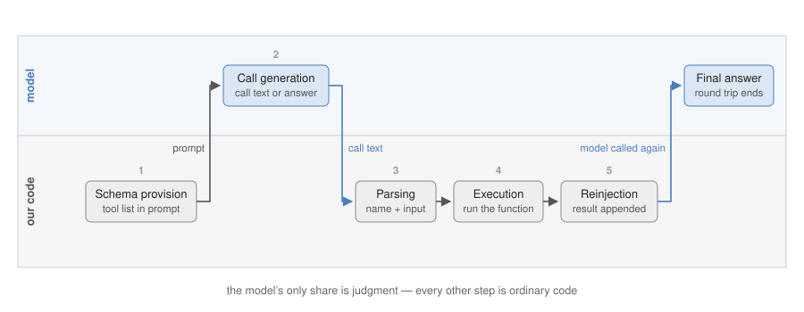

# Chapter 3. Tool Use

Chapter 2 raised the quality of reasoning with prompts and repeated computation. Two defects remain that those methods do not touch. First, the model has no path to verify external facts: what it knows is the knowledge stored in its parameters at training time, and prediction does not stop for lack of a known fact — asked about the Apple Remote's original program, the model fabricated a plausible premise and reasoned coherently to a wrong answer (→ 2.4). Second, arithmetic accuracy is not guaranteed: CoT and self-consistency raise the probability of a correct calculation (→ 2.3, 2.5), but add more steps and digits and wrong answers reappear.

Both defects are already solved outside the model — search engines check facts, calculators compute without error — so the remaining problem is the connection. An LLM call is a function that takes a string and returns a string, with no other input or output path (→ Ch. 1). The smallest instance of the problem opens this week's lab:

```
[user]   What time is it?
[model]  I don't have access to the current time.
```

No prompt fixes this answer. The current time is not in the weights, and nothing inside the call can look at a clock.

## 3.1 Division of Labor

A **tool** is an executable function or API that exists outside the model: a function that reads the clock, a function that evaluates an arithmetic expression, a search API.

The model cannot execute a tool directly, because its only channel of action is text output — generating the sentence "call get_current_time" calls nothing. But dividing up the work shows that execution was never the part the model needed to own. Calling a function and returning its result is what ordinary programs already do exactly. What a program cannot do on its own is the judgment — does this question need the clock, and if a calculator, with which expression? — which requires reading the question's meaning, the model's strength. And the outcome of that judgment can be written as text.

Here the division is established: the model outputs its judgment as text, our code reads that text and executes the function, and the result is fed back into the model's input. The whole division rests on one convention — **the model's output is read not as a final answer but as an execution request.** The text-in/text-out channel is unchanged, yet the system of model plus code gains the ability to tell time, calculate, and search. For the division to work, the model must know which tools exist and must emit requests in a machine-readable format; the only channel for both is the prompt.

## 3.2 The Round Trip

A **round trip** is one cycle in which the model issues an execution request, receives the result, and completes its answer — "round trip" being the word vendor documentation itself uses for results traveling out and back through the API; the lab's client counts these cycles as turns (`max_turns`). The procedure has five named steps, used verbatim in the rest of the chapter.

1. **Schema provision** (our code) — Write each tool's name, description, and input format into the system prompt (the standing instruction of Ch. 1), together with the output format for calls.
2. **Call generation** (model) — Judge whether a tool is needed. If so, emit call text in the designated format; if not, emit the final answer, ending the round trip.
3. **Parsing** (our code) — Read the tool name and input out of the call text. On a broken format or unknown tool, build an error string and pass it to reinjection instead of executing.
4. **Execution** (our code) — Call the function; on an exception, turn the exception into the result string.
5. **Reinjection** (our code) — Append the result string to the conversation and call the model again. The model reads it and answers, or corrects a failed call, repeating from Parsing.



*Figure 3.1 — The five round-trip steps as a swimlane: only the call judgment sits in the model lane; every other step is our code.*

The opening failure, run through this procedure:

```
[system]  Available tools:                                     ← schema provision
          - get_current_time: returns the machine's current
            time. Use when the user asks about the time.
          If a tool is needed, output exactly one line of JSON:
          {"tool": "<name>", "input": "<input>"}

[user]    What time is it?

[model]   {"tool": "get_current_time", "input": ""}            ← call generation
[code]    reads the name, calls get_current_time() → "14:03:22" ← parsing · execution
[user]    Tool result: 14:03:22                                 ← reinjection
[model]   The current time is 14:03:22.                         ← final answer
```

The JSON the model emitted is text, not execution; it leads to execution because parsing and execution implement the convention of 3.1. On the model's side everything is still next-token prediction — the new capability comes from the code that treats output as a request. The same round trip with a calculator tool closes Chapter 2's arithmetic problem for good: the model's share ends at judging that computation is needed and setting up `1400*0.29`; the arithmetic itself runs in a program, leaving no room for error.

## 3.3 Standardization — Function Calling

The protocol above is a handcrafted convention, promised only by prompt instruction. Instructions do not compel, so the promise breaks probabilistically: the model wraps the JSON in prose, drops braces, invents fields — and such output cannot be parsed. **Function calling** is the vendor-standard mechanism that carries schema provision and call generation in structured API fields instead: the tool list travels in a `tools` parameter, and calls come back in a dedicated `tool_calls` field.

```
request (schema provision):  tools = [{ "name": "calculator",
                                        "description": "Evaluates an arithmetic expression.
                                                        Use only for numeric computation.",
                                        "parameters": { "expression": "expression to evaluate" } }]

response (call generation):  tool_calls = [{ "name": "calculator",
                                             "arguments": { "expression": "1400*0.29" } }]

reinjection:                 { "role": "tool", "content": "406" }
```

The step structure is identical to the handcrafted protocol; the reliability is higher, because models are trained to emit this format and arguments arrive as structured fields. Three operating controls come with the standard: **tool_choice** constrains call generation by setting instead of pleading (auto / required / a named tool / none); **parallel tool calls** put several independent calls in one `tool_calls` response, saving a round trip per extra call; **structured outputs** apply the same schema guarantee to the final answer, removing the parse-failure branch for answers as function calling removed it for calls.

Function calling is the substrate of current assistant products, not an optional feature: the web-search and file tools inside ChatGPT and Claude, and every action a coding agent takes — read a file, run the tests, apply an edit — travel the API as exactly these fields. When such a product "does something," a `tool_calls` message like the one above did it.

## 3.4 Schema Writing

A **tool schema** is the specification delivered at the schema-provision step — name, description, parameters. The model never sees the function's implementation; everything it knows about a tool is the schema's text. In the lab's client the schema is generated from the Python function's **docstring** (the documentation string written directly under the function definition), so registering a tool is passing the function object, and schema writing is docstring writing.

The schema is the sole basis for the call judgment, so a poor schema is a concrete malfunction:

```
poor description:      search_papers: searches documents.

improved description:  search_papers: retrieves supporting passages for questions about
                       the content of the course's papers. Do not use for general
                       knowledge or calculation. Input: one sentence describing what
                       to find.
```

Under the poor description the model calls search on general-knowledge questions, or answers from memory when it should search, and puts the whole user question where a query belongs — defects of the description, not of the model, and fixed in the description. The improvement supplies the basis for judgment: what is searched, when not to use it, what form the input takes. The lab measures exactly this with a routing score over a fixed task set — empty docstrings misroute, rewritten ones recover. A serviceable checklist: the name states action and object (`search_papers`, not `helper2`); the description says what, when, and when not; every parameter has a type, description, and example.

## 3.5 Reinjecting Failure

Parsing and execution are the steps that fail: unregistered names, malformed arguments, runtime exceptions. Raising these as program exceptions aborts the request on a single typo — and since call generation is probabilistic text generation, format deviations recur at a steady rate. The design principle instead: **turn every failure into a result string and reinject it.** The model reads what is written into the conversation, so an error it can read is an error it can correct.

```
[model]  {"tool": "calculater", "input": "1400*0.29"}      ← typo in tool name
[code]   does not execute; builds an error string            ← parsing failure
[user]   Tool result: (unregistered tool 'calculater'. Available: calculator, search_papers)
[model]  {"tool": "calculator", "input": "1400*0.29"}      ← corrected call
```

The error string carries what recovery needs — here the "Available:" list. Once failure is part of the conversation, the recovery decision (reissue, switch tools, answer without one) is also the model's share. On the execution side the same discipline applies operationally: a **timeout** bounds how long a tool may run, and retrying failed executions requires **idempotency** — re-execution must not duplicate side effects (a card charged twice), or the retry policy becomes its own failure mode.

## 3.6 The Capability Boundary — an Email Assistant

The lab's second half runs an assistant over a simulated inbox with four registered tools: list unread, search, mark as read, send. A multi-step request — "check for unread mail from the boss, mark it read, send a follow-up" — resolves into a sequence of calls the model orders itself. Then the same assistant is asked to delete an email:

```
tools = [list_unread_emails, search_emails, mark_email_as_read, send_email]

[user]   Delete the Happy Hour email.
[model]  (searches, then) I don't have a way to delete emails.

tools = [... , delete_email]
[user]   Delete the Happy Hour email.                      ← identical prompt
[model]  (search_emails → delete_email)  Deleted.
```

No instruction can make the assistant perform an action it has no tool for; registering `delete_email` changed the outcome while the prompt stayed identical. The principle: **the tool list is the complete action surface** — capability comes from the registered tools, not from the prompt. This cuts both ways. It is a limit (a missing tool is a missing capability) and the primary safety control: what is not registered cannot happen, so granting a tool is granting capability, and the tool list deserves the same deliberation as any permission.

Notice, too, what carried the multi-step request. The model chose each call, read each result, and decided when the sequence was done — and the round trips repeated until then. That repetition did not come from this chapter's procedure; the lab's client ran it, silently, under its `max_turns` bound. A loop has been executing all along. Who owns that loop, what the model should write on each turn of it, and how it decides to stop are the subject of Chapter 4.

## 3.7 The Alternative Paradigm — Code Execution

Function calling assumes the useful actions can be enumerated as a toolbox. A calculator built that way registers `add`, `subtract`, `multiply`, `divide` — and still fails "what is the square root of 2?"; every new operation demands a new tool, and composing operations forces chains of calls for what one line of code expresses.

The alternative gives the model one capability instead of many tools: write code, and our code executes it and reinjects the printed output — the same round trip with parsing and execution generalized.

```
[system]  Write code to solve the user's query. Return it
          delimited with <execute_python> tags.
[user]    What's the square root of 2?
[model]   <execute_python>
          import math
          print(math.sqrt(2))
          </execute_python>
[code]    executes the block → "1.4142135623730951"
[model]   The square root of 2 is approximately 1.4142.
```

The choice between paradigms: function calling suits a fixed action surface with side effects worth controlling — where the capability boundary of 3.6 is the point; code execution suits open-ended computation and data manipulation, where everything the language expresses composes in one block (the Week 5 homework runs exactly this convention on chart generation). The price is safety: generated code can do anything the runtime allows — the source course records an agent tidying a project directory with `rm *.py`, and the apology afterward restored nothing. The rule: execute generated code in a **sandbox**, an isolated runtime with restricted filesystem and network access (a container such as Docker, or a hosted service such as E2B), never in a process that holds real data. Both shapes ship today: ChatGPT's Advanced Data Analysis and Claude's code execution run model-written Python in hosted sandboxes of exactly this kind, while coding agents (Claude Code, Cursor) run the convention against a real repository, with a permission prompt standing where the sandbox wall would be. (Adapted from Ng, *Agentic AI* Module 3.)

## 3.8 Learning the Judgment — Toolformer · ToolLLM

Code-side improvement ends at schema writing and failure handling; the judgment inside call generation — whether, which tool, which arguments — is a model capability, and when it falls short (subtle call decisions, thousands of tools), training it into the weights becomes necessary. No corpus of human tool-use demonstrations exists, so both of this week's papers bootstrap: the model generates candidate data, and an automatic criterion keeps the good ones — the same strategy that later builds reasoning data by keeping only self-generated solutions with correct answers (STaR, → Ch. 11).

**Toolformer** (Schick et al., 2023) learns where and how to insert calls into ordinary text; its filter is the model's own prediction loss — a call is kept if inserting its result makes the following tokens easier to predict. **ToolLLM** (Qin et al., 2023) learns to compose many tools per request over sixteen thousand real APIs; its filter is search — call paths are explored until one completes the request, and the model is fine-tuned on the successful paths. Mechanisms, data pipelines, and numbers belong to the presentation; the lens for both papers is one question — is the call judgment given by prompt or put into the weights?

## 3.9 Summary

The principle of tool use is a division of labor: judgment to the model as text, execution to code, under the convention that output is read as an execution request. Its implementation is the round trip (schema provision → call generation → parsing → execution → reinjection); function calling is its standardization. Operation concentrates on three points: the schema supplies the basis for the call judgment, failures are reinjected as result strings so recovery is delegated to the model, and the tool list is the action surface — capability and safety are both set by what is registered. Code execution rounds out the practice, replacing an enumerated toolbox with one generated program at the price of a sandbox; the seam between applications and tool providers has its own standard, MCP, treated with multi-agent systems (→ Ch. 6). Judgment beyond the reach of prompts is trained into the weights, with self-generated data filtered automatically (Toolformer, ToolLLM).

One fact from this chapter carries forward. The email assistant completed multi-step work because round trips repeated under the client's bound, with the model deciding each next call and the stopping point — by Chapter 1's definition, control flow was already in the model's output. The loop that did this was borrowed and invisible. Chapter 4 builds it by hand: its anatomy, the convention for what the model writes on each turn, and what to read when it fails.

## 3.10 Discussion

Each question is answerable with this chapter's concepts; section numbers point at the relevant part.

1. Three failures are observed in one afternoon: the model calls `search_papers` for "what is 2 + 2"; the model passes the user's whole sentence as a search query; a tool raises an exception that crashes the application. For each, name the round-trip step where the failure lives (3.2) and where the fix belongs — schema, prompt, or code (3.4–3.5).
2. A tool is registered as `helper2(x)` with the description "does the thing", and routing is poor. Rewrite the name, the description, and the parameter line to the checklist of 3.4, and state which misrouting each rewritten line prevents.
3. A product owner wants the email assistant to "never delete emails." Compare enforcing this by instruction against not registering `delete_email` (3.6): which one is a guarantee, and what does the difference come to once untrusted text can enter the context (→ Ch. 14)?
4. Choose the paradigm — function calling or code execution (3.7) — for (a) a banking assistant that executes transfers and (b) an analyst assistant over uploaded CSV files. Name the single property of each task that decides, and the safety cost accepted in (b).
5. An internal agent with five hundred registered tools misroutes even after every docstring passes the checklist. What remains on the prompt side, and what would a Toolformer- or ToolLLM-style weights-side fix require here (3.8) — where would the training data come from?

---

**Presentation.** Toolformer (Schick et al., 2023) — learning calls with self prediction-loss as the filter. ToolLLM (Qin et al., 2023) — learning composition over large-scale real APIs with search. Listen to both through the lens of a single question: is the call judgment given by prompt or put into the weights? Optional reading: ReTool (2025) — reinforcement learning for strategic tool use.

**Lab.** `W3_lab_tools.ipynb` — turning Python functions into tools with `aisuite` (docstring-derived schemas), inspecting the request–execute–reinject cycle, a bad-vs-improved docstring experiment, a measured tool-routing taskset, and the email assistant. Adapted from Andrew Ng's *Agentic AI* Module 3; the sourced-report exercise of the source module returns as part of the Week 7 project. Reference answers: `labs/checkpoints/week03/solution.py`.

**Homework.** `W3_hw_new_tool.ipynb` — extend the toolbox with a schedule-lookup tool of your own: the function, a docstring written to the checklist of 3.4, and two routing tasks that prove the model finds it (target ≥ 7/8 on the extended set). Due before W4.
