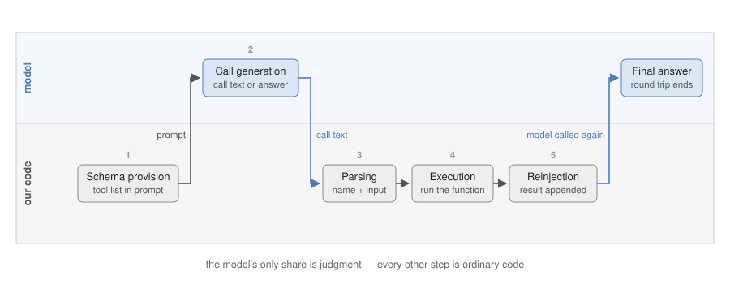

<!-- course-navigation:start -->
<nav class="chapter-nav" aria-label="Course navigation">
<a href="../../index.html">Home</a>
<a href="../reading.html">All chapters</a>
<a href="../../week03.html">Week 3 materials</a>
</nav>
<!-- course-navigation:end -->

<button id="classroom-toggle" type="button" aria-pressed="false">Larger text</button>
<button id="answers-toggle" type="button" aria-pressed="false">Show all answers</button>

::: {.callout-note appearance="minimal"}
## Learning objectives

- Explain why a model needs tools.
- Name the three parts of a tool definition.
- Explain the four steps of a tool round trip.
- Explain how one tool result can give the input of the next request.
- Explain the difference between a model that learns to use a tool and a program that runs it.
:::

In Chapter 2, a prompt guided the text that the model writes. Some tasks need information that text generation cannot produce. For example, a model cannot read a clock. This chapter shows how a model uses a **tool** to get this information.

## 3.1 Why a model needs tools {#why-tools}

A model generates text from its input. It cannot read a clock, search the web, or query a database by itself. For the question "What time is it in Seoul?", a model can only write a guess. To get the real time, a program must run code that reads a clock.

::: {.callout-tip icon=false}
## Tool

A function that an LLM can ask a program to run. The program runs the function and gives the result back to the model.
:::

## 3.2 Tool definition {#tool-definition}

The model must know which tools exist and what input each tool needs. A **tool definition** gives this information. It has three parts:

1. **Name**, for example `get_current_time`.
2. **Description**: what the tool does and what it returns.
3. **Parameters**: the inputs, with a type and a description for each input.

In Python, the function name, the docstring, and the type annotations contain these three parts. The model receives only the definition. The program keeps the function and runs it.

A **parameter** is a named input, for example `timezone_name`. An **argument** is the value for that input in one call, for example `"Asia/Seoul"`.

The tool sets what the program can get. An instruction in the prompt cannot add a capability. For example, a tool that reads the current temperature cannot give tomorrow's forecast. For a forecast, the program needs a forecast tool.

## 3.3 The tool round trip {#clock-exchange}

A tool call has four steps:

1. **Request.** The model receives the task and the tool definitions. It writes a request: the tool name and the arguments.
2. **Execute.** The program runs the function with these arguments.
3. **Return.** The program adds the result to the conversation and calls the model again.
4. **Answer.** The model writes the answer from the result.

{#fig-round-trip fig-alt="Application and model lanes: 1. task and tool schema go to the model; 2. the model requests get_current_time; 3–4. the application parses, validates, and executes it; 5. the result goes back to the model, which answers or writes another request."}

The result of a tool is also called an **observation**. The model writes the request, but it does not run the function. The program runs it. The request is text that the model wrote, so the program checks the tool name and the arguments before it runs the function.

A request is not required. If the model can answer without a tool, it writes the answer directly and makes no request. The model sees the result only when the program puts it into the next input. One round trip uses two model calls and one function run.

::: {.checkpoint}
### Check 1 · Who runs the tool?

The model writes `get_current_time("Asia/Seoul")`. What must the program do before the model can answer?

Read the answer

Run the function to read the clock. Then send the result to the model in the next call.

:::

## 3.4 Function calling {#function-calling}

The round trip can work with plain text: the system message lists the tool definitions, and the model writes the request as text. The program must then read this text to find the function and its arguments.

**Function calling** is an API feature for this work. The program sends the tool definitions in a separate field, as JSON objects called **schemas**. The model returns the tool name and the arguments in separate fields, with an id for each request. The program still runs the function. It returns the result in a message with the role `tool` and the id of the request, so the model can match each result to its request.

The lab uses the `aisuite` library. `tools=[get_current_time]` sends the definition that the library makes from the function. `max_turns` sets the number of model calls that the library can do. The library then does all four steps of the round trip.

## 3.5 One result as the input of the next request {#dependent-calls}

Sometimes the input of a tool is not in the question. For example: "What is the weather tomorrow at Gyeongbokgung Palace?" The forecast tool needs a city. The model first requests a web search for the location. The search result gives the city. Then the model requests the forecast for that city.

The second request **depends** on the first result. The round trip makes this possible: each result goes back to the model, and the model can write the next request. Chapter 4 makes these repeated round trips into a loop.

::: {.checkpoint}
### Check 2 · Does the second request depend on the first?

A user asks for the current temperature in Seoul and in Paris. Does the Paris request depend on the Seoul result?

Read the answer

No. Both cities are in the question. The model can request the two temperatures independently.

:::

## 3.6 Learning to use tools {#toolformer}

So far, the tool definition in the input tells the model which tools exist. Training can also teach a model when to call a tool.

**Toolformer** makes text for training that contains tool calls. A model puts candidate calls into text, and the program runs them. The method keeps a call only when its result helps the model predict the next words. Then the model trains on this text (Schick et al., 2023).

Training teaches the model when to request a tool. The program still runs the tool.

## Summary {#recap}

- A tool is a function that an LLM can ask a program to run.
- A tool definition has a name, a description, and parameters. The model receives the definition, and the program keeps the function.
- A round trip has four steps: request, execute, return, and answer.
- Function calling puts the definitions and the requests in separate API fields.
- A tool result can give the input of the next request.

## Lab preparation: from concept to code {#implementation}

The lab first does the round trip by hand. Then it does the same steps with function calling in `aisuite`.

| Concept | Lab code (short form) |
|--|-------|
| Tool function | `def get_current_time(timezone_name: str = ""):` with a docstring |
| Tool definition in the system prompt | `TOOL_LIST_SYSTEM = """Available tools: - get_current_time(timezone_name: str): ..."""` |
| Request | `call_text = response.choices[0].message.content` |
| Execute | `result = eval(call_text)`: `eval` runs any code in the text, so the lab uses it only to show this step. Chapter 14 covers safe execution. |
| Return | `messages.append({"role": "user", "content": f"Tool result: {result}"})` |
| Answer | `client.chat.completions.create(model=MODEL, messages=messages)` |
| Function calling | `client.chat.completions.create(model=MODEL, messages=messages, tools=[get_current_time], max_turns=2)` |
| Dependent requests | `tools=[web_search, get_forecast], max_turns=3` |

## Lab {#lab-connection}

1. Ask the model for the time without a tool.
2. Do the clock round trip by hand: request, execute with `eval`, return, and answer.
3. Do the same round trip with `tools=[get_current_time]`.
4. Add weather tools. Add a forecast tool for a question that the current-weather tool cannot answer.
5. Ask about a place. Find how the search result gives the input of the forecast request.

[Lab notebook in Colab](https://colab.research.google.com/github/ralbu85/stml_2026/blob/main/lectures/week03/W3_lab_tools.ipynb) · [Homework notebook in Colab](https://colab.research.google.com/github/ralbu85/stml_2026/blob/main/lectures/week03/W3_hw_new_tool.ipynb) · [Week 3 materials](../../week03.html)

## Materials and sources {.unnumbered #sources}

- [Anthropic — Tool use overview](https://platform.claude.com/docs/en/agents-and-tools/tool-use/overview): tool definitions, requests, and execution.
- Schick et al., [Toolformer](https://arxiv.org/abs/2302.04761) (2023): a model learns tool calls from text with useful calls.
- Qin et al., [ToolLLM](https://arxiv.org/abs/2307.16789) (2023): a model learns to use a large set of APIs.

<!-- course-pagination:start -->
<nav class="chapter-pagination" aria-label="Previous and next chapters">
<a href="../week02/notes.html" rel="prev">← Previous: 2 · Prompting &amp; Reasoning</a>
<a href="../week04/notes.html" rel="next">Next →: 4 · The Agent Loop and ReAct</a>
</nav>
<!-- course-pagination:end -->
