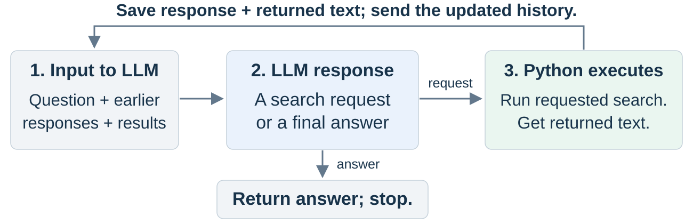
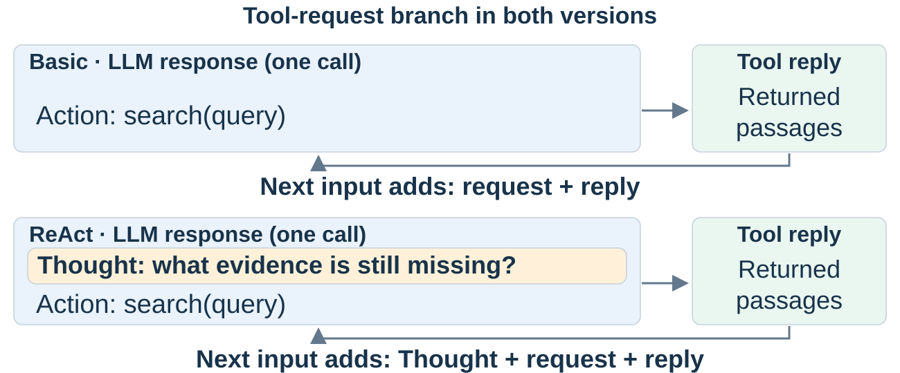

<!-- course-navigation:start -->
<nav class="chapter-nav" aria-label="Course navigation">
<a href="../../index.html">Home</a>
<a href="../reading.html">All chapters</a>
<a href="../../week04.html">Week 4 materials</a>
</nav>
<!-- course-navigation:end -->

<button id="classroom-toggle" type="button" aria-pressed="false">Larger text</button>
<button id="answers-toggle" type="button" aria-pressed="false">Show all answers</button>

::: {.callout-note appearance="minimal"}
## Learning objectives

- Explain the steps of the agent loop.
- Explain why the program saves each request and each result.
- Name the stop conditions of an agent loop.
- Explain what ReAct adds with Thought, Action, and Observation.
:::

In Chapter 3, the program ran one tool and returned its result to the model. Some questions need several tool calls. The model can select the next call only after it sees a result. This chapter shows two methods:

- The **agent loop** repeats the tool round trip until the model gives an answer.
- **ReAct** adds a written reasoning step before each action.

## Part 1. The agent loop {#agent-loop}

### 1.1 Why a loop {#why-loop}

One round trip gives one result. But one result can give only part of the answer. For example: "Where was the author of the novel born?" The first search gives the name of the author. The second search gives the birthplace. The model can write the second request only after it sees the first result. For this, the program must repeat the round trip.

::: {.callout-tip icon=false}
## Agent loop

A repeated process. In each round, the model selects the next action from the task and the results so far. The program runs the action and adds the result to the next model input.
:::

### 1.2 How the loop works {#loop-steps}

1. **Call the model.** The program sends the conversation: the instructions, the question, and all earlier requests and results.
2. **Read the response.** The response is a tool request or a final answer.
3. **Run the tool.** If the response is a request, the program runs the tool.
4. **Save both.** The program adds the request and the result to the conversation. Then it goes back to step 1.

{#fig-agent-loop fig-alt="1. Input to LLM: question, earlier responses, and results. 2. LLM response: a search request or a final answer. 3. Python executes the request. The response and the returned text go back into the input. An answer returns and stops the loop."}

The result of a tool is an **observation**. The saved observation is the important part of the loop. Without it, the next model call does not know what the tool returned.

The model selects each action, but it does not run the tools. The program runs the tools and keeps the conversation.

### 1.3 Stop conditions {#stop}

A loop needs a stop condition. It stops in one of two ways:

1. **The model gives a final answer.** In the lab, the model selects the operation `finish` with its answer.
2. **The number of model calls gets to a limit.** Then the program reports that there is no answer.

::: {.checkpoint}
### Check 1 · Save the observation

The program runs the tool but saves only the request of the model. What does the next model call not receive?

Read the answer

The observation: the result of the tool. Without it, the model cannot use that result to select the next action or to answer.

:::

## Part 2. ReAct {#react}

### 2.1 Why write a reasoning step {#why-react}

In the basic loop, the model writes only the next action. The response does not show why the model selects that action. A written assessment helps the model keep track of what it knows and what it does not know yet. ReAct adds this assessment before each action.

::: {.callout-tip icon=false}
## ReAct

A method in which the model writes a short reasoning step, the **Thought**, before each action. The Thought uses the observations so far to select the next action (Yao et al., 2022).
:::

### 2.2 Thought, Action, Observation {#react-steps}

Each round of ReAct has three parts:

| Part | Meaning | Who writes it |
|---|-----|---|
| **Thought** | An assessment: what the evidence shows, what is not known yet, and what to do next | The model |
| **Action** | The tool request | The model |
| **Observation** | The result of the action | The program, which runs the tool |

The Thought and the Action are in one model response. The Observation comes after the program runs the tool. The program saves all three parts. The next Thought can then use the new observation.

{#fig-react fig-alt="Basic: the LLM response contains an action; the next input adds the request and the reply. ReAct: the LLM response contains a Thought and an action; the next input adds the Thought, the request, and the reply."}

### 2.3 What ReAct changes {#react-vs-basic}

ReAct does not change the loop. The program still runs the tools, saves the results, and stops at the same conditions. Only the model response changes: it contains a Thought and an Action.

In the lab, ReAct adds two things: one paragraph in the instructions, and a `thought` field in the tool request. A Thought is text that the model writes. Compare it with the observations.

::: {.checkpoint}
### Check 2 · Basic and ReAct

What does a ReAct response contain that a basic response does not contain?

Read the answer

A Thought: a written assessment of the evidence so far and of the next action.

:::

## Summary {#recap}

- The agent loop repeats the round trip: call the model, run the requested tool, and save the request and the result.
- The saved observation lets the next model call use the result.
- The loop stops at a final answer or at a call limit.
- ReAct adds a Thought before each Action.
- ReAct does not change the loop. It changes only the content of the model response.

## Lab preparation: from concept to code {#implementation}

The lab uses the OpenAI SDK and a shop database. The model has one tool, `act`. Its field `action` names an operation: `run_sql`, `calculate`, or `finish`. Its field `action_input` holds the input.

| Concept | Lab code (short form) |
|--|-------|
| Call the model | `response = client.chat.completions.create(model=MODEL, messages=messages, tools=tools, tool_choice="required")` |
| Read the request | `request = json.loads(message.tool_calls[0].function.arguments)` |
| Run the tool | `result = operations[request["action"]](request["action_input"])` |
| Save the request | `messages.append(message.model_dump(exclude_none=True))` |
| Save the observation | `messages.append({"role": "tool", "tool_call_id": call.id, "content": json.dumps(result)})` |
| Stop at an answer | `if request["action"] == "finish" and "answer" in result: return ...` |
| Stop at a limit | `for turn in range(max_calls):` |
| ReAct | `run_loop(question, instructions=BASE + REACT, tools=action_tools(react=True))` |

## Lab {#lab-guide}

1. Do one exchange by hand: request, run, and save.
2. Run the same steps as a loop with `run_loop`. Find where the loop stops.
3. Add ReAct to the same question. Read how each Thought uses the last observation.
4. Change the question to the average value of a completed order.
5. Compare sales in February and March. Use the first result to select the next question.

[Lab notebook in Colab](https://colab.research.google.com/github/ralbu85/stml_2026/blob/main/lectures/week04/W4_lab_sql_manual.ipynb) · [Download the notebook](W4_lab_sql_manual.ipynb) · [Local Jupyter bundle](W4_lab_bundle.zip)

[Homework: Follow the Evidence in a Sales Investigation](W4_hw_sales_investigation.ipynb) uses the same loop on sales in January and February. See the [Week 4 homework and submission instructions](../../week04.html#homework).

## Materials and sources {#sources}

- Yao et al., [ReAct: Synergizing Reasoning and Acting in Language Models](https://arxiv.org/abs/2210.03629) (2022) · [Author project](https://react-lm.github.io/): reasoning steps and actions in one loop.
- [OpenAI — Function calling guide](https://developers.openai.com/api/docs/guides/function-calling): the message pattern for tool requests and tool results.
- [Lab notebook](W4_lab_sql_manual.ipynb) · [Lab bundle](W4_lab_bundle.zip).

<!-- course-pagination:start -->
<nav class="chapter-pagination" aria-label="Previous and next chapters">
<a href="../week03/notes.html" rel="prev">← Previous: 3 · Tool Use</a>
<a href="../week05/notes.html" rel="next">Next →: 5 · Reflection &amp; Evaluation</a>
</nav>
<!-- course-pagination:end -->
