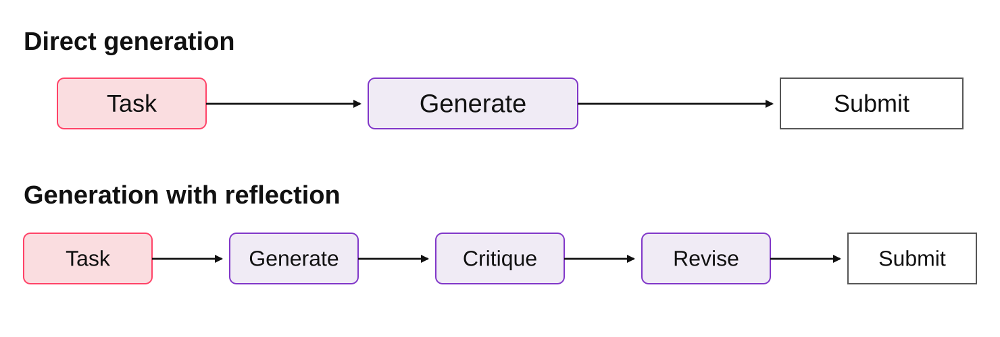
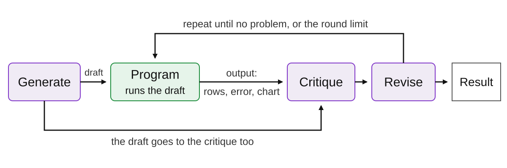
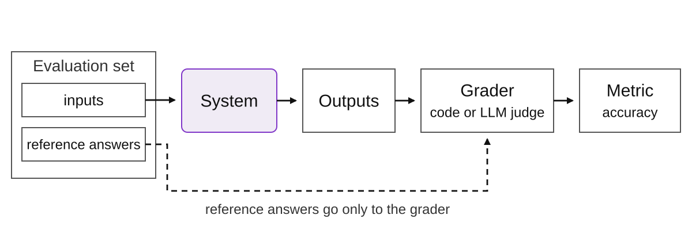
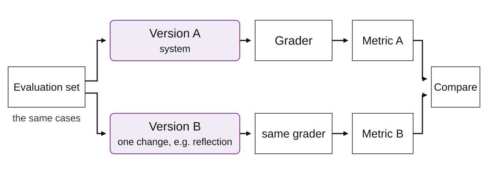

<!-- course-navigation:start -->
<nav class="chapter-nav" aria-label="Course navigation">
<a href="../../index.html">Home</a>
<a href="../reading.html">All chapters</a>
<a href="../../week05.html">Week 5 materials</a>
</nav>
<!-- course-navigation:end -->

<button id="classroom-toggle" type="button" aria-pressed="false">Larger text</button>
<button id="answers-toggle" type="button" aria-pressed="false">Show all answers</button>

::: {.callout-note appearance="minimal"}
## Learning objectives

- Explain the three steps of reflection.
- Explain what external feedback adds to a critique.
- Name the parts of an evaluation.
- Compare two versions of a system with an evaluation.
:::

In Chapter 4, the agent loop returned the first final answer of the model. That answer can contain errors. This chapter adds two methods:

- **Reflection** corrects a result before the system returns it.
- **Evaluation** measures how frequently the results of a system are correct.

## Part 1. Reflection {#reflection}

### 1.1 Why review a result {#why-reflect}

A person often finds errors in a draft when they read it again. The draft is complete, so the person can compare it with the task. A model can do the same. After the model writes a result, a second step gives the result back to the model. This step asks one question: what must change so that the result satisfies the task?

### 1.2 Reflection {#reflection-def}

::: {.callout-tip icon=false}
## Reflection

A workflow in which an LLM examines a result, writes feedback about it, and then uses that feedback to change the result.
:::

Reflection has three steps:

1. **Generate.** The model does the task and writes a first result, the **draft**.
2. **Critique.** The model receives the task and the draft. It examines the draft against the task and lists the problems. This list is the **critique**.
3. **Revise.** The model receives the critique and changes the draft.

::: {.diagram-scroll .comparison-scroll tabindex="0" role="region" aria-label="Comparison of direct generation and reflection; scroll horizontally on small screens"}

{#fig-reflection-flow fig-alt="Direct generation: Task, Generate, Submit. With reflection: Task, Generate, Critique, Revise, Submit."}

:::

The same model can do all three steps. Each step is only a different prompt, and the model itself does not change (Madaan et al., 2023).

### 1.3 Feedback {#feedback}

The critique is one type of **feedback**: information about a result that the next step uses. A model writes the critique from the text of the draft. But some errors are not visible in the text. For example, a SQL query can look correct and still return wrong rows.

**External feedback** comes from outside the model. A program runs the result or draws it, and it gives the output:

- the rows that a query returns,
- an error message,
- a chart that code draws.

The program gives this output to the model together with the draft. Then the critique can use facts about the result, not only its text. For this reason, reflection is most useful when a program can run or examine the result.

### 1.4 The reflection loop {#reflection-loop}

The critique and the revision can repeat. Each round examines the latest version. The loop stops when the critique finds no problem, or when the number of rounds gets to a limit. Each round adds model calls, so the limit is usually small.

::: {.diagram-scroll tabindex="0" role="region" aria-label="Reflection with external feedback"}

{#fig-external-feedback fig-alt="Task, Generate, a program runs the draft; its output (rows, error, chart) and the draft go to Critique; Revise; Result. The revised version runs again until no problem remains or the round limit."}

:::

::: {.checkpoint}
### Check 1 · External feedback

What does external feedback give to the critique that the text of the draft does not give?

Read the answer

Facts about what the result does: for example, the rows that a query returns, an error message, or the chart that code draws.

:::

## Part 2. Evaluation {#evaluation}

### 2.1 Why measure {#why-evaluate}

Reflection can correct one result. But does it make the system better on most tasks? One good result does not answer this question. We must run the system on many tasks and count the correct results. This measurement is an evaluation.

::: {.callout-tip icon=false}
## Evaluation

A measurement of the outputs of a system against written criteria on a fixed set of cases.
:::

### 2.2 The parts of an evaluation {#evaluation-parts}

Chapter 2 compared two prompts with an evaluation set and accuracy. This section names all parts of an evaluation.

An evaluation starts with a **criterion**: a written rule that a correct output obeys. For example: "The output is the payment due date of the invoice, in the form `YYYY/MM/DD`."

Next, the evaluation needs cases. An **evaluation set** is a fixed set of inputs for the system. For each input, a person writes the correct output. This output is the **reference answer**. The system does not receive it.

A **grader** applies the criterion to each output and gives a grade. A **metric** summarizes the grades. The simplest metric is **accuracy**: the number of correct outputs divided by the number of cases.

::: {.diagram-scroll tabindex="0" role="region" aria-label="The parts of an evaluation"}

{#fig-evaluation-parts fig-alt="Evaluation set with inputs and reference answers; the inputs go to the System, its Outputs go to the Grader (code or LLM judge), and the Grader gives the Metric (accuracy). The reference answers go only to the Grader."}

:::

### 2.3 Two types of grader {#graders}

Some criteria are exact. A date is equal to the reference date, or it is not. Code can grade these criteria, for example with `pred == ref`.

Other criteria need an interpretation of meaning. For example: "The summary keeps the three main facts." Two summaries can use different words for the same fact. For these criteria, a model grades the output. This model is an **LLM judge**. It receives the task, the output, and a **rubric**: the criteria and the rules for the score. An LLM judge is also a model, so it can make errors. Known errors include a preference for the first answer in a comparison, for longer answers, and for answers in its own style (Zheng et al., 2023). Before you use it, compare its grades with the grades of a person on some cases.

### 2.4 Compare two versions {#compare}

An evaluation lets you compare two versions of a system. Run both versions on the same evaluation set with the same grader. Change only one part, for example the system message, or add reflection. Then the difference in the metric comes from that change.

::: {.diagram-scroll tabindex="0" role="region" aria-label="Comparing two versions"}

{#fig-compare-versions fig-alt="The same evaluation set goes to Version A and Version B (one change, for example reflection); the same grader gives Metric A and Metric B, which are compared."}

:::

Also read the failed cases. They show what to change next.

::: {.checkpoint}
### Check 2 · Does reflection help?

You add reflection to a system. How do you find out if the system is better?

Read the answer

Run the system with reflection and without reflection on the same evaluation set. Grade both with the same grader, and compare the accuracy. Also compare the number of model calls, because reflection adds calls.

:::

For regression tests and component tests, read the [optional evaluation supplement](evaluation-supplement.html).

## Summary {#recap}

- Reflection has three steps: generate, critique, and revise. The same model can do all three steps.
- External feedback, such as the output of a program, gives the critique facts about the result.
- An evaluation has a criterion, an evaluation set with reference answers, a grader, and a metric.
- Code grades exact criteria. An LLM judge with a rubric grades criteria that need an interpretation of meaning.
- To compare two versions, use the same evaluation set and the same grader, and change one part.

## Lab preparation: from concept to code {#implementation}

The lab uses the `Agent` class from the practice notebook. Each call to `ask` adds a user message to the list of the object and keeps the reply.

| Concept | Lab code (short form) |
|--|-------|
| Generate | `query = writer.ask(QUESTION)` |
| External feedback | `rows = run_sql(query)` |
| Critique | `feedback = reviewer.ask(question + query + rows)` |
| Revise | `writer.ask("A reviewer wrote: " + feedback + " Revise the query if needed.")` |
| Run one case | `Agent(EXTRACT_SYSTEM).ask(invoice)`: a new object for each case, so each case starts with an empty list |
| Code grader | `date_matches(pred, ref)` |
| LLM judge | `Agent(JUDGE_SYSTEM, json_mode=True)`: the rubric is its system message |

## Lab {#lab-guide}

1. Do the practice notebook first.
2. Part 1: correct a SQL query with reflection. Then use a database error message as feedback.
3. Part 2: measure the accuracy on ten invoices with code.
4. Part 3: grade summaries with an LLM judge, and compare the judge with human labels.

[Practice notebook in Colab](https://colab.research.google.com/github/ralbu85/stml_2026/blob/main/lectures/week05/W5_practice_core_patterns.ipynb) · [Lab notebook in Colab](https://colab.research.google.com/github/ralbu85/stml_2026/blob/main/lectures/week05/W5_lab_reflection_evals.ipynb) · [Homework notebook in Colab](https://colab.research.google.com/github/ralbu85/stml_2026/blob/main/lectures/week05/W5_hw_chart_reflection.ipynb): reflection on a rendered chart. Submit the homework on the LMS.

## Materials and sources {.unnumbered #sources}

- Andrew Ng, [Agentic AI](https://www.deeplearning.ai/courses/agentic-ai): Module 2 (reflection, and the adapted workflow diagram) and Module 4 (evaluation).
- Madaan et al., [Self-Refine](https://arxiv.org/abs/2303.17651) (2023): generation, feedback, and revision with one LLM.
- Zheng et al., [Judging LLM-as-a-Judge](https://arxiv.org/abs/2306.05685) (2023): LLM judges and their agreement with human grades.

<!-- course-pagination:start -->
<nav class="chapter-pagination" aria-label="Previous and next chapters">
<a href="../week04/notes.html" rel="prev">← Previous: 4 · The Agent Loop and ReAct</a>
<a href="../week06/notes.html" rel="next">Next →: 6 · Multi-Agent Systems</a>
</nav>
<!-- course-pagination:end -->
