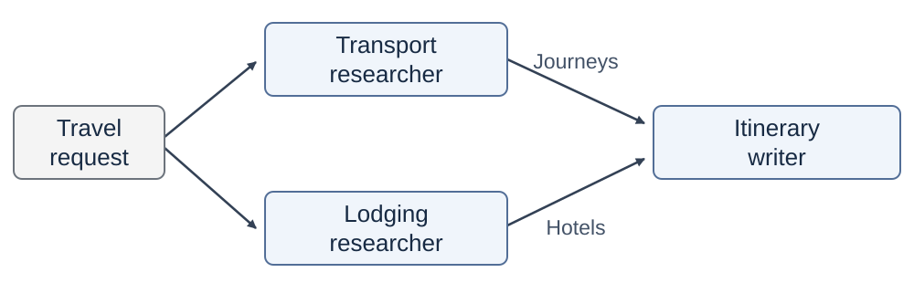
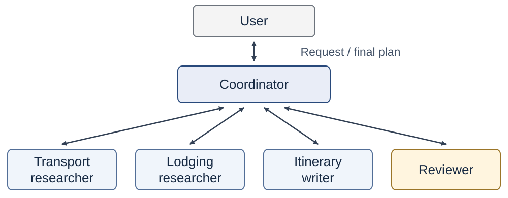

<!-- course-navigation:start -->
<nav class="chapter-nav" aria-label="Course navigation">
<a href="../../index.html">Home</a>
<a href="../reading.html">All chapters</a>
<a href="../../week06.html">Week 6 materials</a>
</nav>
<!-- course-navigation:end -->

<button id="classroom-toggle" type="button" aria-pressed="false">Larger text</button>
<button id="answers-toggle" type="button" aria-pressed="false">Show all answers</button>

::: {.callout-note appearance="minimal"}
## Learning objectives

- Explain what a multi-agent system is and why a task can use one.
- Define a role, a handoff, and coordination.
- Define a communication structure, and name the four structures and the situation for each.
- Build a team of `Agent` objects, with a coordinator agent.
:::

In Chapter 5, a reviewer model examined the result of a writer. That system already had two roles. This chapter uses several agents for one task. It explains how to divide the task and how to connect the results.

## Part 1. Multi-agent systems {#concepts}

### 1.1 Why use several agents {#introduction}

One agent can do a large task. But its instructions, tools, and history must then cover all parts of the task. A travel plan, for example, needs transport, a hotel, and a schedule. If one agent does all three parts, its instructions become long, and its history mixes all three parts. We can divide the work among several agents instead.

### 1.2 Multi-agent system {#definition}

::: {.callout-tip icon=false}
## Multi-agent system

A system in which several agents do parts of one task and exchange their results to complete the task.
:::

Each agent in the system has a role.

::: {.callout-tip icon=false}
## Role

The responsibility of one agent in a multi-agent system. An agent in a role has its own instructions, its own tools, and its own history.
:::

Two agents can use the same model. Their roles make them different.

A simple travel team has three roles:

| Agent | Contribution |
|---|---|
| Transport researcher | Finds a train, with its times and fare |
| Lodging researcher | Finds a hotel, with its price and distance from the station |
| Itinerary writer | Combines the two results into a schedule and a budget |

### 1.3 What a division gives {#purpose}

A division of the task gives three possible advantages:

1. **Specialization.** Each agent receives only the instructions and tools for its part.
2. **Parallel work.** Parts that do not depend on each other can run at the same time.
3. **Review.** Another agent can examine a result against the task, as the reviewer did in Chapter 5.

Each agent adds model calls. For this reason, use several agents when the division makes the task easier to do or to examine.

## Part 2. Collaboration {#collaboration}

### 2.1 Roles {#role-assignment}

A role has three parts:

1. **A task:** the part of the work that the agent does.
2. **Information and tools:** what the agent needs for that task.
3. **An output:** a result that another agent or the user uses.

In code, the system message gives the task, the tool list gives the tools, and the returned answer is the output.

### 2.2 Handoff {#information-exchange}

Agents exchange messages: tasks, findings, questions, and feedback.

::: {.callout-tip icon=false}
## Handoff

The transfer of a task and the information that is necessary to continue it.
:::

An agent knows only what is in its messages. For this reason, a handoff must carry the findings, not only a report that the work is done. "Transport: done" does not help the writer. "The train arrives at 10:00, and the fare is $90" lets the writer plan the first day.

### 2.3 Coordination {#coordination}

::: {.callout-tip icon=false}
## Coordination

The decision of which agent works next and what it receives.
:::

**Integration** combines the results of the agents into one result.

The order of the work comes from the dependencies. An agent that needs the output of another agent must wait for it. Agents that do not need each other's output can work in parallel. In the travel team, the two researchers can start at the same time. The writer waits for both results.

::: {.diagram-scroll tabindex="0" role="region" aria-label="Travel task dependencies"}
{fig-alt="The travel request goes to transport and lodging researchers. Their findings both go to the itinerary writer, which produces one plan."}
:::

Code can do the coordination with a fixed order. An agent can also do it: it reads each result and decides the next task. These two choices lead to different communication structures.

::: {.checkpoint}
### Check 1 · A handoff

The writer receives only this message: "Transport and hotel: sorted." Which information is not in the message, and where must it come from?

Read the answer

The message does not give the train times, the fare, the hotel, or its price. This information must come from the results of the two researchers, in the message to the writer.

:::

## Part 3. Communication structures {#structures}

### 3.1 Four structures {#comparison}

::: {.callout-tip icon=false}
## Communication structure

The pattern of which agents send messages to which agents.
:::

| Structure | How work passes | Use it when |
|--|-----|----|
| Sequential | Each agent gives its output to the next agent, in a fixed order. | The order of the work is known before the run. |
| Manager | A coordinator gives tasks to agents and receives their results. | The next task depends on the results. |
| Hierarchical | A manager gives large parts to leads. Each lead manages its own agents. | Each large part needs its own team. |
| All-to-all | Each agent can send messages to each other agent. | Agents must frequently agree on details. |

A system can combine these structures. For example, a manager can run two researchers in parallel. Select the structure that matches the dependencies of the task.

### 3.2 A coordinator agent {#manager}

In the manager structure, an agent is the coordinator. The coordinator uses the other agents as its tools. To make an agent into a tool, put it in a function. The argument of the function is the task. The function returns the answer of the agent. The loop of the coordinator then calls these functions, as the agent loop of Chapter 4 calls tools.

::: {.diagram-scroll tabindex="0" role="region" aria-label="Travel-planning agent system"}
{fig-alt="The user sends a request to the coordinator. The coordinator exchanges assignments and results with transport researcher, lodging researcher, itinerary writer, and reviewer, then returns a final plan to the user."}
:::

Is a team better than one agent? To find out, use an evaluation from Chapter 5. Give both systems the same requests, and grade both with the same criteria. Also compare the model calls.

::: {.checkpoint}
### Check 2 · Choose a structure

The hotel price changes the next task: if the total is too high, the lodging researcher must search again. Which structure fits, sequential or manager?

Read the answer

The manager structure. The coordinator reads the result and then decides the next task. A sequential structure has a fixed order before the run.

:::

## Summary {#recap}

- A multi-agent system divides one task among agents and connects their results.
- A role has a task, information and tools, and an output.
- A handoff carries the task and the findings. An agent knows only what is in its messages.
- Coordination follows the dependencies. Code or a coordinator agent can do it.
- A communication structure is the pattern of messages between agents: sequential, manager, hierarchical, or all-to-all.

## Lab preparation: from concept to code {#implementation}

The lab uses the `Agent` class from the practice notebook. Each role is one `Agent` object. A handoff is a user message to the next object.

| Concept | Lab code (short form) |
|--|-------|
| Role | `lodging = Agent(LODGING_SYSTEM, [find_hotels])` |
| Task for a role | `lodging_result = lodging.ask(REQUEST)` |
| Handoff | `writer.ask(handoff)`: `handoff` contains the request and the results of the two researchers |
| Review | `reviewer.ask("Request:\n" + REQUEST + ... + "Draft:\n" + draft)` |
| Targeted revision | `lodging.ask("Find a hotel costing at most $120 ...")`, then `writer.ask(review + new_hotel)` |
| Agent as a tool | `def ask_lodging(task: str): return lodging_team.ask(task)` |
| Coordinator agent | `Agent(COORDINATOR_SYSTEM, [ask_transport, ask_lodging, ask_writer, ask_reviewer])` |
| Cost of the team | The sum of `total_tokens` of all objects |

## Lab {#lab-guide}

1. Make one `Agent` object for each role, with its own tools.
2. Compare a handoff that says only "sorted" with a handoff that carries the findings.
3. Write the instructions of the reviewer. Then revise only the affected work.
4. Let a coordinator agent assign the work, with the roles as its tools.
5. Examine the final plan with code, and compare the cost of the two runs.

[Lab notebook in Colab](https://colab.research.google.com/github/ralbu85/stml_2026/blob/main/lectures/week06/W6_lab_multiagent.ipynb) · [Download the lab](W6_lab_multiagent.ipynb) · [Homework notebook](W6_hw_new_intent.ipynb).

## Materials and sources {.unnumbered #sources}

- Wu et al., [AutoGen](https://arxiv.org/abs/2308.08155) (2023): agents that collaborate through conversations.
- Hong et al., [MetaGPT](https://arxiv.org/abs/2308.00352) (2023): roles that follow set procedures and exchange work products.
- Anthropic, [Building effective agents](https://www.anthropic.com/engineering/building-effective-agents) (2024): workflow patterns, such as orchestrator and workers.

<!-- course-pagination:start -->
<nav class="chapter-pagination" aria-label="Previous and next chapters">
<a href="../week05/notes.html" rel="prev">← Previous: 5 · Reflection &amp; Evaluation</a>
<a href="../week07/notes.html" rel="next">Next →: 7 · Planning &amp; Search</a>
</nav>
<!-- course-pagination:end -->
