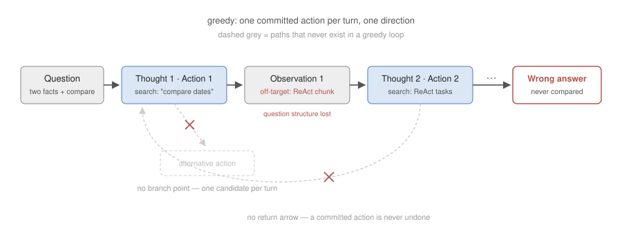
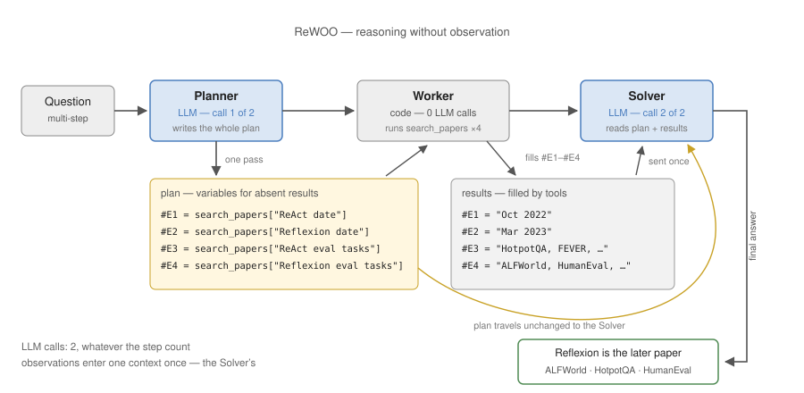
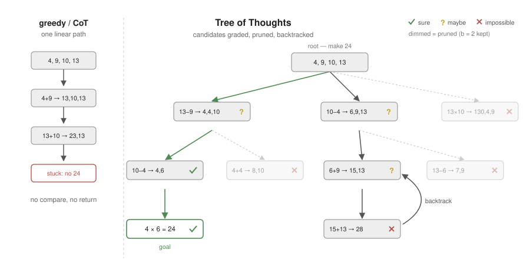

# Chapter 7. Planning & Search

Chapter 6 arranged agents into pipelines and orchestrations, and every arrangement presupposed a sequence of steps — fixed by the developer, or produced at run time by an orchestrator's judgment. This chapter examines that production itself. Some questions can only be answered by establishing several facts separately and combining them: a question that asks for the evaluation tasks of whichever of two papers was published later is of this kind. The loop of Chapter 4 reads the record accumulated so far and commits to exactly one next action per turn, so when the first action goes astray, it advances to the end along the wrong path. It compares no alternative paths, and it never undoes a committed action. The remedy that writes out the whole path in text before execution is planning; the remedy that generates several paths, compares them midway, and backtracks is search.

## 7.1 The Problem — Greedy Progression

The way the loop of Chapter 4 chooses actions is called **greedy**: at every turn it commits to the single most plausible action, keeps no alternatives, and never backtracks. The following is the typical way this progression collapses on a multi-step question. The question is "What are the evaluation tasks of whichever paper, ReAct or Reflexion, was published later?", and the tool is `search_papers`, a keyword search over the course's paper corpus, registered like any tool of Chapter 3 (how such retrieval works inside is Chapter 8's subject).

> Thought 1: The two papers must be compared.
> Action 1: search_papers["comparison of ReAct and Reflexion publication dates"]
> Observation 1: (no passage compares the two papers; a chunk summarizing ReAct is returned)
>
> Thought 2: Content about ReAct came back. Find ReAct's evaluation tasks.
> Action 2: search_papers["ReAct evaluation tasks"]
> …

The very first search went wrong. A question that requires two facts to be established separately (each paper's publication date) and then compared was lumped into a single search, and no such comparison passage exists in the documents. Led by the off-target observation, the model loses the structure of the original question (which paper is later is still unknown) and keeps advancing along the wrong path. The failure divides in two: the whole path was never drawn in advance (absence of a path), and there is no device that detects a wrong turn and returns from it (absence of recovery).



*Figure 7.1 — Greedy progression: one committed action per turn, no alternatives kept, no way back — a wrong first step propagates to the end.*

## 7.2 Task Decomposition and Planning

**Task decomposition** = dividing a composite task into ordered subtasks; the resulting sequence of steps is a **plan**. The planner is also the model: before execution begins, a decomposition prompt is processed first.

```
[Prompt] Decompose the question into subtasks each answerable with one search.
         Question: What are the evaluation tasks of whichever paper, ReAct or
         Reflexion, was published later?

[Model]  1. Find the publication date of ReAct.
         2. Find the publication date of Reflexion.
         3. Compare the two dates and determine the later paper.
         4. Find the evaluation tasks of that paper.
```

The reason for making the model write the plan out first is the same principle as in Chapter 2. The model has no workspace outside of text (→ 2.2), so a plan that is not written down does not exist for later predictions. When the plan sits in the context, every turn's action choice refers to the whole path, and the failure of 7.1 — being pulled off the question's structure by the first observation — becomes less frequent.

There are two ways to couple planning with execution.

| | interleaved (ReAct, Ch. 4) | plan-then-execute |
|---|---|---|
| when planning happens | every turn, after the latest observation | once, at the start |
| strength | flexible path revision in response to observations | prevents path loss; progress is checkable |
| weakness | easily loses the path (7.1) | an observation that breaks a premise invalidates the plan |

The complement to plan-then-execute's weakness is replanning, and it must be operated with an explicit trigger and scope. The **plan–execute–replan loop** consists of the following steps.

1. **Plan** (model) — decompose the question into a full sequence of subtasks before execution.
2. **Execute** (loop) — run the subtasks in order, recording each result.
3. **Replan** (model, conditional) — trigger only when an observation breaks a premise of the plan (a sought item does not exist, an assumed fact is contradicted); keep the results of completed steps as fixed premises and rewrite only the remaining steps, then return to Execute.

This iteration is the basic skeleton of production planners, and it is what Chapter 6's orchestrator–workers pattern executes when the plan's steps are dispatched to separate agents instead of one loop.

Plan-then-execute is visible in products as a control surface. Deep Research products present the research plan for approval before spending the browsing budget, and coding agents ship plan modes (Claude Code, Cursor) that write the whole path out for review before the first edit — a human reader standing exactly where this section put the replan trigger.

## 7.3 Separating Planning from Execution — ReWOO

Interleaved progression has a cost problem separate from accuracy. The Call step of the loop (→ 4.1) re-sends the entire conversation so far to the model at every turn. Search observations are long, so over n turns the first observation is re-sent n times, the second n−1 times. Each action also costs one LLM call. On multi-step tasks, tokens and call counts grow with the number of steps.

With a fixed prompt of $p$ tokens, an average observation of $\bar{o}$ tokens, and $n$ turns, the total input tokens of a progression that re-sends everything each turn is

$$\sum_{t=1}^{n} \big( p + (t-1)\,\bar{o} \big) = np + \frac{n(n-1)}{2}\,\bar{o},$$

which grows quadratically in the number of turns. The LLM is also called $n$ times.

**ReWOO (Reasoning WithOut Observation)** = a configuration that reduces this cost by separating reasoning from observation (Xu et al., 2023). The procedure divides into three modules.

1. **Planner** (LLM) — reads only the question and writes the entire plan at once, referring to results that do not yet exist through variables (#E1, #E2).
2. **Worker** (code) — executes each step of the plan with tools and fills the variables with actual results. No LLM call.
3. **Solver** (LLM) — reads the question, the plan, and all filled-in results at once and writes the final answer.



*Figure 7.2 — ReWOO: the planner writes the whole plan against variables, code fills them, and the solver reads everything once — LLM calls only at the two ends.*

The planner's output takes the following form.

```
Plan: Find the publication date of ReAct.        #E1 = search_papers["ReAct publication date"]
Plan: Find the publication date of Reflexion.    #E2 = search_papers["Reflexion publication date"]
Plan: Find the evaluation tasks of ReAct.        #E3 = search_papers["ReAct evaluation tasks"]
Plan: Find the evaluation tasks of Reflexion.    #E4 = search_papers["Reflexion evaluation tasks"]
```

The third step of the original question (find the evaluation tasks of the later paper) is a branch that depends on an observation: which paper to search changes with which one is later, and the planner cannot resolve that branch without observations. The plan therefore fetches the evaluation tasks of both papers and defers the decision of which to use to the solver, which reads all the results.

LLM calls number two (planner, solver) regardless of the step count, and observations are read once by the solver instead of being re-sent, so the total input is on the order of $2p + n\bar{o}$ — linear. The quadratic term above disappears, so the cost drops. The paper reports that on the same tasks, token consumption falls sharply relative to ReAct while accuracy is maintained; the numbers are covered in the presentation. The price is flexibility: observations made during execution cannot be reflected into the plan, so tasks whose observations break the plan's premises require returning to the replanning of 7.2. The configuration suits tasks whose step structure is predictable.

## 7.4 Search — Tree of Thoughts

A plan is still a single path. If the first plan is wrong, the absence of recovery from 7.1 repeats at the level of plans. Chapter 2 already showed a method that uses multiple paths: self-consistency (→ 2.5) generates N independent paths to completion and takes a majority vote. But each path is judged only at its end, so a path that went wrong early still spends its full cost, and there is no comparison of intermediate states across paths. What is needed is the ability to judge promise in the middle of a path, branch toward the promising side, and return when blocked.

**Tree of Thoughts (ToT)** = a configuration that treats partial-solution states as nodes, generates several candidate next steps per state, evaluates each state's promise, and finds a solution by tree search (Yao et al., 2023). The components are as follows.

1. **Candidate generation** (model) — from the current state, sample several candidate next thoughts (intermediate steps).
2. **State evaluation** (model) — judge how likely each candidate state is to lead to a solution. Two formats exist: scoring each state independently (the paper's sure / maybe / impossible grades), and placing candidates side by side and voting for the most promising. Either way, choosing the best among several candidates requires a scoring verifier, and the model's self-evaluation plays that verifier role (Best-of-N, → 2.6).
3. **Search** (code) — expand the tree according to the evaluations. Breadth-first search (BFS) keeps only the top b most promising states at each depth; depth-first search (DFS) pursues one path and, on an "impossible" verdict, abandons that branch and returns to the fork (backtracking).



*Figure 7.3 — Tree of Thoughts: candidate states graded, unpromising branches pruned or abandoned (backtracking), against the single path of greedy/CoT.*

The paper's example, Game of 24 (make 24 from four given numbers with the four arithmetic operations), shows the structure clearly. From the state "4, 9, 10, 13", candidates such as "13 − 9 = 4 (remaining: 4, 4, 10)" are generated, and each intermediate state is evaluated for whether 24 is still reachable, pruning branches as the search advances. A task that single-pass generation or CoT almost never solves is improved by a wide margin under search; the numbers are covered in the presentation.

ToT belongs to the family of methods that buy accuracy with more predictions at inference time (test-time compute, → 2.6), as its tree-search member — and it is the most expensive one, because model calls are spent not only on candidate generation but also on evaluation. For BFS with depth $d$, $b$ states kept per depth, and $k$ candidates per state, generation calls are on the order of $d \cdot b \cdot k$, with evaluation calls added on top. This is an order of magnitude beyond self-consistency's five samples of the same question.

## 7.5 Adoption Criteria

Planning and search are both extensions of test-time compute (→ 2.6) — accuracy bought with more predictions — and the adoption criteria follow from the same trade. Attaching a planner to a question answered by a single search wastes cost and latency. Multi-step tasks with a clear step structure profit from decomposition and planning; among them, tasks with predictable steps profit from ReWOO's separation. Search holds for tasks whose intermediate states can be evaluated (puzzles, generation under explicit constraints); where evaluation is impossible or inaccurate, it only spends cost. For every configuration, the basis of the decision is a number measured on an evaluation set (→ 5.11).

## 7.6 Summary

The failure of greedy progression divides into the absence of a whole path and the absence of recovery. The remedy for the former is task decomposition: making the model write the plan first lets every action choice refer to the whole path. Separating planning from execution entirely (ReWOO) removes observation re-sending and per-turn calls, so the cost drops. The remedy for the latter is search: ToT, which evaluates intermediate states, prunes, and backtracks, turns self-consistency's independent sampling into structured search. All three are exchanges of computation for accuracy, so the task and the measurement decide adoption.

Even with a plan and search, a committed answer can still be wrong. The remedy — critique grounded in external signals — was Chapter 5, and this week's lab wires the whole first half together: a planner from this chapter drives tool-using loops from Chapter 4, arranged as the specialist pipeline of Chapter 6, closed by the reflection of Chapter 5 and scored by its evaluation half.

## 7.7 Discussion

Each question is answerable with this chapter's concepts; section numbers point at the relevant part.

1. In the failing trace of 7.1, the very first search already went wrong. Separate the two absences that define greedy failure, and state which one planning repairs and which one search repairs.
2. Why must a plan be written into the context rather than "kept in mind" (7.2, → 2.2)? And when an observation contradicts a plan premise, state the replan trigger and its scope — what stays fixed, what is rewritten.
3. For (a) "find the evaluation tasks of whichever of two papers is later" and (b) "keep searching until a dataset with property X appears," decide which suits ReWOO and which needs interleaved execution (7.3), and support the choice with the cost shape.
4. Tree of Thoughts lifts Game of 24 dramatically but does little for "write a better abstract." Name the requirement on intermediate states that decides this (7.4), and connect it to the verifier of 2.6.
5. The W7 lab's assembled system fails three ways: the report cites no sources; the research loop repeats one search; the plan never includes a drafting step. For each, name the catching device and its home chapter.

---

**Presentation.** Two papers this week: ReWOO (Xu et al., 2023) — the planner–worker–solver separation and its token/call savings; Tree of Thoughts (Yao et al., 2023) — branching thoughts, state evaluation, BFS/DFS, Game of 24. For both, listen with the question: where does the extra computation come from, and what breaks without it?

**Lab.** `W7_lab_research_agent.ipynb` — the first half assembled into one system, from Andrew Ng's *Agentic AI* final project: a decomposition planner (this chapter) routes steps to specialist sub-agents (Ch. 6) — a tool-using research loop (Ch. 4, Ch. 3), a writer, and an editor closing the reflection cycle (Ch. 5) — and the final report is scored against a checklist and an LLM judge (Ch. 5). Reference answers: `labs/checkpoints/week07/solution.py`.

**Homework.** `W7_hw_own_topic.ipynb` — the workflow run on a topic from your own research interests, with two self-designed checks added to the report checklist and the scored report submitted. Due before the W8 midterm.

**Next.** Week 8 is the written midterm exam, full session, covering weeks 1–7: the composition and principles of agent systems. Lectures and labs resume in Week 9 with retrieval augmentation.
