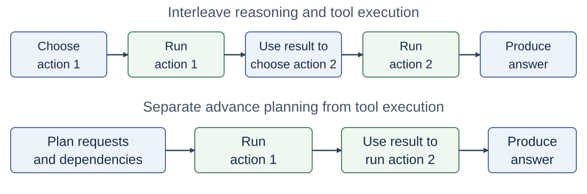
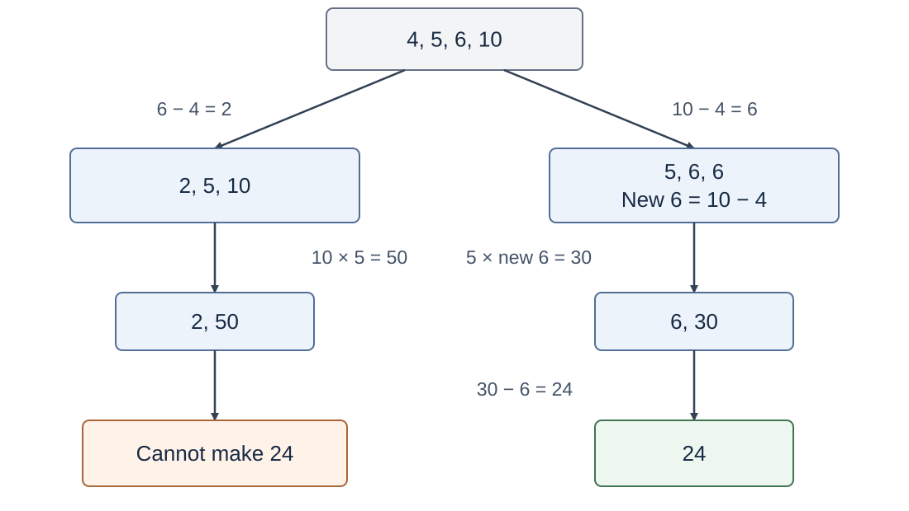

<!-- course-navigation:start -->
<nav class="chapter-nav" aria-label="Course navigation">
<a href="../../index.html">Home</a>
<a href="../reading.html">All chapters</a>
<a href="../../week07.html">Week 7 materials</a>
</nav>
<!-- course-navigation:end -->

<button id="classroom-toggle" type="button" aria-pressed="false">Larger text</button>
<button id="answers-toggle" type="button" aria-pressed="false">Show all answers</button>

::: {.callout-note appearance="minimal"}
## Learning objectives

- Explain goals, plans, task decomposition, and dependencies.
- Compare interleaved execution with plan-and-execute, and explain replanning.
- Explain the three parts of ReWOO.
- Explain states, backtracking, and search order, and how Tree of Thoughts uses them.
:::

In Chapter 4, the agent loop chose one action at a time. In Chapter 6, a team divided a task among agents. Some tasks need several connected actions before the answer is ready. This chapter explains how an agent makes a plan for such a task, and how it searches when several paths are possible.

## Part 1. Planning {#planning}

### 1.1 Why plan {#introduction}

Consider this request: "Find a way for me to reach the conference before it starts." The agent must find the venue and the start time. Then it must find journeys to the venue. Then it must compare the arrival times with the start time. If the agent chooses only one action at a time, it can forget a necessary step. A plan shows all the work before the work starts.

::: {.callout-tip icon=false}
## Plan

A set of tasks that reach a goal, with the order among the tasks. The **goal** is the result that we want. **Planning** is the work that makes the plan.
:::

### 1.2 Task decomposition and dependencies {#plan-construction}

**Task decomposition** divides a goal into smaller tasks. Each task gives a result that another task or the final answer uses.

A **dependency** exists when a task needs the output of another task. A task with a dependency must wait for that output. Tasks without dependencies can run in any order, or at the same time.

To make a plan, do these steps:

1. Write the final result that the goal needs.
2. Find the information that this result needs.
3. Write one task for each piece of information.
4. Put each task after the tasks whose outputs it needs.

### 1.3 Example: a plan for the conference {#basic-plan}

| Task | Output for the next task |
|--|----|
| Find the conference information. | The venue, the date, and the start time |
| Find journeys to the venue on that date. | The departure times and arrival times |
| Compare the arrival times with the start time. | A journey that arrives before the start |

Each task has an output that the next task uses. The last output answers the request.

## Part 2. Planning and execution {#execution}

### 2.1 Two approaches {#execution-approaches}

A plan must also be carried out. There are two approaches. They differ in when the model reads the tool results.

- **Interleaved execution.** The model chooses the next action after it reads the last observation. ReAct in Chapter 4 works in this way.
- **Plan-and-execute.** The model first writes the whole plan. Then an **executor** runs the tasks in order. It gives each result to the tasks that need it.

::: {.diagram-scroll tabindex="0" role="region" aria-label="How observations enter action decisions"}
{fig-alt="In the upper row, the model uses the result of action 1 to choose action 2. In the lower row, the plan specifies both actions and their dependency before execution; the result of action 1 supplies an input to action 2. Both rows end by answering."}
:::

| | Interleaved execution | Plan-and-execute |
|--|----|----|
| When the model chooses actions | After each observation | Once, before the run |
| Model calls | One call for each action | Fewer calls |
| Use it when | A result decides which task comes next | The tasks are known, and only their input values are not known |

### 2.2 Replanning {#replanning}

A result can show that the plan cannot reach the goal. For example, a lookup does not give the information that a later task needs. Then the system changes the tasks that remain. This change is **replanning**. The system keeps the results that are still correct.

Plan-and-execute is therefore also a loop: **plan → execute → examine the results → continue or replan**.

::: {.checkpoint}
### Check 1 · Choose an approach

A search result decides which task comes next. Which approach fits, interleaved execution or plan-and-execute?

Read the answer

Interleaved execution. The model must read the result before it can choose the next task.

:::

## Part 3. ReWOO {#rewoo}

**ReWOO** (*Reasoning WithOut Observation*) applies plan-and-execute to tool calls (Xu et al., 2023). The model plans all tool calls before it receives any tool result. For this reason, it does not read each observation to choose the next call. This gives fewer model calls and shorter inputs.

ReWOO has three parts:

1. **Planner.** It writes all tool calls. A later call can use the result of an earlier call through a label, for example `#E1`.
2. **Worker.** It runs the tool calls in order. It puts each result in the place of its label.
3. **Solver.** It receives the plan and all results, and it writes the answer.

**Planner → Worker → Solver**

For the conference request, the planner writes "find the conference information" as `#E1` and "find journeys to the venue in `#E1`" as `#E2`. The worker runs the two calls. The solver compares the arrival times with the start time.

## Part 4. Search {#search}

### 4.1 States and paths {#search-definition}

A plan can run and still fail. At each step, several choices are possible. An early choice can lead to a point from which the goal cannot be reached. **Search** explores several choices to find a path that reaches the goal.

Search uses three terms:

- A **state** is the current situation: the information and the partial work so far.
- An **action** changes one state into a new state.
- A **goal test** examines if a state satisfies the task.

The states and the actions between them make a **search tree**.

### 4.2 Backtracking {#make24}

Task: use 4, 5, 6, and 10 once each to make 24, with +, −, ×, ÷. A state is the set of numbers that remain. An action combines two numbers into one number.

::: {.diagram-scroll tabindex="0" role="region" aria-label="Alternative paths through partial solutions"}
{fig-alt="Starting with 4,5,6,10, one path subtracts 4 from 6 and multiplies 10 by 5, leaving 2,50, which cannot make 24. Another subtracts 4 from 10, multiplies the result by 5, and subtracts the original 6 to reach 24."}
:::

The left path leaves 2 and 50. No operation makes 24 from these two numbers.

::: {.callout-tip icon=false}
## Backtracking

A return to an earlier state, to try a different choice.
:::

After backtracking, the right path reaches the goal: (10 − 4) × 5 − 6 = 24. To backtrack, the system must keep the other choices, not only the current path.

### 4.3 Search order and pruning {#search-order}

A search procedure decides which state to expand next. To **expand** a state is to make its next states.

- **Breadth-first search (BFS)** expands all states at one depth before it goes deeper.
- **Depth-first search (DFS)** follows one branch to its end before it returns to other branches.

**Pruning** removes a branch that looks invalid or unlikely to succeed. This saves work. The search stops when it finds a solution, when no choice remains, or when it gets to a limit of time or calls.

::: {.checkpoint}
### Check 2 · Backtracking

In the example, a path leaves 2 and 50. What does backtracking do next?

Read the answer

It returns to an earlier state, for example 4, 5, 6, 10, and tries a different pair of numbers.

:::

## Part 5. Tree of Thoughts {#tot}

A model usually writes one reasoning path. It keeps its first choices, also when they lead to a dead end. **Tree of Thoughts (ToT)** applies search to reasoning (Yao et al., 2023).

::: {.callout-tip icon=false}
## Tree of Thoughts

A method in which a model makes several possible next steps of reasoning and evaluates them. The search continues only from the steps that can still reach the goal. A **thought** is one intermediate step, for example one calculation.
:::

ToT repeats three steps:

1. **Generate.** The model writes several possible next thoughts for each state.
2. **Evaluate.** The model judges which partial solutions can still reach the goal.
3. **Select.** The search procedure (BFS or DFS) keeps the best states and continues from them.

**Generate → evaluate → select**

In the make-24 task, the model proposes several next calculations. Then it judges which sets of numbers can still make 24. The model guides the search, and the search procedure keeps the alternatives for backtracking.

ReWOO and ToT help at different points:

| Method | What it organizes |
|--|-----|
| ReWOO | Tool calls that the plan knows before the run |
| ToT | Reasoning paths when an early choice can fail |

## Summary {#recap}

- A plan is a set of tasks with dependencies. Each task gives an output that a later task uses.
- Interleaved execution reads each observation before the next action. Plan-and-execute plans first and then runs the tasks.
- Replanning changes the tasks that remain when a result shows that the plan cannot reach the goal.
- ReWOO plans all tool calls first: planner, worker, and solver.
- Search explores states and backtracks. Tree of Thoughts uses a model to generate and evaluate the states.

## Lab {#lab-guide}

The lab builds a research team that uses plan-and-execute. A planner writes the task list. An executor gives each task to a role: researcher, writer, or editor. Each role receives the outputs of the earlier tasks.

1. Run each role by hand. Pass the research notes to the writer, and the draft to the editor.
2. Let a planner write the task list for a research question.
3. Let the executor choose a role for each task and pass the earlier outputs automatically.
4. Write your own plan for a question in your field, and run it.
5. Trace one claim in the final report back to its source.

[Lab notebook](W7_lab_research_agent.ipynb) · [Homework notebook](W7_hw_own_topic.ipynb).

## Materials and sources {.unnumbered #sources}

- Yao et al., [ReAct](https://arxiv.org/abs/2210.03629) (2022): reasoning interleaved with actions.
- Xu et al., [ReWOO](https://arxiv.org/abs/2305.18323) (2023): planning separated from tool observations.
- Yao et al., [Tree of Thoughts](https://arxiv.org/abs/2305.10601) (2023): search over reasoning steps ([implementation](https://github.com/princeton-nlp/tree-of-thought-llm)).
- Andrew Ng, [Agentic AI](https://www.deeplearning.ai/courses/agentic-ai/): the lab adapts the research-agent project of Module 5.

<!-- course-pagination:start -->
<nav class="chapter-pagination" aria-label="Previous and next chapters">
<a href="../week06/notes.html" rel="prev">← Previous: 6 · Multi-Agent Systems</a>
<a href="../week09/notes.html" rel="next">Next →: 8 · Retrieval-Augmented Generation</a>
</nav>
<!-- course-pagination:end -->
