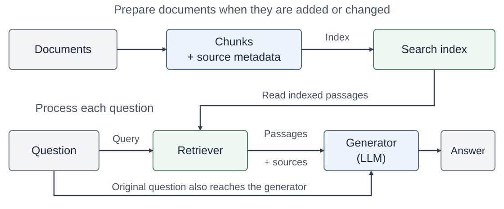
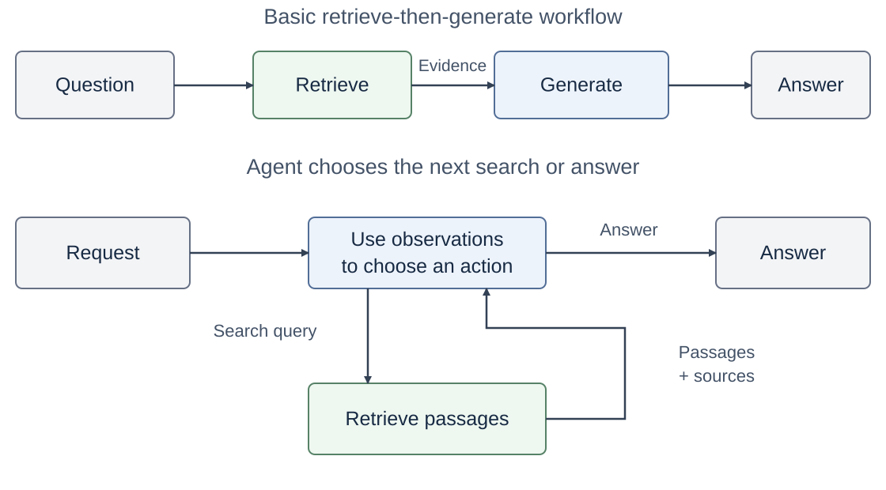

<!-- course-navigation:start -->
<nav class="chapter-nav" aria-label="Course navigation">
<a href="../../index.html">Home</a>
<a href="../reading.html">All chapters</a>
<a href="../../week09.html">Week 9 materials</a>
</nav>
<!-- course-navigation:end -->

<button id="classroom-toggle" type="button" aria-pressed="false">Larger text</button>
<button id="answers-toggle" type="button" aria-pressed="false">Show all answers</button>

::: {.callout-note appearance="minimal"}
## Learning objectives

- Explain why a model needs retrieval to answer from documents.
- Explain the three steps that prepare documents for search.
- Explain how a question becomes a grounded answer.
- Find the stage that caused a wrong answer: retrieval or generation.
- Explain what agentic RAG and Self-RAG add to basic RAG.
:::

In Chapter 7, an agent made a plan and used tools to get the information for each step. A search over documents is one such tool. This chapter explains how that search works and how the model uses the text that it finds.

## Part 1. RAG {#concepts}

### 1.1 Why retrieval is needed {#purpose}

A model gets general knowledge from its training data. This knowledge is in the weights of the model, and it is **parametric knowledge**. It does not contain the rules of a specific course or a rule that changed last week. Documents outside the model contain this information. It is **non-parametric knowledge**. You can update it, and you do not train the model again.

A short document can go directly into the prompt. Many long documents do not fit in the prompt. The system must first find the parts that the question needs. This step is retrieval.

### 1.2 Retrieval-augmented generation {#definition}

::: {.callout-tip icon=false}
## Retrieval-augmented generation (RAG)

A method in which a system retrieves relevant text from external documents and gives it to a language model. The model then generates an answer from that text.
:::

RAG has two stages:

1. **Prepare the documents.** Before questions arrive, the system divides the documents into passages and makes them searchable.
2. **Process each question.** The system retrieves the passages that the question needs. The model generates an answer from those passages.

{#fig-rag-pipeline fig-alt="Preparation: documents become chunks with source metadata and then a search index. Question processing: the question goes to a retriever, which reads the index and returns passages with sources; the generator receives the passages and the original question and writes the answer."}

Part 2 explains the first stage. Part 3 explains the second stage.

## Part 2. Document preparation {#preparation}

Search must be fast when a question arrives. For this reason, the system prepares the documents before the questions. Preparation has three steps: chunking, embedding, and indexing.

### 2.1 Chunking {#chunking}

A long document covers many topics, but a question needs only one part. **Chunking** divides a document into passages that the system can retrieve separately. Each passage is a **chunk**. The system then gives the model only the relevant part, not the full document.

A good chunk contains connected text that has a meaning by itself. **Chunk size** is the length limit of a chunk, in characters or tokens. A small chunk can lose its context. A large chunk can mix different topics. **Overlap** repeats some text at the boundary of two adjacent chunks, so that a sentence keeps its context.

### 2.2 Embeddings {#embeddings}

A question and a passage can use different words for the same meaning. For example, "hand in the report" and "submit the report" have the same meaning. A search for equal words does not find this match.

An **embedding** is a vector of numbers that represents a text. An **embedding model** gives similar vectors to texts with related meanings. During preparation, the embedding model changes each chunk into a vector.

### 2.3 Indexing {#indexing}

The system must find the relevant vectors quickly, and it must return readable text. **Indexing** puts the chunk vectors into a structure for fast search. Each entry keeps a link to the text of its chunk and to its source. The source details, such as the title, section, and page, are the **metadata**. A **vector store** keeps the vectors, the text, and the metadata together.

The result of preparation is a searchable collection. The system uses it again for each question. When a document changes, update only the entries of the changed chunks.

## Part 3. Answer a question {#question-processing}

The collection is ready. When a question arrives, the system finds the relevant chunks and gives their text to the model.

### 3.1 Similarity search {#similarity}

The system changes the question into a vector $q$. It uses the same embedding model that encoded the chunks. Then it compares $q$ with each chunk vector $d$. **Cosine similarity** measures how closely two vectors point in the same direction:

$$
\operatorname{sim}(q,d)=\frac{q\cdot d}{\lVert q\rVert\,\lVert d\rVert}
$$

A high score shows a related meaning. It does not prove that the chunk contains the fact that the question needs.

### 3.2 Top-k retrieval {#top-k}

**Top-k retrieval** selects the $k$ chunks with the highest scores. A small $k$ can leave out useful text. A large $k$ adds unrelated text to the model input. The retriever returns the original text of each chunk and its source, not the vector.

### 3.3 Grounded generation {#generation}

The model input has three parts:

1. The question.
2. The retrieved chunks, each with its source.
3. An instruction: answer from the supplied text, cite the source, and say which information the text does not contain.

The model then generates the answer. An answer is **grounded** when the retrieved text supports each of its factual claims.

::: {.checkpoint}
### Check 1 · What goes to the model?

The retriever finds the best chunk for a question. What does the model receive from the retriever: the vector of the chunk, or its text?

Read the answer

The text of the chunk and its source. The vector only helps to find the chunk. The model reads the text.

:::

## Part 4. Retrieval errors and grounding errors {#errors}

A RAG answer comes from two stages. If the answer is wrong, first find the stage that failed.

### 4.1 Retrieval errors {#retrieval-errors}

In a **retrieval error**, the retrieved chunks do not contain the necessary text. The document is not in the collection, chunking cut the fact apart, or the search ranked the chunk too low. Correct the collection, the chunks, or the search.

Two methods make the search better:

- **Hybrid search** combines keyword search and embedding search. Keyword search finds exact names and codes. Embedding search finds related meanings.
- **Reranking** examines each candidate chunk again together with the question, and it puts the candidates in a new order. It changes only the order of chunks that the search already found.

### 4.2 Grounding errors {#grounding}

In a **grounding error**, the model receives the necessary text, but the answer does not agree with it. More retrieved text does not correct this error. Correct the instruction to the model, and compare each claim of the answer with the text.

::: {.checkpoint}
### Check 2 · Which stage failed?

The correct chunk is in the model input, but the answer is wrong. Which stage failed?

Read the answer

Generation. Retrieval supplied the necessary text, so this is a grounding error.

:::

## Part 5. Agentic RAG and Self-RAG {#agentic-rag}

### 5.1 Agentic RAG {#retrieval-control}

Basic RAG searches one time and then answers. Sometimes the first result shows that another search is necessary. For example, a passage says: "For the submission procedure, consult the assignment instructions."

::: {.callout-tip icon=false}
## Agentic RAG

RAG in which an agent uses the retriever as a tool. The model reads each result and selects the next action: another search, or the answer.
:::

This is the agent loop of Chapter 4 with a retrieval tool. The query goes in, and passages with sources come back as the observation.

{#fig-rag-control fig-alt="Top: a fixed workflow, Question, Retrieve, Generate, Answer. Bottom: an agent receives the request, sends search queries to a retrieval tool, receives passages with sources, and then selects another search or the answer."}

### 5.2 Self-RAG {#self-rag}

A RAG system can make three decisions: Is retrieval necessary now? Is this passage relevant? Does the passage support the answer? **Self-RAG** trains a language model to make these decisions during generation. The model learns to write **reflection tokens**: special tokens that express each decision. The system uses these tokens to control retrieval and to select the generated text.

Agentic RAG describes how a system selects retrieval actions. Self-RAG trains the model to make these decisions.

## Summary {#recap}

- RAG retrieves text from external documents and gives it to the model, which generates an answer from it.
- Preparation has three steps: chunking, embedding, and indexing.
- To answer a question, embed it, retrieve the top-k chunks, and generate a grounded answer from their text.
- A wrong answer comes from a retrieval error or a grounding error. Find the stage first.
- Agentic RAG lets the model select the next search. Self-RAG trains the model to make retrieval decisions.

## Lab {#lab-guide}

1. Divide a document into chunks, and examine the chunks.
2. Embed and index the chunks. Retrieve the top-k chunks for a question.
3. Generate an answer from the retrieved text. Examine the model input and the cited answer.
4. Apply the same steps to the RAG paper. Change $k$, and compare the retrieved chunks and the answers.

[Lab page](lab.html) · [Download the notebook](W9_lab_rag.ipynb). Upload the notebook to [Google Colab](https://colab.research.google.com/) to run it.

## Materials and sources {.unnumbered #sources}

- Lewis et al., [Retrieval-Augmented Generation for Knowledge-Intensive NLP Tasks](https://arxiv.org/abs/2005.11401) (2020): RAG, and parametric and non-parametric knowledge.
- Asai et al., [Self-RAG](https://arxiv.org/abs/2310.11511) (2023): reflection tokens for retrieval and self-evaluation.
- Manning et al., [Introduction to Information Retrieval](https://nlp.stanford.edu/IR-book/): keyword retrieval.
- Sentence Transformers, [semantic search](https://www.sbert.net/examples/sentence_transformer/applications/semantic-search/README.html) and [retrieve and rerank](https://www.sbert.net/examples/sentence_transformer/applications/retrieve_rerank/README.html): embedding search and reranking.
- [Diagram sources](figures/rag/SOURCES.md).

<!-- course-pagination:start -->
<nav class="chapter-pagination" aria-label="Previous and next chapters">
<a href="../week07/notes.html" rel="prev">← Previous: 7 · Planning &amp; Search</a>
<a href="../week10/notes.html" rel="next">Next →: 9 · Context Engineering</a>
</nav>
<!-- course-pagination:end -->
